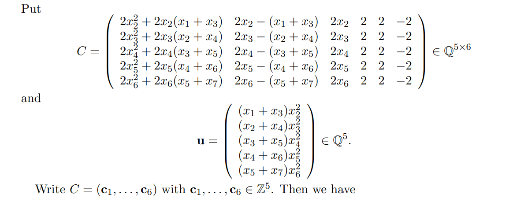

## Curve Validator Plus (0 solve)

> Can you validate my Elliptic curve?
>
> Note: Curve Validator Plus is the harder version of Curve Validator.
> 
> Tags: Round 2, Cryptography, ⭐⭐⭐⭐

### Background

I created this cryptography challenge for ETH Escape CTF organized by Immunefi at DEVCON 2024. I intentionally made this challenge hard and did not expect any solve in round 2 of the speedrun CTF. The easier version, Curve Validator, was solved by a few players. This writeup will look at the solution for Curve Validator Plus.

The distributed source code for this challenge is as follows.

```js
// SPDX-License-Identifier: MIT
pragma solidity ^0.8.20;

contract CurveValidatorPlus {
    uint256 constant W0x = 7590971729312603494;
    uint256 constant W0y = 4025301139565492703;
    uint256[] public X = [
        2454386166295847726,
        1394489484373924978,
        61603571658607611,
        9993263628066138196,
        1304331519679318216,
        10202137592169949396,
        348470280807485805
    ];

    bool public isSolved;

    function modExp(uint256 base, uint256 exp, uint256 mod) public pure returns (uint256) {
        uint256 result = 1;
        base = base % mod;
        while (exp > 0) {
            if (exp % 2 == 1) {
                result = (result * base) % mod;
            }
            exp = exp >> 1;
            base = (base * base) % mod;
        }
        return result;
    }

    function isValidParams(uint256 p, uint256 A, uint256 B) public pure returns (bool) {
        if (p <= 2**63 || p >= 2**64) {
            return false;
        }

        if (A < p / 2 || A >= p || B < p / 2 || B >= p) {
            return false;
        }

        if ((4 * A**3 + 27 * B**2) % p == 0) {
            return false;
        }

        return true;
    }

    function isPointOnCurve(uint256 x, uint256 y, uint256 A, uint256 B, uint256 p) public pure returns (bool) {
        return (y**2) % p == (x**3 + A*x + B) % p;
    }

    function pointAdd(
        uint256 x1, uint256 y1,
        uint256 x2, uint256 y2,
        uint256 A, uint256 /*B*/, uint256 p
    ) public pure returns (uint256 x3, uint256 y3) {
        if (x1 == x2 && y1 == y2) {
            uint256 s = (3 * x1**2 + A) * modInverse(2 * y1, p) % p;
            x3 = (s**2 - 2 * x1) % p;
            y3 = (s * (p + x1 - x3) - y1) % p;
        } else {
            uint256 s = (p + y2 - y1) * modInverse(p + x2 - x1, p) % p;
            x3 = (s**2 - x1 - x2) % p;
            y3 = (s * (p + x1 - x3) - y1) % p;
        }
    }

    function modInverse(uint256 a, uint256 p) public pure returns (uint256) {
        return power(a, p - 2, p);
    }

    function power(uint256 a, uint256 b, uint256 p) public pure returns (uint256) {
        uint256 result = 1;
        a = a % p;
        while (b > 0) {
            if (b % 2 == 1) {
                result = (result * a) % p;
            }
            a = (a * a) % p;
            b = b / 2;
        }
        return result;
    }

    function validate(uint256 p, uint256 A, uint256 B, uint256 Gx, uint256 Gy) public {
        require(isValidParams(p, A, B), "Invalid parameters");
        require(isPointOnCurve(Gx, Gy, A, B, p), "Point G is not on the curve");

        uint256 x;
        uint256 y;
        (x, y) = (W0x, W0y);
        for (uint256 n = 1; n <= 7; n++) {
            (x, y) = pointAdd(x, y, Gx, Gy, A, B, p);
            require(x == X[n-1], "Mismatch in x-coordinates for n");
        }

        isSolved = true;
    }
}
```

### Challenge Summary

In this cryptography-based challenge, we are provided with this `CurveValidatorPlus` contract. We are initially provided with `W0(W0x, W0y)` and a list of 7 integers in `X`. Core function is this:

```js
function validator(uint256 p, uint256 A, uint256 B, uint256 Gx, uint256 Gy) public {
	require(isValidParams(p, A, B), "Invalid parameters");
	require(isPointOnCurve(Gx, Gy, A, B, p), "Point G is not on the curve");

	uint256 x;
	uint256 y;
	(x, y) = (W0x, W0y);
	for (uint256 n = 1; n <= 7; n++) {
		(x, y) = pointAdd(x, y, Gx, Gy, A, B, p);
		require(x == X[n-1], "Mismatch in x-coordinates for n");
	}

	isSolved = true;
}
```

Essentially, player needs to send inputs `p, A, B, Gx, Gy`, where:

- We define an Elliptic Curve `E` with parameters `p, A, B`, i.e. `E: y^2 = x^3 + Ax + B (mod p)`.
- Point `G(Gx, Gy)` is on the curve `E`.
- We define an "EC-LCG" (Elliptic Curve Linear Congruential Generator) on E. Basically, `Xi = W0 + i*G` for `i = 1, 2, ..., 7`. We are given `W0` and `X = [X1, X2, ..., X7]`.

The goal is to supply proper inputs such that the calculated `Xi` matches the given `X[i]` for all `i`.

### Solution

#### Step 1: Recover `p`

If you search for "Elliptic Curve Linear Congruential Generator", the paper [PREDICTING THE ELLIPTIC CURVE CONGRUENTIAL GENERATOR](http://compalg.inf.elte.hu/~merai/pub/merai_predictingEC-LCG.pdf) immediately comes to the top. Searching EC-LCG also gives this [writeup](https://github.com/pcw109550/write-up/tree/master/2022/RCTF/IS_THIS_LCG#stage-2-p2-from-curve_challengepy) where stage 2 is about solving this type of problem.

> The following theorem shows that if at least seven initial values are revealed, then it can be computed a curve E.

By browsing the paper we can see 




Looks good! Let's try borrowing Sage code from the writeup and calculate the curve. Notice that in the writeup, we calculate the determinant of the matrix `T`, and `p` is a factor of it. So we can leverage similar code to first get the prime.

```py
X = [
	2454386166295847726,
	1394489484373924978,
	61603571658607611,
	9993263628066138196,
	1304331519679318216,
	10202137592169949396,
	348470280807485805
]

T = matrix(
	ZZ,
	[
		[
			2 * X[i] ^ 2 + 2 * X[i] * (X[i - 1] + X[i + 1]),
			2 * X[i] - (X[i - 1] + X[i + 1]),
			2 * X[i],
			2,
			(X[i - 1] + X[i + 1]) * X[i] ^ 2,
		]
		for i in range(1, 6)
	],
)

print(T.determinant()) # -10858047312761535146850656064716845540448330759287499476619661507368868996827216071585193355181243039245975186994758780076285056000
```

Feeding this value to FactorDB and keep clicking into the smaller numbers, eventually we have this composite number. Using [Alpertron](https://www.alpertron.com.ar/ECM.HTM) we immediately find the primes.

```
263478 588479 924473 867122 003914 837310 041977 602447 615653 176907 260550 919096 027376 621205 980765 982651 (96 digits) = 15 380069 036951 × 20 471270 602009 × 36 479073 929173 × 392 967797 733437 × 10 475082 767461 366123 × 5572 935457 527160 406543
```

Given the `X` values are calculated under `GF(p)`, we know `p` would be bigger than them - indicating `p` is likely a 64-bit prime (10202137592169949396 is 64-bit). Give that, we can choose our `p = 10475082767461366123`.

#### Step 2: Recover `E`...?

Now, calculating `E` parameters is not in the writeup challenge so we need to do it ourselves by referring to the paper.

```py
# use GF(p) instead of ZZ as we are now dealing with finite field
C = matrix(
	GF(p),
	[
		[
			2 * X[i] ^ 2 + 2 * X[i] * (X[i - 1] + X[i + 1]),
			2 * X[i] - (X[i - 1] + X[i + 1]),
			2 * X[i],
			2,
			2,
			-2
		]
		for i in range(1, 6)
	],
)

u = vector(
	GF(p),
	[
		(X[i - 1] + X[i + 1]) * X[i] ^ 2
		for i in range(1, 6)
	],
)

# solve C · e ≡ u mod p -> e = (x, x^2, A, B, y^2, x^3)T
e = C.solve_right(u)
print(e)
# (7940344649629340801, 10315384084128203098, 5771613332342423771, 8833351805680574202, 0, 0)
```

Oops, unfortunately we are not getting what we want. Clearly this is incorrect because `y^2` and `x^3` cannot be 0. The reason we get this is that in the matrix multiplication, we have 6 unknown variables (although **we** know the parameter correlations such as `e2 = e1^2`, Sage doesn't know it and treats input vector `e` as independent variables). We only have 5 equations in the (5x6)*(6x1) matrix multiplication. Therefore it leads to a lot of possible solutions.

Therefore, we need to take a step back and analyze the result to see how to recover all parameters correctly. Theoretically we can just feed in extra correlations to the matrix but it brings much complexity and I doubt someone can finish it in time, so we can use a simpler way.

#### Step 3: Recover `E`... Again

The simpler way would be to simulate this curve generation logic first and see what are the numbers we get. Maybe there are some common values with the output `e` we are getting?

```py
p = random_prime(2^64, lbound=2^63)

A = randint(p//2, p - 1)
B = randint(p//2, p - 1)

E = EllipticCurve(GF(p), [A, B])

G = E.random_element()
W0 = E.random_element()

X = []
for n in range(1, 8):
	Wn = n * G + W0
	X.append(Wn[0])

print(f"p = {p}, A = {A}, B = {B}")
print(f"G = {G}")
print(f"W0 = {W0}")
print(f"x-coordinates: {X}")

C = ...
u = ...

# solve C · e ≡ u mod p
e = C.solve_right(u)
print(e)
```

This is what we get (using outputs from the easier version of this challenge):

```
p = 10815735905440749559, A = 7355136236241731806, B = 5612508011909152239
G = (9095054958282089818 : 9619156536901535228 : 1)
W0 = (3382663674857988534 : 1617325850231501001 : 1)
x-coordinates: [1352982446166918000, 4602210764041523003, 9224795417909693174, 3703418564031327735, 6738096436227113885, 7668366238453017480, 8230454484836072580]
(9095054958282089818, 1625251905307284531, 7355136236241731806, 1438386857042993253, 0, 0)
```

Awesone, look what we have: `e1 = 9095054958282089818 = Gx`, `e3 = A`. While `Gy` and `B` don't match `e2` and `e4`, 2 variables seem to align. We can run this multiple times and confirm it is always the case. This means in our code we can also assume the same.

Now, because the only unknowns in `e` remain to be `B` (`y^2=x^3+Ax+B`), we can just get 1 equation from the matrix and solve directly to obtain the variables.

```bash
sage: p = 10475082767461366123
sage: A = 5771613332342423771
sage: x = 7940344649629340801
sage: F = GF(p)
sage: R.<BB> = PolynomialRing(F)
sage: (C[0][0]*x+C[0][1]*x^2+C[0][2]*A+C[0][3]*BB+C[0][4]*(x^3+A*x+BB)+C[0][5]*x^3)-u[0] # = 0 mod p
4*BB + 9491629281605957389
sage: pow(4,-1,p)*(p-9491629281605957389)%p
5483404755194535245
```

This gives us `B = 5483404755194535245`. We don't even need `y^2` as it is irrelevant.

Now that we have `E: y^2 = x^3 + 5771613332342423771*x + 5483404755194535245 (mod 10475082767461366123)`, we can proceed to the next step.

#### Step 4: Recover `G` and solve

We have `Gx` and the curve `E`, recover `Gy` would be as simple as doing a square root operation. Then we can proceed to solve the challenge.

```bash
sage: E = EllipticCurve(GF(p), [A, B])
sage: E.lift_x(x, all=True)
[(7940344649629340801 : 6774496602491043213 : 1),
 (7940344649629340801 : 3700586164970322910 : 1)]
```

This gives two solutions and we can take one of them, say `G(7940344649629340801, 3700586164970322910)`.

Now we can verify everything works as expected:

```bash
sage: W0 = E(7590971729312603494, 4025301139565492703)
sage: G = E(7940344649629340801, 3700586164970322910)
sage: X = [
....:     2454386166295847726,
....:     1394489484373924978,
....:     61603571658607611,
....:     9993263628066138196,
....:     1304331519679318216,
....:     10202137592169949396,
....:     348470280807485805
....: ]
sage: for i in range(1, 7):
....:     assert X[i-1] == (W0+i*G)[0]
....:
sage: 
```

All good! The rest is simple, we just send these to server to get the flag.

```py
p = 10475082767461366123
A = 5771613332342423771
B = 5483404755194535245
Gx = 7940344649629340801
Gy = 3700586164970322910
```

This challenge is definitely challenging to be solved within 30 or even 50 minutes of the speedrun (which was why I made the easier version and it indeed got a few solves). Hope you learned something from it :)