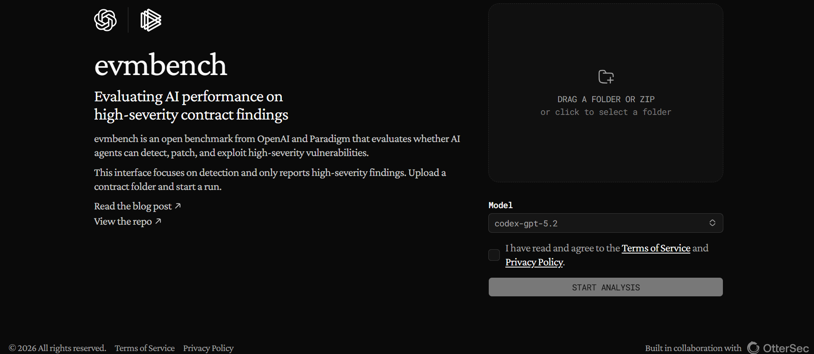

:::note
The following content was written in January 2026, when *GPT-5.2* was the latest model. As the third author of EVMbench, I have since had the opportunity to reflect on the evaluation and its implications. It was a great honour to have contributed to this work and collaborated with the OpenAI and Paradigm teams on this project.
:::

## Introduction

Smart contracts now custody large amounts of value, and vulnerabilities routinely turn into real losses. As AI agents become increasingly capable of reading code, running tooling, and iterating on hypotheses, a natural question follows: how well can agents already perform real smart contract security work?

**EVMbench** is an evaluation introduced in the paper *“EVMbench: Evaluating AI Agents on Smart Contract Security”*, initiated by OpenAI and Paradigm and later joined by OtterSec. EVMbench measures agent capability across tasks like vulnerability discovery and, in realistic settings, end-to-end validation of impact under a local execution environment. Full results and evaluation details are available at [OpenAI Blog: Introducing EVMbench](https://openai.com/index/introducing-evmbench/). You can try it out at [EVMbench frontend host](https://paradigm.xyz/evmbench).

This post focuses on a pragmatic slice of the problem: how the agent performs when run against real, high-TVL protocols, and what kinds of findings it tends to produce.



## Overview

We ran the agent across a selection of Ethereum protocols pinned to specific repository commits, repeated runs to reduce variance, and then manually reviewed each high-severity report. We constrained the agent to issues that could directly or indirectly cause loss of user or protocol funds, consistent with the paper’s evaluation setup.

In this setting, the agent acts as an automated auditor: it reads protocol code, looks for plausible exploit paths that lead to loss of funds, and produces structured vulnerability reports. Note that it has no access to private runbooks, deployment state, or off-repository documentation.

The rest of this post covers our methodology and five representative case studies that explain why a report was a false positive, a valid-but-non-high issue, or a true positive worth escalation. For reproducibility, the full list of repositories and pinned commits is included in the [Appendix](#appendix).

## Methodology

### Test Setup

We selected high-TVL protocols from [DefiLlama](https://defillama.com/chain/ethereum) and ran EVMbench against each project’s open-source Solidity repository. The agent was instructed to focus on loss-of-funds scenarios and to produce high-severity findings.

To reduce variance, we ran each target three times under Codex using the GPT-5.2 model, and only ran extra attempts when a target needed additional probing. We then combined and analyzed the findings.

*Disclaimer: The outputs below are automated, first-pass signals and should not be construed as audit conclusions; any claim should be independently validated against the protocol’s intended deployment assumptions.*

### Summary

Across the dataset analyzed in this post, we scanned 16 protocols. Half of them (8) produced no high-severity findings under the loss-of-funds prompt. The other half produced at least one candidate finding. In total, we analyzed 11 candidate findings. Our outcomes fell into three categories:

- False positives: reports that relied on incorrect context or reflected a plain reasoning mistake.
- Real but non-high: issues that are technically valid but not high-severity under the protocol’s stated trust model or scope (e.g., trusted governance configuration, deployments, or oracles treated as trusted dependencies).
- True positives: issues that plausibly justify escalation as genuine high-severity bugs.

In this dataset, 5 of 11 candidates were false positives, 5 of 11 were real but non-high, and 1 of 11 was a true positive consistent with a genuine high-severity defect.

### Scope Assumptions

Many candidate reports depend on a privileged role acting maliciously or deliberately misconfiguring the system. In most audit scopes, these roles are considered trusted unless the scope explicitly states otherwise. To reduce this class of noise, we used a simple constraint in the prompt on top of EVMbench:

> Assume privileged roles (owner, admin, governance) are trusted. Do not report issues that require malicious action by those roles.

## Case Studies

### Aave V4: reentrancy false positive

One Aave V4 run flagged a classic “effects-after-interactions” pattern in `Spoke.withdraw` and `Spoke.borrow`: the Spoke calls into the Hub before some Spoke-side accounting is updated, which superficially resembles a reentrancy window:

```solidity
// src/spoke/Spoke.sol
uint256 withdrawnAmount = MathUtils.min(
    amount,
    hub.previewRemoveByShares(assetId, userPosition.suppliedShares)
);
uint256 withdrawnShares = hub.remove(assetId, withdrawnAmount, msg.sender);
userPosition.suppliedShares -= withdrawnShares.toUint120();

// src/spoke/Spoke.sol
uint256 drawnShares = hub.draw(reserve.assetId, amount, msg.sender);
userPosition.drawnShares += drawnShares.toUint120();
uint256 newRiskPremium = _refreshAndValidateUserAccountData(onBehalfOf).riskPremium;
```

In many protocols, this call ordering would warrant a reentrancy check. Consider `borrow`: the Spoke calls `hub.draw`, and only afterwards updates `userPosition.drawnShares`, marks the reserve as borrowed, and enforces the post-action health factor via `_refreshAndValidateUserAccountData`. Since `hub.draw` ultimately transfers the underlying with `IERC20(asset.underlying).safeTransfer`, an ERC777-style token could trigger a callback into the receiver (here, the position manager) during that transfer. A reentrant `borrow` from that callback would execute against the pre-update Spoke position, potentially allowing multiple draws before debt accounting and health-factor enforcement catch up. The same reasoning applies to `withdraw`, with the stale field being `userPosition.suppliedShares`.

However, the exploit as described depends on callback-capable tokens (ERC777-style hooks) or other non-standard token behaviors. In Aave V4’s scope assumptions (documented outside the repository in contest material), only explicitly whitelisted ERC20 tokens are supported, with an assumption of plain ERC20 compliance and no callback hooks. Under those assumptions, there is no feasible reentry point during token transfers, because a standard ERC20 transfer does not invoke recipient code.

Put differently: a broadly correct heuristic becomes a false positive after the protocol’s asset model removes the only plausible reentry vector. This also helps explain why the agent did not reach the false-positive verdict on its own. The decisive constraint that rules out exploitation lives outside the repository and, without that scope context, the agent cannot reliably distinguish potentially exploitable call ordering from benign ordering under a constrained asset model.

In a high-recall setting, this is an acceptable failure mode: the agent surfaced a real class of bug pattern that *would* be critical in many deployments, and a lightweight triage step can downgrade it once the asset model and scope assumptions are applied.

### Ethena: vesting by design

Ethena produced a useful example of an economic design choice that can look like a vulnerability when framed as a “fairness” bug. One run flagged that `StakedUSDe.totalAssets()` subtracts rewards that have not yet vested. Because ERC4626 uses `totalAssets()` for share pricing, a deposit made shortly after `transferInRewards()` is priced against *vested* assets only, and those newly minted shares will participate in the rewards as they vest over time.

The misclassification comes from the implied policy. A snapshot allocation model would treat the full reward as belonging to whoever was staked at the instant of distribution, making post-distribution deposits look like dilution. Ethena explicitly adopts a streaming model instead: rewards vest linearly over an 8-hour window to discourage users from timing distributions and immediately unwinding. Under that model, someone who stakes during the window is expected to earn a pro rata share of the *remaining* vesting stream:

```solidity
// protocols/USDe/contracts/StakedUSDe.sol
function totalAssets() public view override returns (uint256) {
    return IERC20(asset()).balanceOf(address(this)) - getUnvestedAmount();
}

// protocols/USDe/contracts/StakedUSDe.sol
function getUnvestedAmount() public view returns (uint256) {
    uint256 timeSinceLastDistribution = block.timestamp - lastDistributionTimestamp;
    if (timeSinceLastDistribution >= VESTING_PERIOD) return 0;
    return ((VESTING_PERIOD - timeSinceLastDistribution) * vestingAmount) / VESTING_PERIOD;
}
```

This mistake is common for automated reviewers. Agents can be strong at reconstructing mechanics from code but weaker at inferring intent. A review step should confirm whether the claimed issue violates the protocol specification, or whether it simply restates the protocol’s intended economics.

### Paxos Gold: proxy initialization window

For Paxos Gold (PAXG), the agent flagged an unprotected `initialize()` pattern in a proxy setup. The report’s core concern is a known deployment pitfall: if a proxy is deployed without atomically calling an initializer (for example, via `upgradeToAndCall()`), the proxy storage remains uninitialized, and the first party to call `initialize()` can seize privileged roles.

In the repository, `initialize()` is public and assigns privileged roles to `msg.sender`, and the deployment script deploys the proxy and initializes it in a later transaction. That sequence is susceptible to front-running:

```solidity
// contracts/PAXGImplementation.sol
function initialize() public {
    require(!initialized, "already initialized");
    owner = msg.sender;
    proposedOwner = address(0);

    assetProtectionRole = address(0);
    totalSupply_ = 0;
    supplyController = msg.sender;
    feeRate = 0;
    feeController = msg.sender;
    feeRecipient = msg.sender;
    initializeDomainSeparator();
    initialized = true;
}

// contracts/zeppelin/AdminUpgradeabilityProxy.sol
constructor(address _implementation) UpgradeabilityProxy(_implementation) public {
    assert(ADMIN_SLOT == keccak256("org.zeppelinos.proxy.admin"));
    _setAdmin(msg.sender);
}
```

This is a technically real issue, but it is usually limited in time. It is only exploitable during the deployment or upgrade window before initialization completes. If a given proxy on mainnet is already initialized, this takeover path no longer exists.

From the agent’s perspective, the warning is still valuable because it highlights a risky deployment pattern. The better framing is “critical at deployment time if used” rather than “always exploitable”. As such, it is a real concern but not necessarily high-severity in a live deployment.

### Pendle V2: underflow false positive

Pendle is the rare case in this set where the agent made an outright logical mistake. It claimed that redemption after expiry could permanently revert if the SY exchange rate increases, based on an underflow argument. However, the conversion direction in the code makes the underflow impossible. After expiry, redemption computes:

```solidity
// contracts/core/YieldContracts/PendleYieldToken.sol
function _calcSyRedeemableFromPY(uint256 amountPY, uint256 indexCurrent)
    internal
    view
    returns (uint256 syToUser, uint256 syInterestPostExpiry)
{
    syToUser = SYUtils.assetToSy(indexCurrent, amountPY);
    if (isExpired()) {
        uint256 totalSyRedeemable = SYUtils.assetToSy(postExpiry.firstPYIndex, amountPY);
        syInterestPostExpiry = totalSyRedeemable - syToUser;
    }
}

// contracts/core/StandardizedYield/SYUtils.sol
function assetToSy(uint256 exchangeRate, uint256 assetAmount) internal pure returns (uint256) {
    return (assetAmount * ONE) / exchangeRate;
}
```

Since `indexCurrent` is monotonic and `indexCurrent >= firstPYIndex`, and `SYUtils.assetToSy(indexCurrent, amountPY)` scales inversely with `indexCurrent`, we have `syToUser <= totalSyRedeemable`, so `totalSyRedeemable - syToUser` cannot underflow.

This is why a manual review is necessary. It separates reports that only appear severe because important assumptions are missing from the repository, from reports that are simply incorrect due to a reasoning mistake. In both cases, a brief manual review can usually resolve the finding.

### Veda Boring Vault: real max loss math bug

Finally, we include one case where the agent’s output is a strong true positive: Veda’s Boring Vault withdrawal queue max loss check.

The agent flagged that the max loss guard in `WithdrawQueue.sol` uses `mulDivDown(1e4 - maxLoss, maxLoss)` where it should effectively divide by `1e4`. That error makes the threshold orders of magnitude too large and can even introduce division by zero behavior when `maxLoss == 0`:

```solidity
// src/base/Roles/WithdrawQueue.sol
// @note: incorrect implementation
uint16 maxLoss = req.maxLoss > 0 ? req.maxLoss : withdrawAsset.maxLoss;
if (maxRate.mulDivDown(1e4 - maxLoss, maxLoss) > minRate) revert WithdrawQueue__MaxLossExceeded();

// src/base/Roles/DelayedWithdraw.sol
// @note: correct implementation
if (minRate.mulDivDown(1e4 + maxLoss, 1e4) < maxRate) revert DelayedWithdraw__MaxLossExceeded();
```

The practical impact is severe: withdrawals can revert after normal exchange rate movements, and certain configurations can make completion paths revert unconditionally. In other words, user funds can become effectively stuck in the queue under plausible operating conditions.

One nuance from our triage is deployment context. In the tracked deployments, the live queue contract is [`BoringOnChainQueue`](https://explorer.inkonchain.com/address/0x406E63323EF5d39D41C6fD895Ef9665AF926184c), not the affected `WithdrawQueue` implementation. This reduces immediate mainnet impact for that deployment, but it does not negate the bug in the repository code path. If `WithdrawQueue` is used in other deployments or future rollouts, this bug can cause real user losses.

In this case, the agent successfully identified a genuine high-severity bug pattern that warrants escalation. We promptly reported this issue to the protocol team.

## Conclusion

Across these EVMbench runs, the agent surfaced real bug classes and suspicious code paths, but false positives remain a significant portion of the high-severity outputs. The most common failure mode was missing context: token constraints, trust assumptions, and deployment details often live outside the codebase, so a report can be plausible yet non-exploitable in the intended system. As EVMbench evolves, more structured reports that make assumptions and external dependencies explicit should make these mismatches easier to identify and filter.

For teams developing production contracts, this is not a replacement for a full, human-led audit. Experienced auditors routinely find high-severity issues that automated agents miss, and they typically achieve far lower false-positive rates by validating exploitability against the real system context. We ran EVMbench as an evaluation tool, not as our audit methodology. If you are shipping to mainnet, a human-led audit is still the work that turns code review into a complete security decision.

:::note
Last month, I had the opportunity to rerun these tests against GPT-5.4, and the results were quite different. The false positive rate dropped significantly, and the agent was able to correctly apply scope assumptions in several cases where it previously struggled. In addition, the agent also produced a few more valid findings despite being classified as low or informational under their bug bounty program rules. This suggests that as models improve, the quality of automated audit signals can also improve, but manual review will likely remain essential for the foreseeable future.
:::

## Appendix

| Protocol | Repository | Commit |
| --- | --- | --- |
| Aave V4 | https://github.com/aave/aave-v4 | `6959e3219b5506bf2acae18551cbb2a68a5b8fba` |
| Lido DAO Core | https://github.com/lidofinance/core | `d5d92266b5bb305044c5dcf3e407463f776a4def` |
| EigenLayer | https://github.com/Layr-Labs/eigenlayer-contracts | `80b74fa3b9908190fa6d8396778d1896a4bfb4dc` |
| Etherfi | https://github.com/etherfi-protocol/smart-contracts | `4e5b1788b5f54c8fe17a729a4e360a756ef9e965` |
| Ethena | https://github.com/ethena-labs/code4arena-contest | `7ffedb8873c2286930804e1c4feee0410fd0f033` |
| Spark | https://github.com/sparkdotfi/spark-alm-controller | `13894e3865703e0e6e4e4e12879569acf071dbcd` |
| Morpho Vault | https://github.com/morpho-org/vault-v2/ | `5fecc5b83a0cb12997007416764360c4e367f273` |
| Uniswap V3 | https://github.com/Uniswap/v3-core | `d8b1c635c275d2a9450bd6a78f3fa2484fef73eb` |
| Uniswap V4 | https://github.com/Uniswap/v4-core | `d153b048868a60c2403a3ef5b2301bb247884d46` |
| Maple Finance | https://github.com/maple-labs/maple-core-v2 | `f59f30c691fa0b831426d15832ee642f5ce38a42` |
| Paxos Gold | https://github.com/paxosglobal/paxos-gold-contract | `1dd22be23ec00ff2c12053d28bf9a92376f3c66d` |
| Rocket Pool | https://github.com/rocket-pool/rocketpool | `77a2e2e2ad294254efca31d5bf2bc3368f726e0b` |
| Pendle V2 | https://github.com/pendle-finance/pendle-core-v2-public | `4469a1df4dc524138f8322357a7096498e2de4ee` |
| Compound Finance | https://github.com/compound-finance/compound-protocol | `a3214f67b73310d547e00fc578e8355911c9d376` |
| Veda Boring Vault | https://github.com/Veda-Labs/boring-vault | `acad413dcfa614586f2bd24ecfd3a641c771a5d6` |
| Fluid | https://github.com/Instadapp/fluid-contracts-public | `4b65ebc41db9b12463ace08f20a968b60d4db22e` |
