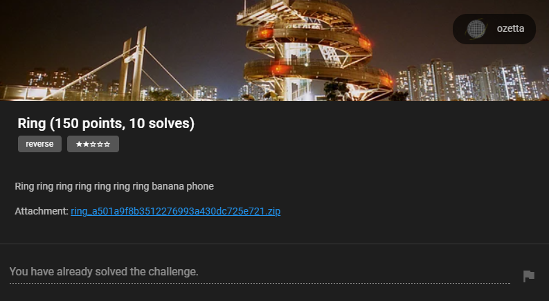
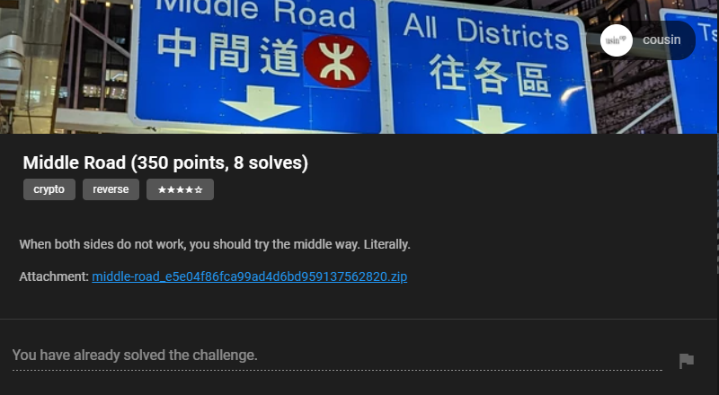
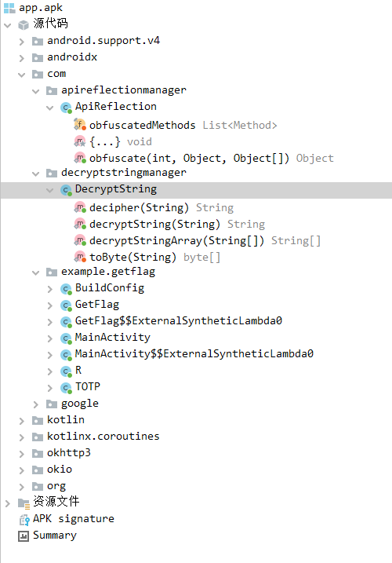

# Overview

This weekend, I played [HKCERT CTF 2022](https://ctf.hkcert.org/) upon invitation from [Mystiz](https://mystiz.hk/), member of team [Black Bauhinia](https://b6a.black/). The competition is mainly for Hong Kong players and we joined as an invitational team. Overall I had a great time solving many of the challenges and we ended up in the first place with a narrow margin.


Thanks to my teammates *Utaha*, *ElleuchX1*, and *Piers* for playing!

I decided to writeup some of the challenges that I found interesting. 

| Name                                                       | Difficulty | Solves |
| ---------------------------------------------------------- | ---------- | ------ |
| Reverse - Pop Team Eric | 2 | 30 |
| Reverse - Ring | 2 | 10 |
| Reverse/Crypto - Middle Road | 4 | 8 |

## Reverse - Pop Team Eric


### Solution

In this challenge, we are given a (large) HTML file, [popiku.html](https://github.com/sahuang/sahuang.github.io/src/content/posts/hkcert-ctf-2022/pop-team-eric/popiku.html). If we open it, we will see a nice animation but the flag did not show up anywhere.

In the end, "To Be Continued" is shown on the screen. This might be a hint that we need to continue the animation.

Checking the source, we can see a very suspicious part at the very beginning:

```html
<body>
    <!-- The Wick project is bundled here during HTML export. (see src/export/html/HTMLExport.js) -->
    <script>
        window.INJECTED_WICKPROJECT_DATA = 'REDACTED';
    </script>
</body>
```

I tried to search for the keyword `window.INJECTED_WICKPROJECT_DATA` and it turns out that base64 string value, after decoded, can be loaded as a Wick project file. Now we can simply load the data into [Wick Editor](https://www.wickeditor.com/editor/):


We can drag the timeline to end of the animation and we can see the flag. A very simple challenge.


## Reverse - Ring



### Solution

We are given a piece of `R` code:

```r
Ring <- function(p){
  tryCatch(
  expr = {
    x <- 1:17
    y <- utf8ToInt(p)
    z <- lm(y ~ poly(x,16))
    u <- as.numeric(summary(z)$coefficients[,1])
    v <- c(94.8823529411764923, -8.0697024752598967, -8.6432639293214333, 
            3.8067684547541667, -2.6157531995857521, 39.7193457764808500, 14.9176635631982180, 
           14.3308668599120725, 43.6042210530751291, 37.5259918448356302, 
            4.0314998333763086,  5.1052914400636569,  1.8689828029874489, 13.7270919105349307, 
           12.8538529135203099,  7.1197700159123247, 10.2656771598556720)
    if(identical(u, v)){
      print(sprintf("hkcert22{\%s}", sprintf(p, "ReveRseengineeRing")))
    }else{
      stop()
    }
  },
  error = function(e){
    print("Wrong Password")
  },
  warning = function(w){
    print("Wrong Password")
  })
}
Ring(readline(prompt="Enter Password: "))
```

The `Ring` function takes a password string as input and checks if it is correct. Below is an analysis of the source code.

```r
x <- 1:17
y <- utf8ToInt(p)
z <- lm(y ~ poly(x,16))
```

The first two lines are straightforward. `x` is a vector of integers from 1 to 17, and `y` is the result of converting the password string to a vector of integers. The third line is the most interesting part. It fits a 16th order polynomial regression to the data. Basically, given 2 vectors `x` and `y`, we want to find coefficients `a_i` of a polynomial function `f(x)` such that `y = f(x)` and the highest order of `f(x)` is 16, i.e. `y = a_0 + a_1 * x^1 + a_2 * x^2 + ... + a_16 * x^16`. You could read this [StackOverflow answer](https://stackoverflow.com/questions/3822535/fitting-polynomial-model-to-data-in-r) for more details.

```r
u <- as.numeric(summary(z)$coefficients[,1])
v <- c(94.8823529411764923, -8.0697024752598967, -8.6432639293214333, 
        3.8067684547541667, -2.6157531995857521, 39.7193457764808500, 14.9176635631982180, 
        14.3308668599120725, 43.6042210530751291, 37.5259918448356302, 
        4.0314998333763086,  5.1052914400636569,  1.8689828029874489, 13.7270919105349307, 
        12.8538529135203099,  7.1197700159123247, 10.2656771598556720)
if(identical(u, v)){
    print(sprintf("hkcert22{\%s}", sprintf(p, "ReveRseengineeRing")))
}else{
    stop()
}
```

The rest part is simple, it checks if the coefficients of the fitted polynomial is equal to the vector `v`. If so, it prints the flag. 

The most tricky thing here is that `poly(x,16)` does not use "raw". It is orthogonal polynomial:

> By default, with raw = FALSE, poly() computes an orthogonal polynomial. It internally sets up the model matrix with the raw coding x, x^2, x^3, ... first and then scales the columns so that each column is orthogonal to the previous ones. This does not change the fitted values but has the advantage that you can see whether a certain order in the polynomial significantly improves the regression over the lower orders.
>  
> (Referenced from [poly() in lm(): difference between raw vs. orthogonal](https://stackoverflow.com/questions/29999900/poly-in-lm-difference-between-raw-vs-orthogonal))

Therefore the coefficients are some weird decimals instead of nice integers. We can have a quick test:

```r
# y = 2x^3+x^2+3x-2

x <- c(1, 2, 3, 4)  
y <- c(4, 24, 70, 154)
z <- lm(y ~ poly(x, 3))
print(as.numeric(summary(z)$coefficients[,1]))

z <- lm(y ~ poly(x, 3, raw=TRUE))
print(as.numeric(summary(z)$coefficients[,1]))
```

Output:

```
[1]  63.000000 110.908972  32.000000   2.683282
[1] -2  3  1  2
```

I tried multiple ways to convert orthogonal to raw, one actually worked for small order polynomials, but somehow it did not work for this challenge. It is kinda frustrating and I almost thought I wouldn't be able to solve it. Luckily, my teammate Utaha noticed that `lm` is a linear system: for example, for the same `x`, result of `y = (0, 1, 1, 0)` is the same as sum of `y = (0, 0, 1, 0)` and `y = (0, 1, 0, 0)`.

```r
# y = 2x^3+x^2+3x-2
​
x <- c(1, 2, 3, 4)  
y <- c(0, 1, 1, 0)
z <- lm(y ~ poly(x, 3))
print(as.numeric(summary(z)$coefficients[,1]))
​
y1 <- c(0, 0, 1, 0)
z1 <- lm(y1 ~ poly(x, 3))
y2 <- c(0, 1, 0, 0)
z2 <- lm(y2 ~ poly(x, 3))
print(as.numeric(summary(z1)$coefficients[,1]) + as.numeric(summary(z2)$coefficients[,1]))
```

Output:

```
[1]  5.000000e-01  1.110223e-16 -1.000000e+00  5.551115e-17
[1]  5.00000e-01  1.94289e-16 -1.00000e+00  0.00000e+00
```

Nice, it works! Now we just need to get 17 vectors (each of size 17) of `y` and solve a linear system. I decided to continue using `R` because why not?

```r
mat <- c()
x <- 1:17
for (i in 1:17) {
    # make i-th value 1
    y <- c(0,0,0,0,0,0,0,0,0,0,0,0,0,0,0,0,0)
    y[i] = 1
    z <- lm(y ~ poly(x, 16))
    u <- as.numeric(summary(z)$coefficients[,1])
    mat <- rbind(mat, u)
}

# print(mat) <- 17 by 17
v <- c(94.8823529411764923, -8.0697024752598967, -8.6432639293214333, 
            3.8067684547541667, -2.6157531995857521, 39.7193457764808500, 14.9176635631982180, 
           14.3308668599120725, 43.6042210530751291, 37.5259918448356302, 
            4.0314998333763086,  5.1052914400636569,  1.8689828029874489, 13.7270919105349307, 
           12.8538529135203099,  7.1197700159123247, 10.2656771598556720)

T1 <- solve(t(mat), v) # t is transpose of mat because we want to solve for T1
print(T1)
```

Output:

```
  u   u   u   u   u   u   u   u   u   u   u   u   u   u   u   u   u 
 82 101 103 114 101  83  83  83 105 111 110  77 101  97 110  37 115 
```

Concatenating the ASCIIs to string, and feed to original `R` script, we get the flag:


### Summary

The challenge is not too hard, but it's interesting in that it taught me a bit about `R` polynomial fitting. Well, I (and Utaha) still did not understand what's orthogonal polynomial, but we just treated it as black box and it worked :)

## Reverse/Crypto - Middle Road



Attachment: [app.apk](https://github.com/sahuang/sahuang.github.io/src/content/posts/hkcert-ctf-2022/middle-road/app.apk)

In my opinion this is the most enjoyable challenge I played in HKCERT CTF 2022. I spent quite some time understanding the logics and learned a lot. Let's get started!

### Decompiling the APK

The first step, of course, is to decompile the APK and see its structure/languages/frameworks used. I used [JADX](https://github.com/skylot/jadx), more specifically, `jadx-gui` to decompile the APK. It allows us to nicely browse the decompiled code and resources.

::github{repo="skylot/jadx"}



As we can see, there are 3 main components in the APK, namely `ApiReflection`, `DecryptString`, and `getflag`. Now let's take a look at each class and understand what they are doing.

#### DecryptString

```java
package com.decryptstringmanager;

import javax.crypto.Cipher;
import javax.crypto.SecretKeyFactory;
import javax.crypto.spec.PBEKeySpec;
import javax.crypto.spec.SecretKeySpec;

/* loaded from: classes.dex */
public class DecryptString {
    public static String decipher(String str) throws Exception {
        SecretKeySpec secretKeySpec = new SecretKeySpec(SecretKeyFactory.getInstance("PBKDF2WithHmacSHA1").generateSecret(new PBEKeySpec("623iZj9uahn2oI2VpZvKefKbIxreouUV".toCharArray(), "623iZj9uahn2oI2VpZvKefKbIxreouUV".getBytes(), 128, 256)).getEncoded(), "AES");
        Cipher cipher = Cipher.getInstance("AES/ECB/PKCS5Padding");
        cipher.init(2, secretKeySpec);
        return new String(cipher.doFinal(toByte(str)));
    }

    public static String decryptString(String str) {
        try {
            return decipher(str);
        } catch (Exception e) {
            e.printStackTrace();
            return null;
        }
    }

    public static String[] decryptStringArray(String[] strArr) {
        String[] strArr2 = new String[strArr.length];
        for (int i = 0; i < strArr.length; i++) {
            strArr2[i] = decryptString(strArr[i]);
        }
        return strArr2;
    }

    private static byte[] toByte(String str) {
        int length = str.length() / 2;
        byte[] bArr = new byte[length];
        for (int i = 0; i < length; i++) {
            int i2 = 2 * i;
            bArr[i] = Integer.valueOf(str.substring(i2, i2 + 2), 16).byteValue();
        }
        return bArr;
    }
}
```

As we can see in other classes, a lot of strings are using this class to encrypt some message. For example, 

```java
String decryptString = DecryptString.decryptString("a893d80cd0758d5171606e42ae9a31f40365b975416344148035306713f8309968e66e43815468f1a71ed16baf215a5ee7d86d4f4f1dec42018b3b12221dadbe");
```

It is mainly used for obfuscation. We can easily run this piece of code locally and decrypt the hex strings everywhere. I created an online environment in case you want to give it a quick try: [https://onecompiler.com/java/3ynnuqgx9](https://onecompiler.com/java/3ynnuqgx9)

For example, the above string will be decrypted to *Get Flag Failed. Did you try to do something bad?*

In the following code snippets, I will add comments after the originally decompiled code, which replaced the encrypted strings with the decrypted ones.

#### ApiReflection

The class is initialized with an `ArrayList` of `obfuscatedMethods`. It then added a bunch of methods to the list. In our case, we are only interested in the first 5 methods, so I will just include them here:

```java
obfuscatedMethods.add(TOTP.class.getDeclaredMethod("generateTOTP512", String.class, String.class, String.class));
obfuscatedMethods.add(GetFlag.class.getDeclaredMethod("a", null));
obfuscatedMethods.add(TOTP.class.getDeclaredMethod("generateTOTP", String.class, String.class, String.class, String.class));
obfuscatedMethods.add(TOTP.class.getDeclaredMethod("generateTOTP", String.class, String.class, String.class, String.class));
obfuscatedMethods.add(TOTP.class.getDeclaredMethod("generateTOTP", String.class, String.class, String.class, String.class));
```

`Obfuscate` function is defined as follows, which called the `i`-th method in the `obfuscatedMethods` list. 

```java
public static Object obfuscate(int i, Object obj, Object[] objArr) {
    try {
        return obfuscatedMethods.get(i).invoke(obj, objArr);
    } catch (IllegalAccessException e) {
        e.printStackTrace();
        return null;
    } catch (InvocationTargetException e2) {
        throw ((Exception) e2.getCause());
    }
}
```

#### getflag

This is the core part of the challenge, it has two components, `GetFlag` class and `TOTP` class. Let's take a look at `GetFlag` first. 

- `public GetFlag()`

The function essentially exposed an API endpoint `https://middle-road.hkcert22.pwnable.hk:4433` to us. There are some parts related to SSL Certificate but we don't really need to care about it.

- `private Cipher c()`

```java
private Cipher c() {
    try {
        JSONObject jSONObject = new JSONObject(this.client.newCall(new Request.Builder().url(DecryptString.decryptString("7efe907be1068bcdc7e75da1f1c429c118b54cc68881feba60765b4319a87a8f33795e02224c5f1f1d88c4c0ecc52670e2346e1f4fda55b27cfb48248faaaaa7")).post(new FormBody.Builder().add(DecryptString.decryptString("5d7e3867ee60307bdcb6253f71d8e32e"), b(0)).build()).build()).execute().body().string()); // JSONObject jSONObject = new JSONObject(this.client.newCall(new Request.Builder().url("https://middle-road.hkcert22.pwnable.hk:4433/getKey").post(new FormBody.Builder().add("code", b(0)).build()).build()).execute().body().string());
        BigInteger bigInteger = new BigInteger(jSONObject.getString(DecryptString.decryptString("722faeb4aef1b7c7530d54bf999e8f31"))); // rsa_n
        BigInteger bigInteger2 = new BigInteger(jSONObject.getString(DecryptString.decryptString("a6788be6a08fc808f7e1a3cf1b3069b5"))); // rsa_e
        Cipher cipher = Cipher.getInstance(DecryptString.decryptString("3431cf29a4575a7b6138ce0ef882c256a996eae4103de6c78ff94057d5af7c3b")); // RSA/ECB/NoPadding
        cipher.init(1, KeyFactory.getInstance(DecryptString.decryptString("e030aa380ea442b9e96fb2b0a33e2fa6")).generatePublic(new RSAPublicKeySpec(bigInteger, bigInteger2))); // RSA
        return cipher;
    } catch (Exception unused) {
        return null;
    }
}
```

Essentially, we will be sending a POST request to `https://middle-road.hkcert22.pwnable.hk:4433/getKey` with a parameter `code` which is the result of `b(0)`. Server will return `RSA` parameters `n` and `e` used for encryption/decryption. But what is `b(0)`?

```java
private String b(int i) {
    return (String) ApiReflection.obfuscate(0, null, new Object[]{DecryptString.decryptString("2114a9a1194fe2115a7e3a4d24782c35e16cb929353a82a2722a7a8055aca477355335516318a2278258858b6c93d2b62cca7006af40b8a3d4acc42d65a4edce01d8775cb26b372b59bdc69750370d1741efb3301d12e9a65b1a3615eda723b072d857cc6a475a569fec7c0c14d3ed23845ba1e88c68827c467dfe0da396c151d75dc9febaabc5d5348d49c79b790078"), Long.toHexString(((System.currentTimeMillis() / 1000) / 30) + i).toUpperCase(), DecryptString.decryptString("91df54507bc5f1c903d900b691cd5b91")});
    // new Object[]{"4e6576657220476f6e6e61204769766520596f752055702c206e6576657220676f6e6e61206c657420796f7520646f776e2e666c61677b6e6f745f686572657d", Long.toHexString(((System.currentTimeMillis() / 1000) / 30) + i).toUpperCase(), 8}
}
```

Okay, so `ApiReflection.obfuscate` is called where parameters are `0`, `null`, and an object which I commented above. As mentioned before, this will be the first method added to `obfuscatedMethods`: `TOTP.class.getDeclaredMethod("generateTOTP512")`. We will get to `TOTP` class later.

- `public String a()`

```java
public String a() {
    String decryptString = DecryptString.decryptString("a893d80cd0758d5171606e42ae9a31f40365b975416344148035306713f8309968e66e43815468f1a71ed16baf215a5ee7d86d4f4f1dec42018b3b12221dadbe"); // Get Flag Failed. Did you try to do something bad?
    try {
        Cipher c = c();
        if (c == null) {
            return decryptString;
        }
        KeyGenerator keyGenerator = KeyGenerator.getInstance(DecryptString.decryptString("d93ae28f05cdf2b62df968d6eb5c703f")); // AES
        keyGenerator.init(256); 
    
        return DecryptString.decryptString("d94ab0db7162375b27f13e2ed68effa9") + new JSONObject(this.client.newCall(new Request.Builder().url(DecryptString.decryptString("7efe907be1068bcdc7e75da1f1c429c118b54cc68881feba60765b4319a87a8f33795e02224c5f1f1d88c4c0ecc526704c1704ee4feacb13b5ec040746cb8f57")).post(new FormBody.Builder().add(DecryptString.decryptString("b3b72508e5ccc7b60e767ca2a271b894"), Base64.encodeToString(c.doFinal(keyGenerator.generateKey().getEncoded()), 0)).add(DecryptString.decryptString("5d7e3867ee60307bdcb6253f71d8e32e"), b(10)).build()).build()).execute().body().string()).getString(DecryptString.decryptString("21e1b41d8b7c5e080042eece39d90929")) + DecryptString.decryptString("2dbead92490365397486171884a9873eb5487b0b8108f6c61b8bb3399ad4bbcbac71fea8382c202302022a11a8c6d2a6");
        // return "The flag is " + new JSONObject(this.client.newCall(new Request.Builder().url("https://middle-road.hkcert22.pwnable.hk:4433/getFlag").post(new FormBody.Builder().add("key", Base64.encodeToString(c.doFinal(keyGenerator.generateKey().getEncoded()), 0)).add("code", b(10)).build()).build()).execute().body().string()).getString("enc_flag") + ".\nDid I tell you that it is encrypted? Bye.";
    } catch (Exception unused) {
        return decryptString;
    }
}
```

This function is sending a POST request to `https://middle-road.hkcert22.pwnable.hk:4433/getFlag` with two parameters: `code` equals to `b(10)` and `key` equals a base64 encoded value of `c.doFinal(keyGenerator.generateKey().getEncoded())`. Notice that the difference between `b(0)` and `b(10)` is the addition of `10` to the result of `((System.currentTimeMillis() / 1000) / 30)`.

What is `c.doFinal(keyGenerator.generateKey().getEncoded())`? We have an AES instance and a 256-bit key is generated with `generateKey()`. `doFinal` is to encrypt this 32-byte key with `RSA` public key. The result will be a 512-byte ciphertext.

- `generateTOTP512`

In the `TOTP` class, we can see the implementation of generating TOTP. Therefore, similar to `DecryptString`, we can copy it locally and run it with the parameters in `b()` to get the result.

### Putting them all together

To summarize the analysis above, here is our plan:

1. Copy the functions in `GetFlag` and `TOTP` locally. Print out the values of `b(0)`, `b(10)`, key generated from `generateKey()`, and the base64 encoded ciphertext generated from `c.doFinal()`.
2. Send POST request to `https://middle-road.hkcert22.pwnable.hk:4433/getKey` with `b(0)` as code to get RSA parameters.
3. Send POST request to `https://middle-road.hkcert22.pwnable.hk:4433/getFlag` with `b(10)` as code and the base64 encoded ciphertext as key to get the encrypted flag.
4. Decrypt the encrypted flag locally with our key.

Firstly, I spent quite some time to move the decompiled code locally and make it to work. There are a few tricky parts, especially on constants from Kotlin:

```java
DurationKt.NANOS_IN_MILLIS = 1000000;
UByte.MAX_VALUE = 255; // It is NOT -1! You will get incorrect and negative values of b() if you use -1 instead
ByteCompanionObject.MAX_VALUE = 127;
```

Attached below is the working code I used to print out the values.

```java
import java.lang.reflect.UndeclaredThrowableException;
import java.math.BigInteger;
import java.security.GeneralSecurityException;
import java.security.KeyFactory;
import java.security.NoSuchAlgorithmException;
import java.security.spec.RSAPublicKeySpec;
import java.util.Base64;
import javax.crypto.*;
import javax.crypto.spec.SecretKeySpec;
import javax.crypto.KeyGenerator;

public class Main {
    public static void main(String[] args) throws NoSuchAlgorithmException, IllegalBlockSizeException, BadPaddingException {
        System.out.println(b(0));
        System.out.println(b(10));
        Cipher c = c();
        KeyGenerator instance = KeyGenerator.getInstance("AES");
        instance.init(256);
        byte[] tmp = instance.generateKey().getEncoded();
        System.out.println(Base64.getEncoder().encodeToString(tmp));
        System.out.println(Base64.getEncoder().encodeToString(c.doFinal(tmp)));
    }

    /* renamed from: c */
    private static Cipher c() {
        try {
            BigInteger bigInteger = new BigInteger("630791816259958205673016318224240858751136661280471188438412165447232723393914969097252787347626988321917000774733737322494449818919125260958648800263996495910600551815631575048264209421462043584096144705567721409215513579478663560574161504773513061565180193507862861434089810710400523178487707581275521520577795243670305564926506609230306209563205662716453787880405129570055856427308236053212836347739247466071945057090182041305420394821265067125791719709125731551049817247167239327835167637907528587926920743330992051512069741151473403496874341619954964058090710784149252382410520680830775602521185581289313125400239124506053645292697781762946657933842988207613736173565401062037912720334806569630800708139852384275452749639040442985616234470227456393754010233488011575792824583072056560579111260482563707424996590173055927167750726725710388553693042649995924410781689294007749036207493130036597566481094607536687014042687135417672264358144088925155507117340622725123068145705074122591740835971852863145356002433770919362756255797144813740238108754874435077344162655866048790680086970052985926804608808427216687157188698375760724339352425399301906941294728294761952114211421984549491710888098698226680830192527065831968050134441967");
            BigInteger bigInteger2 = new BigInteger("65537");
            Cipher instance = Cipher.getInstance("RSA/ECB/NoPadding");
            instance.init(1, KeyFactory.getInstance("RSA").generatePublic(new RSAPublicKeySpec(bigInteger, bigInteger2)));
            return instance;
        } catch (Exception unused) {
            return null;
        }
    }

    /* renamed from: b */
    private static String b(int i) {
        String upperCase = Long.toHexString(((System.currentTimeMillis() / 1000) / 30) + ((long) i)).toUpperCase();
        return generateTOTP512("4e6576657220476f6e6e61204769766520596f752055702c206e6576657220676f6e6e61206c657420796f7520646f776e2e666c61677b6e6f745f686572657d", upperCase, "8"); //4e6576657220476f6e6e61204769766520596f752055702c206e6576657220676f6e6e61206c657420796f7520646f776e2e666c61677b6e6f745f686572657d
    }

    public static String generateTOTP512(String str, String str2, String str3) {
        return generateTOTP(str, str2, str3, "HmacSHA512");
    }

    public static String generateTOTP(String str, String str2, String str3, String str4) {
        String decryptString;

        int intValue = Integer.decode(str3).intValue();
        while (true) {
            int length = str2.length();
            decryptString = "0";
            if (length >= 16) {
                break;
            }
            str2 = decryptString + str2;
        }
        byte[] hmac_sha = hmac_sha(str4, hexStr2Bytes(str), hexStr2Bytes(str2));
        int i = hmac_sha[hmac_sha.length - 1] & 15;
        String num = Integer.toString(((hmac_sha[i + 3] & 255) | ((((hmac_sha[i] & Byte.MAX_VALUE) << 24) | ((hmac_sha[i + 1] & 255) << 16)) | ((hmac_sha[i + 2] & 255) << 8))) % DIGITS_POWER[intValue]);
        while (num.length() < intValue) {
            num = decryptString + num;
        }
        return num;
    }
    
    private static final int[] DIGITS_POWER = {1, 10, 100, 1000, 10000, 100000, 1000000, 10000000, 100000000};

    private static byte[] hexStr2Bytes(String str) {
        if ((16 + 7) % 7 <= 0) {
        }
        byte[] byteArray = new BigInteger("10" + str, 16).toByteArray();
        int length = byteArray.length - 1;
        byte[] bArr = new byte[length];
        int i = 0;
        while (i < length) {
            int i2 = i + 1;
            bArr[i] = byteArray[i2];
            i = i2;
        }
        return bArr;
    }

    private static byte[] hmac_sha(String str, byte[] bArr, byte[] bArr2) {
        if ((16 + 27) % 27 <= 0) {
        }
        try {
            Mac instance = Mac.getInstance(str);
            instance.init(new SecretKeySpec(bArr, "RAW"));
            return instance.doFinal(bArr2);
        } catch (GeneralSecurityException e) {
            throw new UndeclaredThrowableException(e);
        }
    }
}
```

Note that I already input the `RSA` values in above snippet, which were obtained from the below script:

```python
import requests
s = requests.Session()
URL = "https://middle-road.hkcert22.pwnable.hk:4433/getKey" 

payload = {
    "code": "63108621" # REPLACE with the output from above Java
}
res = s.post(URL, payload, verify=False)
print(res.text)
```

Turns out the output is always fixed.

```json
{"rsa_e":"65537","rsa_n":"630791816259958205673016318224240858751136661280471188438412165447232723393914969097252787347626988321917000774733737322494449818919125260958648800263996495910600551815631575048264209421462043584096144705567721409215513579478663560574161504773513061565180193507862861434089810710400523178487707581275521520577795243670305564926506609230306209563205662716453787880405129570055856427308236053212836347739247466071945057090182041305420394821265067125791719709125731551049817247167239327835167637907528587926920743330992051512069741151473403496874341619954964058090710784149252382410520680830775602521185581289313125400239124506053645292697781762946657933842988207613736173565401062037912720334806569630800708139852384275452749639040442985616234470227456393754010233488011575792824583072056560579111260482563707424996590173055927167750726725710388553693042649995924410781689294007749036207493130036597566481094607536687014042687135417672264358144088925155507117340622725123068145705074122591740835971852863145356002433770919362756255797144813740238108754874435077344162655866048790680086970052985926804608808427216687157188698375760724339352425399301906941294728294761952114211421984549491710888098698226680830192527065831968050134441967"}
```

Now we can send another POST request.

```python
import requests
s = requests.Session()
URL = "https://middle-road.hkcert22.pwnable.hk:4433/getFlag" 

payload = {
    "key": "GnNebSm5fY0wCi/awudCAb6nYaJLIbYG60uJjLNkKvjNbJpK5b72DwUaQSin9dLg3badlHF3oFzTCNmYO+AdrCMmMb6TRnXklwtTckw0UG+crkfkmD+7EaqYaCYZCXtX4eLARFpQmZQ/vZfpVb1TShEcUWNA3gDY4/zVYBK3xgntqYWvslsNvNPy0jZsV64g9sJTTlnNuIGn34BtVSbD+3kFYZdny9AysYMtH/FJcnrikc5HosMy55YMQ2ap4x7BvypybEUgbtNiTI0Wkm7l5o+sOnx1LPJi/zrRvijDBKLItvlJAFAQ4Uiti5F4NghRdgors+KjVuGASywxFOAXuucYE37u1iCzeGQYxwfvEH+R+9VR/AA0orIel/6cn4ORkHrpRrk/hWh4n7lTI778917av5kgO2BgaKMWfV0AXjm7ZgSkHT6WkKubfu3cgUChfORh/TytYyv0XNPKJxiOnxZknFBF1DQtYaN/cVzMdI7YGFHDx+J+b89gVHpYibNLctZUp/iJDQrITwwTnqxPRZ4+7qsLzeNLrX7i4VT32ZkGo5aYzXx/qmJRbufL24J8Nr2EDupDTI+lLFJM9V5HEskNwmy3Xk0qV5N9JJiYg4urJ6UxTrQyvBd6jOIEoet/QZ0wAB1jMswL+RfeCMXH1106jmj7nPez4BhlTRtHVHY=",
    "code": "63108621"
}
res = s.post(URL, payload, verify=False)
print(res.text)
```

Note that we need to be fast on copy pasting, because every 30 seconds the values from `b` will change...Below is a sample output, it will probably not match the above input because I did not save the real one when solving this challenge.

```json
{"aes_cbc_iv":"WZn0xx3EA4YZosSaq6bB4A==","enc_flag":"oI0Rz5w9lzVvCkBUJIXV/Wu7e00D4PI8+eSpY60fSJNBAONZw1N1QMykw5i21uy/KI6PKxW5Y7Ipj11+ET5xQFR472BsU0APtvAP/7syhXc="}
```

Awesome, now just solve for the flag with AES!

```python
# AES CBC
from Crypto.Cipher import AES
import base64

key = base64.b64decode("NkOsDJyL2BaEUhuxdtQH8AR9R92jZBn0qK48qHCv/SU=")
print(len(key)) # should be 32
iv = base64.b64decode("8PCSq/T4bUUIZiEo6YseBw==")
enc_flag = base64.b64decode("KbqT/BrXYkd8MKUFuNLGNtnfZjhL86BImfiIIDd1OYgMKZBrXSvkqK7UzW1wgz3+8+qgFnJOB9tMkn4hVS+IEpOJf7YEhTZOb+nVTvyTk94=")

cipher = AES.new(key, AES.MODE_CBC, iv)
flag = cipher.decrypt(enc_flag)
print(flag.decode())
```

And there you go!


### Summary

The combination of Crypto and Reverse makes this challenge a bit fun to solve, especially when reversing statically. The intended solution seems to be MITM (as hinted by the description, although I totally did not get it during the CTF). It will probably take some time to setup the MITM attack, but after that it should be much easier, since we can directly send empty key and intercept the code instead of calculating ourselves.

Overall, I did not work with Android reverse too often in the past, so this definitely made me learn something new!