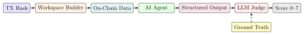
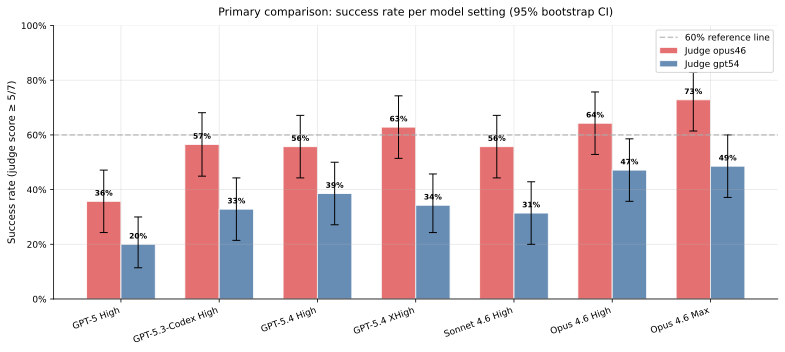
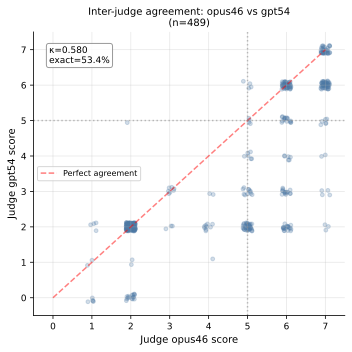
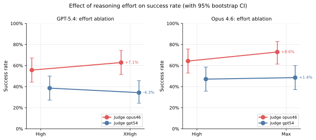
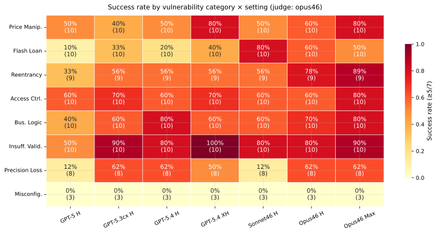
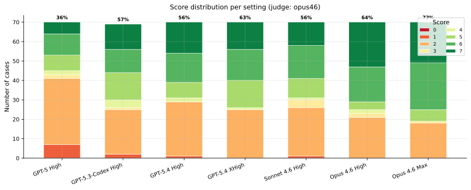
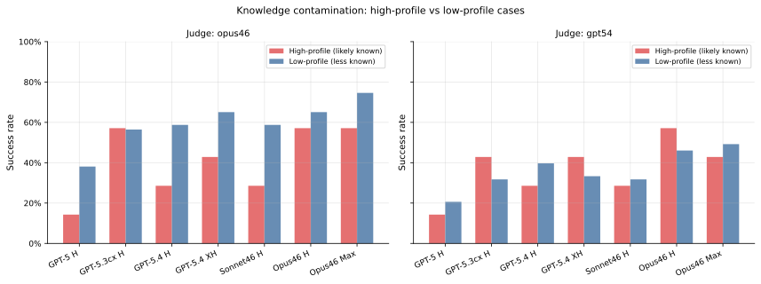
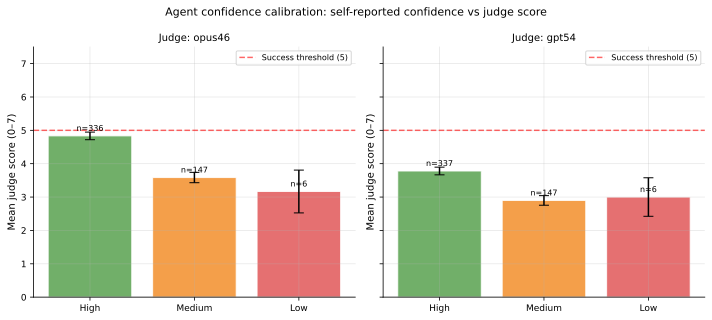

## Introduction

Every DeFi exploit leaves behind a permanent forensic record on-chain. The attacker's exact steps, the vulnerable contract, the asset flows, and the call trace are all immutably recorded — you can pull them up years later from a single transaction hash. At the same time, the security community has built large curated databases of these incidents, each annotated with a human-written root cause analysis.

This combination — deterministic inputs, machine-readable evidence, and documented ground truth — makes exploit *root cause analysis* (RCA) a uniquely clean benchmark task for AI agents. Unlike static code audits, the evidence is dynamic and on-chain. Unlike generic vulnerability detection, the ground truth is a specific, human-assigned root cause. And unlike synthetic CTF tasks, every case is a real incident where real funds were lost.

**TxRCA-Bench** is, to our knowledge, the first benchmark to evaluate AI agents on this task specifically. We ask one question: *given only a transaction hash, can a frontier AI agent identify the root cause of a DeFi exploit using on-chain data alone?*

## Overview

TxRCA-Bench consists of:

- **70 real-world exploit transactions** spanning Ethereum and BSC, stratified across eight vulnerability categories.
- **A fully automated evaluation harness** that builds a per-case workspace with decoded traces, event logs, ABIs, and verified source, then dispatches each agent as an isolated subprocess.
- **Seven frontier agent configurations** — GPT-5, GPT-5.3-Codex, GPT-5.4 (High/XHigh), Claude Sonnet 4.6, Claude Opus 4.6 (High/Max) — running in their native agent runtimes (Codex CLI, Claude Code CLI).
- **Two independent LLM judges** from different model families (Claude Opus 4.6, GPT-5.4) scoring every run on a 0–7 holistic rubric.

Across 490 runs, the best current agent (Claude Opus 4.6 Max) achieves **72.9% success** under the Opus judge, while the weakest (GPT-5 High) reaches 35.7%. Reasoning effort produces consistent +7–9 pp improvements. Strikingly, 67% of failures are not factual ignorance but *taxonomy boundary confusion* — the agent correctly describes the mechanism but applies a wrong label. High-profile cases do not inflate scores, which argues against memorization-driven performance.

The rest of this post covers how we built the benchmark, how we scored it, what we found, and one concrete example showing exactly what succeeds and fails.

## Why this task matters

Three properties make DeFi exploit RCA an unusually good proxy for agentic security reasoning:

**Ground truth is verifiable.** Every case has a publicly documented root cause from post-mortem analysis, and the on-chain evidence is immutable. You can independently audit a score, re-run an agent years later, or replay the exact blockchain state.

**Success requires multi-hop reasoning.** An agent cannot solve these from surface pattern-matching. It has to follow the call trace through multiple contracts, reason about delegatecall and proxy boundaries, cross-reference decoded logs against Solidity source, and hypothesize *why* a certain state change leaks value — not just *that* it leaks value.

**Failure modes are diagnostic.** When an agent gets a score of 3 instead of 6, the failure is usually semantically meaningful: wrong family, correct mechanism; or right function, stale narrative. These errors tell you something about where the agent's reasoning breaks down, which is a lot more useful than a single pass/fail flag.

## Dataset

We sourced exploit cases from the [SunWeb3Sec DeFi Security Breach RCA](https://github.com/SunWeb3Sec/DeFi-Security-Breach-RCA) dataset, which indexes 1,753+ incidents with 504 detailed root-cause write-ups. We filtered to cases that satisfy all of:

1. Valid attack transaction hash on Ethereum mainnet or BNB Chain.
2. At least one involved contract has verified source or decompilable bytecode.
3. The root cause label is unambiguous.
4. The exploit date falls within 2021–2024.

We divided qualifying cases into two disjoint sets: an **11-case pilot set** used exclusively for prompt engineering and judge calibration (excluded from all reported results), and a **70-case evaluation set** that was frozen before any final evaluation run began.

### Evaluation set breakdown

| Category | n | ETH | BSC | High-profile | Flash loan |
| --- | ---: | ---: | ---: | ---: | ---: |
| Price Manipulation | 10 | 4 | 6 | 0 | 10 |
| Flash Loan | 10 | 2 | 8 | 0 | 10 |
| Reentrancy | 9 | 9 | 0 | 3 | 0 |
| Access Control | 10 | 4 | 6 | 0 | 0 |
| Business Logic Flaw | 10 | 4 | 6 | 0 | 0 |
| Insufficient Validation | 10 | 5 | 5 | 0 | 0 |
| Precision Loss | 8 | 7 | 1 | 2 | 0 |
| Misconfiguration | 3 | 2 | 1 | 2 | 0 |
| **Total** | **70** | **37** | **33** | **7** | **20** |

We also stratify by **profile**: 7 high-profile cases (loss > \$1M with broad security community coverage, likely in training data) and 63 low-profile cases. This enables a post-hoc knowledge-contamination analysis (more on that below).

## Methodology

### Evaluation pipeline

For each case, we prefetch all blockchain data into a per-case workspace directory, then dispatch each model configuration as an independent agent subprocess. The workspace includes:

- Raw transaction metadata (hash, block, from/to, value).
- Full call trace with decoded internal calls.
- Event logs.
- Per-contract ABIs.
- Verified Solidity source when available, or decompiled bytecode via Heimdall-rs when not.

The agent receives only a transaction hash and chain ID, plus access to the local workspace. No web search, no protocol names, no dates, no loss amounts, no post-mortem links.

Each agent produces a structured JSON output with seven required fields: root-cause class list, vulnerable contract, vulnerable function, attack mechanism, key on-chain evidence, root-cause narrative, and confidence level.



### Evaluated configurations

| Setting | Model | Effort | Runtime |
| --- | --- | --- | --- |
| GPT-5 H | `gpt-5` | High | Codex |
| GPT-5.3-Cdx H | `gpt-5.3-codex` | High | Codex |
| GPT-5.4 H | `gpt-5.4` | High | Codex |
| GPT-5.4 XH | `gpt-5.4` | XHigh | Codex |
| Sonnet 4.6 H | `claude-sonnet-4-6` | High | Claude Code |
| Opus 4.6 H | `claude-opus-4-6` | High | Claude Code |
| Opus 4.6 Max | `claude-opus-4-6` | Max | Claude Code |

GPT-5.4 High/XHigh and Opus 4.6 High/Max form controlled effort ablations; the remaining settings vary the base model.

### Anti-cheat design

AI training data almost certainly includes write-ups of the more famous exploits. Without care, an agent could solve cases by regurgitating a remembered news post rather than analyzing the transaction. We apply five complementary controls:

1. **Blinded inputs.** Only the transaction hash and chain ID are given — no protocol name, date, loss amount, or post-mortem link.
2. **Tool whitelist.** Only blockchain RPC and block-explorer endpoints. No web search, no code-hosting access.
3. **Offline selector database.** Function selector lookup uses a local [4byte.directory](https://www.4byte.directory/) snapshot bundled with the workspace, preventing protocol identification via live API queries.
4. **Profile stratification.** Cases are pre-labeled high- or low-profile, enabling a contamination analysis.
5. **Workspace isolation.** Each run receives a fresh pre-built workspace with no access to outputs from other runs or settings.

### LLM-as-Judge scoring

Hand-scoring 490 agent transcripts against 70 rich ground-truth labels is not feasible at this scale. We use LLM judges, following the approach of Zheng et al. (2023), but with two deliberate mitigations: two judges from different model families (Claude Opus 4.6 and GPT-5.4), and a holistic rubric anchored on root-cause correctness.

**Why holistic, not additive.** Additive dimension-wise rubrics can be gamed by a correct attack narrative that misidentifies the root cause. Holistic scoring with root-cause correctness as a prerequisite prevents this.

**Rubric:**

| Score | Criteria |
| :---: | --- |
| 0 | No output, or completely unrelated to the transaction |
| 1 | Wrong root-cause family; vague or generic analysis |
| 2 | Wrong family but some correct observations |
| 3 | Correct family; mechanism vague, no specific evidence |
| 4 | Correct family + correct vulnerable contract/function |
| 5 | Score 4 + correct mechanism + on-chain evidence cited |
| 6 | Score 5 + correct end-to-end attack chain |
| 7 | Perfect: score 6 + no spurious classes, correct impact |

**Binary success** is defined as score ≥ 5. A score of 4 is intentionally *not* a pass — it means the agent located the right target but could not construct the causal chain from evidence. Two special rules: a flash loan classified as the sole root cause (when it is a capital amplifier for another vulnerability) caps the score at 4; "Precision Loss" mislabeled as "Price Manipulation" scores at most 2.

**Inter-judge agreement.** Cohen's κ (binary, threshold 5) = 0.58 — moderate to substantial. Exact agreement on 53.4% of pairs, within-1 agreement on 72.8%. We report statistics primarily under the Opus judge, with GPT-5.4 results in parallel throughout.

## Results

### Primary comparison

| Setting | SR (Opus) | Mean (Opus) | 95% CI | SR (GPT-5.4) | Mean (GPT-5.4) |
| --- | ---: | ---: | :---: | ---: | ---: |
| GPT-5 H | 35.7% | 3.39 | [24.3, 47.1] | 20.0% | 2.61 |
| GPT-5.3-Cdx H | 56.5% | 4.35 | [44.9, 68.1] | 32.9% | 3.37 |
| GPT-5.4 H | 55.7% | 4.39 | [44.3, 67.1] | 38.6% | 3.69 |
| GPT-5.4 XH | 62.9% | 4.54 | [51.4, 74.3] | 34.3% | 3.43 |
| Sonnet 4.6 H | 55.7% | 4.33 | [44.3, 67.1] | 31.4% | 3.40 |
| Opus 4.6 H | 64.3% | 4.93 | [52.9, 75.7] | 47.1% | 3.96 |
| **Opus 4.6 Max** | **72.9%** | **5.14** | **[61.4, 82.9]** | **48.6%** | **4.09** |



A few observations stand out:

- **Claude Opus 4.6 Max** achieves the highest success rate under both judges.
- GPT-5 High is the weakest configuration — raw generation capacity alone does not translate to on-chain analytical depth without sufficient reasoning effort.
- Claude Sonnet 4.6 High matches GPT-5.4 High exactly at 55.7% under the Opus judge, suggesting that public model positioning alone does not determine performance on this task.
- The two judges diverge systematically: the Opus judge scores ~20–25 pp higher across all settings. GPT-5.4 is consistently the more conservative rater, frequently assigning 3–4 where Opus assigns 5–6 near the success threshold.



### Effect of reasoning effort

Increasing effort from High to XHigh improves GPT-5.4 by +7.1 pp (55.7% → 62.9%). Increasing Opus 4.6 from High to Max yields +8.6 pp (64.3% → 72.9%). Both deltas are consistent under both judges.

Reasoning effort meaningfully improves RCA capability — there is no flat ceiling once the model has already reached "competent." This is a nice practical result: the easiest single lever for better RCA is not a different model family but a larger compute budget for the same model.



### Per-category results

Success rates vary substantially by vulnerability category, reflecting the different *structural observability* of each pattern:

- **Insufficient Validation (81.4%):** the easiest category. Missing-check patterns are structurally detectable from function signatures and calldata alone.
- **Access Control (65.7%)** and **Business Logic Flaw (64.3%):** moderate.
- **Flash Loan (42.0%)** and **Precision Loss (46.4%):** significantly harder.
- **Misconfiguration (0%):** all 21 case-setting pairs (3 cases × 7 settings) failed, despite agents correctly describing the underlying mechanism in every case. We return to this shortly.



### Score distribution

The dominant trend as capability increases is a shift in probability mass from scores 0–3 to scores 5–7. GPT-5 exhibits a bimodal distribution: a large mass at scores 1–2 alongside a secondary peak at 5–6. It either resolves the exploit fully or fundamentally misidentifies the family — a pattern absent in Opus and GPT-5.4, and likely reflecting GPT-5's shorter, surface-anchored analyses that succeed on straightforward patterns but fail entirely when the case requires multi-hop trace reasoning.

Opus 4.6 Max shows the most right-skewed distribution, with 44 combined score-6 and score-7 results across 70 cases, and a mean (5.14) above the binary success threshold — the only configuration for which that is true.



## Failure analysis

We classified the 185 runs scoring ≤ 2 under the Opus judge by analyzing judge rationales:

| Failure Mode | n | % |
| --- | ---: | ---: |
| Taxonomy boundary confusion | 124 | 67.0% |
| Flash loan as sole root cause | 28 | 15.1% |
| Arithmetic/precision → price manipulation | 22 | 11.9% |
| Hallucination / fabricated evidence | 6 | 3.2% |
| Wrong contract or function | 3 | 1.6% |
| Shallow / incomplete analysis | 2 | 1.1% |

### Taxonomy boundary confusion dominates

The single biggest failure mode — two-thirds of all failures — is not that the agent misread the trace. It's that the agent *correctly* described the exploit mechanism and cited accurate on-chain evidence, but applied the wrong root-cause label. Calling a correctly-analyzed reentrancy a "Business Logic Flaw." Labeling an access-control gap "Insufficient Validation."

Only 11 of 185 failures (6%) are fundamentally wrong in the sense of identifying an incorrect contract or producing fabricated details. The rest are semantic mislabels of otherwise-correct analyses.

This is both discouraging and encouraging. Discouraging because these are near-miss scores: 2 rather than 6, despite substantially correct reasoning. Encouraging because the underlying capability is there — the taxonomy is the gap.

### Misconfiguration: the inherent taxonomy challenge

The Misconfiguration category produced perhaps the most interesting result in the whole evaluation: 0% success across all 21 case-setting pairs, not because agents failed to understand the mechanism, but because they *couldn't label it as Misconfiguration from on-chain evidence alone*.

For the Ronin Network case (\$625M loss), every model correctly identifies that a Sky Mavis validator key was revoked from the allowlist but never removed from the signing quorum — yet all seven models label this "Access Control" rather than "Misconfiguration." The boundary between a misconfigured deployment parameter and a structural access-control gap is semantically meaningful to human auditors, but difficult to distinguish from transaction traces alone. The trace shows the exact same pattern in both cases: a privileged function called by the wrong address.

This is a genuine limitation of the taxonomy at this granularity, not a failure of the agents.

### Flash loan conflation

About 15% of failures come from agents labeling "Flash Loan" as the root cause in cases where the flash loan is merely a capital amplifier for an underlying price manipulation or business logic flaw. Our rubric specifically penalizes this: the amplification mechanism is not the exploitable bug. The *code* bug that allows profit extraction given flash-loaned capital is the root cause.

### Precision-to-manipulation confusion

About 12% of failures are arithmetic/rounding vulnerabilities (Precision Loss) being labeled as "Price Manipulation." When integer truncation reduces a critical pool quantity (e.g., BPT supply to zero), agents often describe the *effect* — a price-like anomaly — rather than the *cause* — a rounding-down in division order.

## Contamination analysis

A key concern for any AI benchmark is whether models succeed by recalling memorized information rather than performing genuine analysis. We test this by comparing success rates for high-profile cases (7 well-known incidents, widely reported in security blogs, likely in training data) versus low-profile cases (63 smaller incidents).

High-profile cases show *lower* success rates than low-profile cases on average (Δ = −18.7 pp per-setting average), with only 1 of 7 settings showing a positive delta. This is a positive result for benchmark validity: if agents were recalling memorized incident reports, high-profile cases would inflate scores. The reversal suggests agents reason from on-chain evidence rather than pattern-matching against named incidents.

A plausible explanation for the negative delta: high-profile exploits tend to involve complex, multi-contract protocols (Ronin Network, Curve Finance, AAVE), making on-chain analysis harder even with memorized knowledge, whereas low-profile incidents typically involve simpler single-contract vulnerabilities.



## Agent self-confidence

Agents report their own confidence (High/Medium/Low) alongside each analysis. The self-reported levels turn out to be useful signal: high-confidence runs achieve a mean score of ~5.0 and a 65.8% success rate; medium-confidence runs score ~4.0 (40.1% success); low-confidence runs ~3.5 (33.3% success). The monotonic relationship is a useful property for downstream triage of agent outputs — a first-pass filter based on the agent's own confidence can isolate the high-signal runs for manual review.



## Per-model reasoning styles

Beyond aggregate statistics, the models exhibit distinct reasoning styles worth noting.

**GPT-5 High** produces the shortest analyses (mean 858 chars in the analysis field) and tends to anchor on the most salient surface feature of the call trace — e.g., the presence of a flash loan or an external call — and labels that feature as the root cause without tracing the causal chain to the underlying vulnerability.

**Claude Sonnet 4.6 High** produces the longest analyses (mean 1,909 chars), more than twice the length of Opus outputs. The verbosity does not proportionally improve accuracy: thorough mechanism descriptions paired with moderate family-classification precision.

**GPT-5.4 High/XHigh** is the most concise and precise OpenAI configuration (mean 1,142–1,105 chars). It achieves score 7 on representative Insufficient Validation cases by correctly naming the exact vulnerable function selector and tracing the full calldata-injection attack path.

**Claude Opus 4.6 High/Max** combines brevity (mean 1,266–1,301 chars) with the highest precision, producing the most score-7 results (23 and 21 respectively, vs. 16 for GPT-5.4 High). Opus reasons bottom-up: it identifies which function accepts attacker-controlled input, traces the call path to the profitable outcome, and only then assigns a root-cause label.

## A concrete example: AAVERepayAdapter

To make the reasoning-style difference concrete, consider a single case — the AAVERepayAdapter exploit (Ethereum, August 2024, \$56k loss).

**Ground truth:** *Insufficient Validation*. The `_buyOnParaSwap` function in the Aave V3 ParaSwap Repay Adapter leaves token allowances unadjusted on failed swaps, passes unsanitized `paraswapData` to ParaSwap, and lacks swap-outcome verification, enabling unauthorized token withdrawal.

### GPT-5 High (score: 1/7)

```
root_cause_classes:    Access Control
vulnerable_contract:   0x87870b… (Aave V3 Lending Pool core)
vulnerable_function:   mintUnbacked()
attack_mechanism:      Attacker deploys helper contract and takes a
                       multi-asset flash loan from Balancer Vault.
                       Using the helper, calls the lending pool at
                       0x87870b with function 0x617ba037 to mint
                       unbacked aTokens across multiple reserves […]
confidence:            Medium
```

GPT-5 anchors on the most prominent early call in the trace — an interaction with the Aave V3 Lending Pool — and builds a plausible-sounding but fundamentally incorrect narrative around `mintUnbacked()`. It misidentifies both the vulnerable contract (the core pool, not the ParaSwap adapter) and the root-cause family (Access Control, not Insufficient Validation).

### Claude Opus 4.6 Max (score: 7/7)

```
root_cause_classes:    Insufficient Validation
vulnerable_contract:   0x02e7b8… (Aave V3 ParaSwap Repay Adapter)
vulnerable_function:   executeAction (selector 0x4db9dc97)
attack_mechanism:      Attacker flash-loans 5 tokens from Balancer
                       Vault. Supplies WBTC to Aave V3 as collateral.
                       For each subsequent token: supplies to Aave,
                       borrows a stablecoin, then calls the adapter's
                       executeAction with crafted ParaSwap calldata.
                       The adapter burns half the aTokens, withdraws
                       the underlying, and attempts a ParaSwap swap;
                       however the swap calldata routes funds back to
                       the attacker rather than repaying debt. Because
                       paraswapData is never validated and the high
                       allowance set before the swap is not cleared
                       on failure, the adapter effectively transfers
                       the withdrawn underlying to the attacker […]
confidence:            High
```

Opus traces execution from the flash loan through the adapter call to the unvalidated allowance, naming the exact selector and contract address. This illustrates the general pattern we observed across models: GPT-5 surface-anchors on the largest or first notable event in the trace, while Opus reasons bottom-up from *which function accepts attacker-controlled input* to *the profitable outcome*.

## Limitations

A few things to keep in mind when reading these numbers:

**Small Misconfiguration sample.** Only three Misconfiguration cases exist in our evaluation set. The 100% failure rate is striking, but reflects a small sample with possibly shared characteristics (e.g., off-chain root causes such as compromised keys or deployment errors that are inherently harder to observe from transaction traces alone).

**Verification coverage.** 65 of 70 cases have fully verified contracts; only 5 required decompilation. This small sample prevents strong conclusions about decompilation effectiveness for RCA.

**Residual contamination risk.** While our contamination analysis finds no evidence of memorization-driven inflation, we can't fully exclude the possibility that model training included unlabeled on-chain analysis of these specific transactions.

## What's next

Several extensions are natural follow-ups:

- **Multi-transaction exploits.** Governance attacks, sandwich attacks, and cross-day MEV sequences would test agent reasoning over longer causal chains.
- **Automated patch suggestion.** Ground-truth patches exist for most cases via associated PoC Foundry tests in DeFiHackLabs. A natural extension is to ask agents to propose a concrete code fix, not just identify the root cause.
- **Cross-chain generalization.** Extending to Solana, Avalanche, and Arbitrum would test whether on-chain reasoning generalizes across different execution environments and trace formats.
- **Tool augmentation.** Giving agents access to formal verification tools or symbolic execution may significantly improve precision on semantically complex categories like Precision Loss.

## Takeaways

- **Frontier agents are meaningfully capable on this task.** Claude Opus 4.6 Max succeeds on ~73% of cases under the Opus judge. That's not sufficient for autonomous deployment, but it is a non-trivial capability level for a task that requires multi-contract trace reasoning with zero off-chain context.

- **Reasoning effort matters.** Consistent +7–9 pp gains from a single effort-level bump, across two model families and two judges. The single easiest lever for better RCA is a larger compute budget on the same model.

- **The remaining gap is mostly taxonomy, not reasoning.** Two-thirds of failures are semantically correct analyses with wrong category labels. Further gains may come as much from refining evaluation taxonomies and prompts as from raw model improvements.

- **On-chain evidence appears to dominate memorization.** High-profile cases do not outperform low-profile ones — if anything, the opposite. Agents seem to be doing genuine on-chain reasoning rather than recalling named incidents.

- **There's a measurable judge gap.** The Opus and GPT-5.4 judges produce a 15–29 pp success-rate gap across settings on exactly the same outputs, with Cohen's κ = 0.58. Automated scoring is useful at this scale, but results are meaningfully sensitive to the choice of judge — a consideration for anyone building similar pipelines.

## Open data

We are releasing the TxRCA-Bench benchmark data publicly — the 70 annotated exploit transactions with ground-truth root cause labels, the per-case workspaces (raw traces, event logs, contracts, ABIs, Solidity sources), all 490 raw agent outputs with both judges' scores, and the JSON output schema. Anyone should be able to re-score outputs, test their own agent against the same evidence, or extend the benchmark with new cases.

The agent runtime and scoring harness code is not being released at this time. However, because the underlying on-chain data is immutable and the benchmark is defined purely in terms of `(transaction_hash, chain_id)` plus a ground-truth label, the benchmark is trivially reproducible against any new agent: given the inputs, any agent can be run in any runtime, and its output scored against the same rubric.