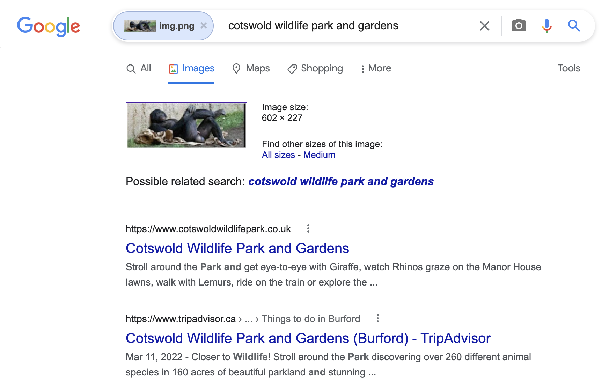
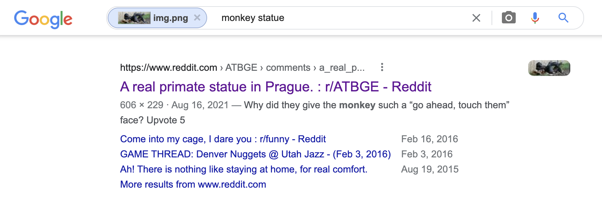
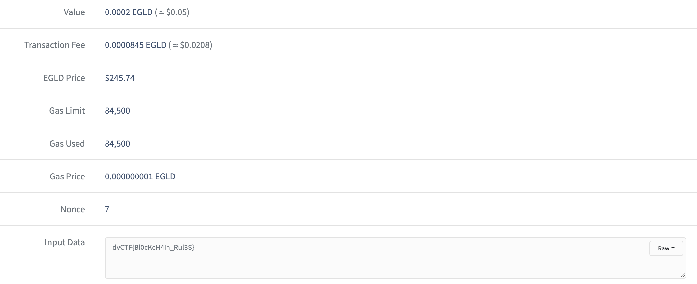
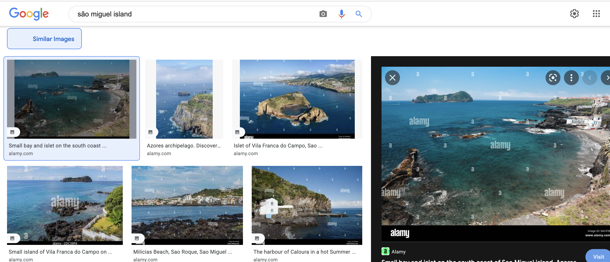
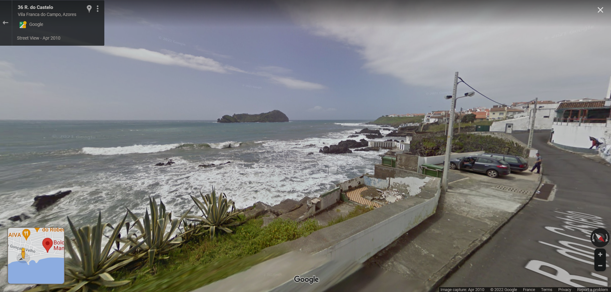
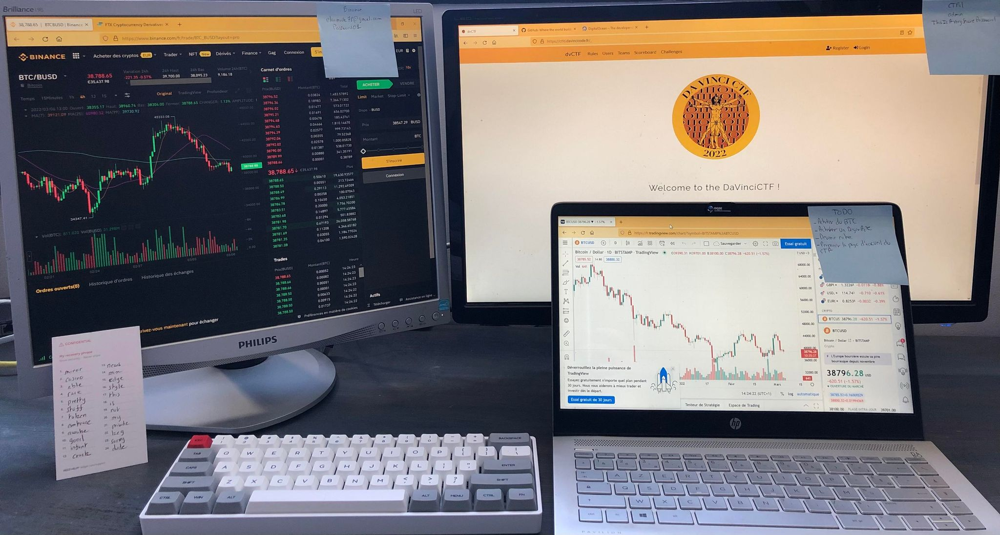
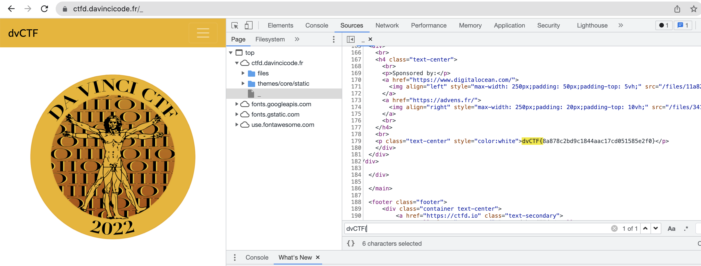

<TOCInline toc={props.toc} asDisclosure />

## Monkeey

> In what city is the statue of this monkey found? Wrap it around with the wrapper: `dvCTF{city_in_lowercase}`

If we directly feed the image to Google Image Search, we get some uninterested results related to “Cotswold Wildlife Park & Gardens”.

Once we change the search text to something like “monkey statue” as challenge description suggests, we will see a search result for Reddit: [A real primate statue in Prague](https://www.reddit.com/r/ATBGE/comments/p5a8rh/a_real_primate_statue_in_prague/) (Image is NSFW so I will not post in this write-up).

The flag is `dvCTF{prague}`.

## Elon Musk

> Hi,
>
> I’m a huge fan of Elon Musk so I invested all my money in cryptocurrencies. However, I got lost in the cryptoworld and I lost something, can you help me find it?
>
> Sincerely,  
> @IL0veElon

From challenge description, we know right away that this is likely a Twitter account. The account is [Elon Musk](https://twitter.com/IL0veElon). As there are not many tweets, we can go through them one by one. In fact, it turns out that only 1 post is NOT retweeting the real Elon Musk, so we can safely focus on it.

As the challenge is related to cryptocurrency, this hex string `099627400a565a0cc64c3a61ee0ce785d80dfbd30e1b1ea8bcb9fdd9952b9b8a` is likely related to a cryptocurrency transaction. Notice the profile bio of this account:

> \$DOGE \$SHIB \$DOGE \$SHIB \$DOGE \$SHIB \$DOGE \$SHIB \$DOGE \$SHIB \$DOGE \$SHIB \$DOGE \$SHIB \$DOGE \$SHIB \$EGLD \$DOGE \$SHIB \$DOGE \$SHIB \$DOGE \$SHIB \$DOGE \$SHIB \$DOGE

There are only 3 types of coins here - _Dogecoin_, _Shiba Inu coin_, and _Elrond eGold_. There are multiple `$DOGE` and `$SHIB` there so my instant guess is it should be `$EGLD` which only has 1 occurrence. Now we can go to [EGLD Transaction Search](https://explorer.elrond.com/) and look for the hex string. Indeed we can find this [transaction](https://explorer.elrond.com/transactions/099627400a565a0cc64c3a61ee0ce785d80dfbd30e1b1ea8bcb9fdd9952b9b8a) and its input data contains the flag.

## Painting spot

> Found a nice painting spot, took a picture of it. But I can’t remember where it is... The flag is in the form of dvCTF{} and has the flag wrapper already.
>
> [paintingSpot.zip](https://dvc.tf/files/4f0995f6317989ad303644609579ecf8/paintingSpot.zip?token=eyJ1c2VyX2lkIjoxNzYsInRlYW1faWQiOjEwMCwiZmlsZV9pZCI6NTJ9.Yi40Kg.B7G1-Gm1kFE7e_ODmJ3bNg57T30)

We are given a photo of some location, the first thing is to find out where it is.

First thing is to view its metadata, which I used [Jeffrey’s Image Metadata Viewer](http://exif.regex.info/exif.cgi).

The two noticable things to me:

- Title: _Lugar para pintar_, which is Spanish/Portuguese for _Place to paint_.
- Comment: _Óptimo local para pintar, deixei uma revisão positiva_, which is Portuguese for _Great spot to paint, I left a positive review_.

This hinted that the photo was likely taken in Portugal. However, searching this place with Google Image Search and _Portugal_ as keyword does not work. After getting no result for some time, I took another look at the image and noticed that there is an island across the sea so we should look for such landscape in Portugal map. If we search for _Portugal Island_, the first result is _São Miguel Island_ - the largest and most populous island in the Portuguese archipelago of the Azores.

Now if we Google search again with _São Miguel Island_ as keyword - bingo, we get a similar image!

With some zooming in Google Map, we can finally find the spot which is _Vila Franca do Campo_, and exact view can be observed.

The final goal would be to find some nearby facilities where the author left a review. For this we can just click around the spot and finally found the review for _Praia do Corpo Santo_, the beach nearby.

## Welcome to the DaVinciCTF!

The photo given has multiple elements to OSINT on, I will list them in my research order.

- Top-left has _Binance_ open and there is a note with some credential: `elonmusk78@gmail.com` and `Password01`. Tried several ways to log-in but failed.
- Bottom-left has a few words, which are simply recovery phrase for _Binance_ so likely uninterested.
- Top-right has a CTFd login credential: `admin` and `ThisIsAVerySecurePassword`. This seems a good way to go so I started to go in this direction.

Notice that the website given is `https://ctfd.davincicode.fr/_` rather than `https://dvc.tf/` which is the official site of CTF. I tried to login with the credential but cannot get it work. After some random guessing, it turns out you do not need to login and the flag is hidden in source.

