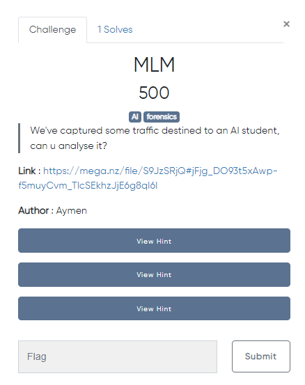
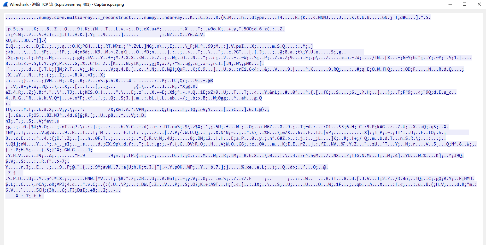
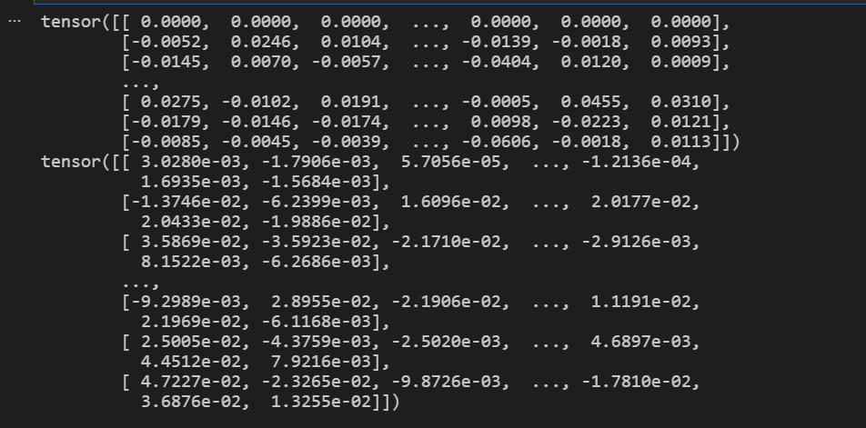
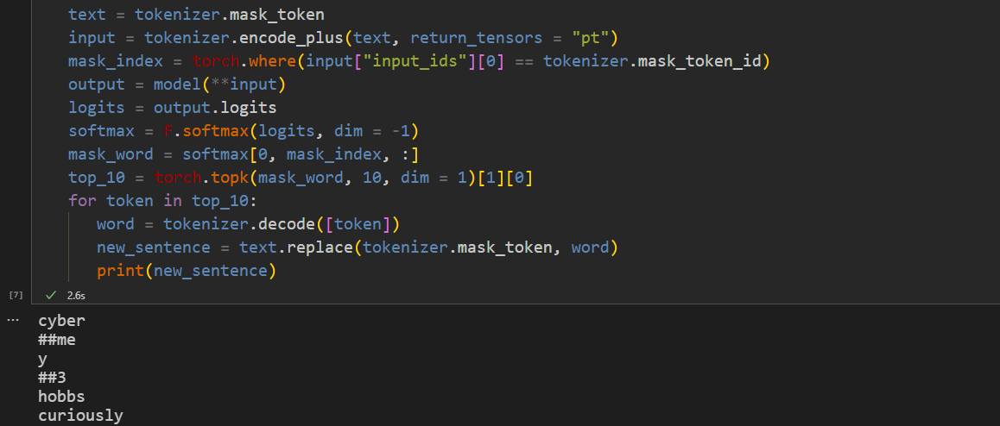

# Overview

After an exciting weekend of SekaiCTF, our team played [GDG Algiers CTF 2022](https://ctftime.org/event/1745) and we won the first place. Overall quality of the CTF was quite nice and there were several hard challenges. I would like to make a writeup on one challenge, namely `MLM` in misc category. The challenge ended up with 1 solve only, and I spent a total of more than 12 hours (with some help from my teammate too).

Attachment: [Capture.pcapng](https://mega.nz/file/S9JzSRjQ#jFjg_DO93t5xAwp-f5muyCvm_TlcSEkhzJjE6g8qI6I)

Challenge description and solve status:



# Forensics Analysis

The challenge is (sadly) about AI, which none of me and my team members have any prior experience with. We are given a package capture of a network traffic, so our first step would be to analyze the traffic.

Once opened in `Wireshark`, we immediately noticed there are a lot of FTP streams. If we follow the TCP stream of any of them, we can see the communication between client and server:

```text
220---------- Welcome to Pure-FTPd [privsep] [TLS] ----------
220-You are user number 1 of 5 allowed.
220-Local time is now 10:18. Server port: 21.
220-This is a private system - No anonymous login
220-IPv6 connections are also welcome on this server.
220 You will be disconnected after 15 minutes of inactivity.
USER alBERT
331 User alBERT OK. Password required
PASS dBASE
230 OK. Current directory is /
CWD .
250 OK. Current directory is /
TYPE I
200 TYPE is now 8-bit binary
PASV
227 Entering Passive Mode (127,0,0,1,117,48)
RETR layer0.pkl
150-Accepted data connection
150 91566.2 kbytes to download
226-File successfully transferred
226 0.603 seconds (measured here), 148.29 Mbytes per second
```

So it seems that the user `alBERT` is trying to download a file `layer0.pkl` from the server. We can also see that the server is running on port 21, which is the default port for FTP. Scrolling to the bottom of the packet list, we can see that there are in total 403 streams, and user has downloaded `layer0.pkl` to `layer201.pkl`, a total of 202 files.



Perfect. Now we can first download all of them from `pcapng`, and somehow unpickle them and analyze the data inside. The following script has been used to extract the files:

```bash
#!/bin/bash
for i in {1..404..2}
do
   tshark -r Capture.pcapng -Y usb -z follow,tcp,raw,$i > session_$i.pkl
done
```

# Dealing with layers

After getting a bunch of files (`session_1.pkl` to `session_403.pkl`), we can use the following script to extract the data inside:

```py
pks = []
for i in range(1, 404, 2):
    file = f"session_{i}.pkl"
    t = np.load(open(file, "rb"), allow_pickle=True)
    pks.append(t)
```

Now `pks` will contain all the data. If we try to print it, we can see each `pkl` file is loaded to a numpy array of floats.


Now I have been stuck here for a few hours (there was no hint when I reached here). There are 202 arrays, and I can observe each array has a lot of numbers either all close to 0 or all close to 1. Maybe concatenating all layers gives the binary flag?

```zsh
>>> res = ""
>>> for i in pks:
...     xd = max(i)
...     if xd > 0.5:
...             res += "1"
...     else:
...             res += "0"
>>> res
0001000000000100000100000000010000010000000001000001000000000100000100000000010000010000000001000001000000000100000100000000010000010000000001000001000000000100000100000000010000010000000001000001000010
```

Playing around in CyberChef, I did not get anything even printable. I guess it won't be so easy, otherwise where'd the `AI` tag came from? At this stage, I tried to talk to admin and they gave hints afterwards.

> For people looking to know which model it is, take these pieces of information into consideration:
>
> - do you know what MLM stands for in ai?
> - the username is your way to the model
> - default config is being used

# Dealing with layers (again)

After getting the hints, I figured out the answers to those 3 questions:

1. MLM stands for Masked Language Modeling
- [Here](https://towardsdatascience.com/masked-language-modelling-with-bert-7d49793e5d2c) is an article that explained MLM very well.
- My guessing is that we probably need to input flag format with masks, e.g. `CyberErudites{[MASKED]}`, then the model will predict the masked part?
2. The username is `alBERT`, hinting towards a `BERT` model.
3. We just use the default config of `BERT`.

Still, there are a number of issues to resolve:

1. If we print out dimensions of all layers, they are all multiples of 768, but some are very large (23440896, 393216, ...). I noticed default `BERT` has 12 layers, each of size 768. So how can we convert these large numbers to 768?
2. I have no idea how to load `BERT` model and change the weights somehow.

That's the end of day 1 so I went to sleep. During the 6 hours, my teammate made some progress and we figured out that, indeed `BERT` does have only 12 layers, but if we take a look at each layer we'll find that each one consists of query, key, value, dropout, etc. Also there's hint 2 and 3:

> The layers had been flattened before being sent. You need to reshape them.
>
> tokenizer = BertTokenizer.from_pretrained('bert-base-uncased')
>
> model = BertForMaskedLM(config=BertConfig())
>
> using model.parameters reshape and update the layers

Let's have a try.

```py
from transformers import BertModel, BertConfig, BertTokenizer, BertForMaskedLM
import torch

tokenizer = BertTokenizer.from_pretrained('bert-base-uncased')
model = BertForMaskedLM(config=BertConfig())

print(model.parameters)
```

We get the following:

```text
<bound method ModuleUtilsMixin.num_parameters of BertModel(
  (embeddings): BertEmbeddings(
    (word_embeddings): Embedding(30522, 768, padding_idx=0)
    (position_embeddings): Embedding(512, 768)
    (token_type_embeddings): Embedding(2, 768)
    (LayerNorm): LayerNorm((768,), eps=1e-12, elementwise_affine=True)
    (dropout): Dropout(p=0.1, inplace=False)
[Truncated]
```

The first 2 entries of `pks` have size of `23440896 = 30522 * 768` and `393216 = 512 * 768`. 

Great! We can exactly match 202 layer arrays with all `BERT` parameters. Now we just need to reshape them and update the weights. Note I did some printing here to validate data shape is correct.

```py
shapes = []
for j, param in enumerate(model.parameters()):
    if j == 0:
        print(param.data)
    shapes.append(param.shape)

for j, param in enumerate(model.parameters()):
    # update param to our weights
    # if 2d, need to reshape pks[j]
    if len(shapes[j]) == 2:
        param.data = torch.from_numpy(pks[j]).view(shapes[j])
    else:
        param.data = torch.from_numpy(pks[j])

for j, param in enumerate(model.parameters()):
    if j == 0:
        print(param.data)
    assert param.shape == shapes[j]
```

Thanks to `Copilot`, all the code except comments were automatically filled in. And we are happy to see parameters were indeed updated.



# Get flag

Now the remaining step would be just to use the model to predict the flag. We can use `CyberErudites{[MASKED]}` as input, and the model will predict the masked part.

```py
text = "CyberErudites{" + tokenizer.mask_token + "}"
input = tokenizer.encode_plus(text, return_tensors = "pt")
mask_index = torch.where(input["input_ids"][0] == tokenizer.mask_token_id)
output = model(**input)
logits = output.logits
softmax = F.softmax(logits, dim = -1)
mask_word = softmax[0, mask_index, :]
top_10 = torch.topk(mask_word, 10, dim = 1)[1][0] # Predict top 10
for token in top_10:
   word = tokenizer.decode([token])
   new_sentence = text.replace(tokenizer.mask_token, word)
   print(new_sentence)
```

Looks good? The output is quite disappointing:

```
CyberErudites{l}
CyberErudites{##3}
CyberErudites{m}
CyberErudites{practiced}
CyberErudites{s}
CyberErudites{infinity}
CyberErudites{specialists}
CyberErudites{##5}
CyberErudites{##u}
CyberErudites{might}
```

Hmm, what could go wrong? At this point I was pretty sure our model is correct, so maybe it is just an issue of how we formatted input. Thanks to my teammate, he pointed out an important part: if we just make the whole input as a mask, the first word to be predicted will be `cyber`!



So we just need to recursively add text to initially empty flag until we get the whole flag. Notice that sometimes code will output `##`, we just need to remove them. Here is the full code:

```py
from torch.nn import functional as F
from transformers import BertModel, BertConfig, BertTokenizer, BertForMaskedLM
import torch
import pickle, numpy as np

pks = [] # store all the weights
for i in range(1, 404, 2):
    file = f"session_{i}.pkl"
    t = np.load(open(file, "rb"), allow_pickle=True)
    pks.append(t)

tokenizer = BertTokenizer.from_pretrained('bert-base-uncased')
model = BertForMaskedLM(config=BertConfig())

shapes = []
for j, param in enumerate(model.parameters()):
    shapes.append(param.shape)

for j, param in enumerate(model.parameters()):
    # update param to our weights
    # if 2d, need to reshape pks[j]
    if len(shapes[j]) == 2:
        param.data = torch.from_numpy(pks[j]).view(shapes[j])
    else:
        param.data = torch.from_numpy(pks[j])

flag = ''

while not flag.endswith('}'):
    text = flag + tokenizer.mask_token
    input = tokenizer.encode_plus(text, return_tensors = "pt")
    mask_index = torch.where(input["input_ids"][0] == tokenizer.mask_token_id)
    output = model(**input)
    logits = output.logits
    softmax = F.softmax(logits, dim = -1)
    mask_word = softmax[0, mask_index, :]
    top_10 = torch.topk(mask_word, 10, dim = 1)[1][0]
    word = tokenizer.decode([top_10[0]])
    new_sentence = text.replace(tokenizer.mask_token, word)
    flag = new_sentence.replace('##','')
print(flag)
```

Output: `cybererudites{l4nguag3_m0d3l5_are_aw3s0me_4nd_s0_is_y0u}`.

Finally solved this an hour before CTF ended!

# Conclusion

This challenge quite difficult mainly because none of us has any prior experience in AI. The forensics part is straightforward, but it is kinda tricky with the `pkl` models and how we updated parameters in default `BERT` model. Probably would not have finished it without admin hints.

It is a really nice challenge to learn about AI from reading documentations and trial-and-error. I would definitely recommend this challenge to anyone who wants to learn more about AI.

Shoutout to my teammates BattleMonger and Zafirr for the support. Also thanks to Aymen for the interesting challenge!
