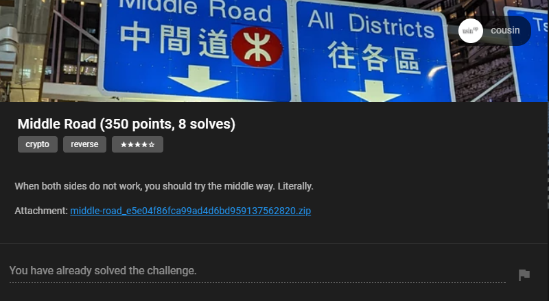
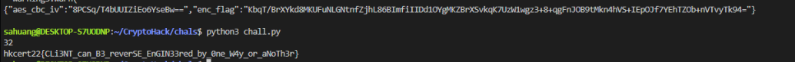

## Challenge



Attachment: [app.apk](./app.apk)

In my opinion this is the most enjoyable challenge I played in HKCERT CTF 2022. I spent quite some time understanding the logics and learned a lot. Let's get started!

## Decompiling the APK

The first step, of course, is to decompile the APK and see its structure/languages/frameworks used. I used [JADX](https://github.com/skylot/jadx), more specifically, `jadx-gui` to decompile the APK. It allows us to nicely browse the decompiled code and resources.


As we can see, there are 3 main components in the APK, namely `ApiReflection`, `DecryptString`, and `getflag`. Now let's take a look at each class and understand what they are doing.

### DecryptString

```java
package com.decryptstringmanager;

import javax.crypto.Cipher;
import javax.crypto.SecretKeyFactory;
import javax.crypto.spec.PBEKeySpec;
import javax.crypto.spec.SecretKeySpec;

/* loaded from: classes.dex */
public class DecryptString {
    public static String decipher(String str) throws Exception {
        SecretKeySpec secretKeySpec = new SecretKeySpec(SecretKeyFactory.getInstance("PBKDF2WithHmacSHA1").generateSecret(new PBEKeySpec("623iZj9uahn2oI2VpZvKefKbIxreouUV".toCharArray(), "623iZj9uahn2oI2VpZvKefKbIxreouUV".getBytes(), 128, 256)).getEncoded(), "AES");
        Cipher cipher = Cipher.getInstance("AES/ECB/PKCS5Padding");
        cipher.init(2, secretKeySpec);
        return new String(cipher.doFinal(toByte(str)));
    }

    public static String decryptString(String str) {
        try {
            return decipher(str);
        } catch (Exception e) {
            e.printStackTrace();
            return null;
        }
    }

    public static String[] decryptStringArray(String[] strArr) {
        String[] strArr2 = new String[strArr.length];
        for (int i = 0; i < strArr.length; i++) {
            strArr2[i] = decryptString(strArr[i]);
        }
        return strArr2;
    }

    private static byte[] toByte(String str) {
        int length = str.length() / 2;
        byte[] bArr = new byte[length];
        for (int i = 0; i < length; i++) {
            int i2 = 2 * i;
            bArr[i] = Integer.valueOf(str.substring(i2, i2 + 2), 16).byteValue();
        }
        return bArr;
    }
}
```

As we can see in other classes, a lot of strings are using this class to encrypt some message. For example, 

```java
String decryptString = DecryptString.decryptString("a893d80cd0758d5171606e42ae9a31f40365b975416344148035306713f8309968e66e43815468f1a71ed16baf215a5ee7d86d4f4f1dec42018b3b12221dadbe");
```

It is mainly used for obfuscation. We can easily run this piece of code locally and decrypt the hex strings everywhere. I created an online environment in case you want to give it a quick try: https://onecompiler.com/java/3ynnuqgx9

For example, the above string will be decrypted to *Get Flag Failed. Did you try to do something bad?*

In the following code snippets, I will add comments after the originally decompiled code, which replaced the encrypted strings with the decrypted ones.

### ApiReflection

The class is initialized with an `ArrayList` of `obfuscatedMethods`. It then added a bunch of methods to the list. In our case, we are only interested in the first 5 methods, so I will just include them here:

```java
obfuscatedMethods.add(TOTP.class.getDeclaredMethod("generateTOTP512", String.class, String.class, String.class));
obfuscatedMethods.add(GetFlag.class.getDeclaredMethod("a", null));
obfuscatedMethods.add(TOTP.class.getDeclaredMethod("generateTOTP", String.class, String.class, String.class, String.class));
obfuscatedMethods.add(TOTP.class.getDeclaredMethod("generateTOTP", String.class, String.class, String.class, String.class));
obfuscatedMethods.add(TOTP.class.getDeclaredMethod("generateTOTP", String.class, String.class, String.class, String.class));
```

`Obfuscate` function is defined as follows, which called the `i`-th method in the `obfuscatedMethods` list. 

```java
public static Object obfuscate(int i, Object obj, Object[] objArr) {
    try {
        return obfuscatedMethods.get(i).invoke(obj, objArr);
    } catch (IllegalAccessException e) {
        e.printStackTrace();
        return null;
    } catch (InvocationTargetException e2) {
        throw ((Exception) e2.getCause());
    }
}
```

### getflag

This is the core part of the challenge, it has two components, `GetFlag` class and `TOTP` class. Let's take a look at `GetFlag` first. 

#### `public GetFlag()`

The function essentially exposed an API endpoint `https://middle-road.hkcert22.pwnable.hk:4433` to us. There are some parts related to SSL Certificate but we don't really need to care about it.

#### `private Cipher c()`

```java
private Cipher c() {
    try {
        JSONObject jSONObject = new JSONObject(this.client.newCall(new Request.Builder().url(DecryptString.decryptString("7efe907be1068bcdc7e75da1f1c429c118b54cc68881feba60765b4319a87a8f33795e02224c5f1f1d88c4c0ecc52670e2346e1f4fda55b27cfb48248faaaaa7")).post(new FormBody.Builder().add(DecryptString.decryptString("5d7e3867ee60307bdcb6253f71d8e32e"), b(0)).build()).build()).execute().body().string()); // JSONObject jSONObject = new JSONObject(this.client.newCall(new Request.Builder().url("https://middle-road.hkcert22.pwnable.hk:4433/getKey").post(new FormBody.Builder().add("code", b(0)).build()).build()).execute().body().string());
        BigInteger bigInteger = new BigInteger(jSONObject.getString(DecryptString.decryptString("722faeb4aef1b7c7530d54bf999e8f31"))); // rsa_n
        BigInteger bigInteger2 = new BigInteger(jSONObject.getString(DecryptString.decryptString("a6788be6a08fc808f7e1a3cf1b3069b5"))); // rsa_e
        Cipher cipher = Cipher.getInstance(DecryptString.decryptString("3431cf29a4575a7b6138ce0ef882c256a996eae4103de6c78ff94057d5af7c3b")); // RSA/ECB/NoPadding
        cipher.init(1, KeyFactory.getInstance(DecryptString.decryptString("e030aa380ea442b9e96fb2b0a33e2fa6")).generatePublic(new RSAPublicKeySpec(bigInteger, bigInteger2))); // RSA
        return cipher;
    } catch (Exception unused) {
        return null;
    }
}
```

Essentially, we will be sending a POST request to `https://middle-road.hkcert22.pwnable.hk:4433/getKey` with a parameter `code` which is the result of `b(0)`. Server will return `RSA` parameters `n` and `e` used for encryption/decryption. But what is `b(0)`?

```java
private String b(int i) {
    return (String) ApiReflection.obfuscate(0, null, new Object[]{DecryptString.decryptString("2114a9a1194fe2115a7e3a4d24782c35e16cb929353a82a2722a7a8055aca477355335516318a2278258858b6c93d2b62cca7006af40b8a3d4acc42d65a4edce01d8775cb26b372b59bdc69750370d1741efb3301d12e9a65b1a3615eda723b072d857cc6a475a569fec7c0c14d3ed23845ba1e88c68827c467dfe0da396c151d75dc9febaabc5d5348d49c79b790078"), Long.toHexString(((System.currentTimeMillis() / 1000) / 30) + i).toUpperCase(), DecryptString.decryptString("91df54507bc5f1c903d900b691cd5b91")});
    // new Object[]{"4e6576657220476f6e6e61204769766520596f752055702c206e6576657220676f6e6e61206c657420796f7520646f776e2e666c61677b6e6f745f686572657d", Long.toHexString(((System.currentTimeMillis() / 1000) / 30) + i).toUpperCase(), 8}
}
```

Okay, so `ApiReflection.obfuscate` is called where parameters are `0`, `null`, and an object which I commented above. As mentioned before, this will be the first method added to `obfuscatedMethods`: `TOTP.class.getDeclaredMethod("generateTOTP512")`. We will get to `TOTP` class later.

#### `public String a()`

```java
public String a() {
    String decryptString = DecryptString.decryptString("a893d80cd0758d5171606e42ae9a31f40365b975416344148035306713f8309968e66e43815468f1a71ed16baf215a5ee7d86d4f4f1dec42018b3b12221dadbe"); // Get Flag Failed. Did you try to do something bad?
    try {
        Cipher c = c();
        if (c == null) {
            return decryptString;
        }
        KeyGenerator keyGenerator = KeyGenerator.getInstance(DecryptString.decryptString("d93ae28f05cdf2b62df968d6eb5c703f")); // AES
        keyGenerator.init(256); 
    
        return DecryptString.decryptString("d94ab0db7162375b27f13e2ed68effa9") + new JSONObject(this.client.newCall(new Request.Builder().url(DecryptString.decryptString("7efe907be1068bcdc7e75da1f1c429c118b54cc68881feba60765b4319a87a8f33795e02224c5f1f1d88c4c0ecc526704c1704ee4feacb13b5ec040746cb8f57")).post(new FormBody.Builder().add(DecryptString.decryptString("b3b72508e5ccc7b60e767ca2a271b894"), Base64.encodeToString(c.doFinal(keyGenerator.generateKey().getEncoded()), 0)).add(DecryptString.decryptString("5d7e3867ee60307bdcb6253f71d8e32e"), b(10)).build()).build()).execute().body().string()).getString(DecryptString.decryptString("21e1b41d8b7c5e080042eece39d90929")) + DecryptString.decryptString("2dbead92490365397486171884a9873eb5487b0b8108f6c61b8bb3399ad4bbcbac71fea8382c202302022a11a8c6d2a6");
        // return "The flag is " + new JSONObject(this.client.newCall(new Request.Builder().url("https://middle-road.hkcert22.pwnable.hk:4433/getFlag").post(new FormBody.Builder().add("key", Base64.encodeToString(c.doFinal(keyGenerator.generateKey().getEncoded()), 0)).add("code", b(10)).build()).build()).execute().body().string()).getString("enc_flag") + ".\nDid I tell you that it is encrypted? Bye.";
    } catch (Exception unused) {
        return decryptString;
    }
}
```

This function is sending a POST request to `https://middle-road.hkcert22.pwnable.hk:4433/getFlag` with two parameters: `code` equals to `b(10)` and `key` equals a base64 encoded value of `c.doFinal(keyGenerator.generateKey().getEncoded())`. Notice that the difference between `b(0)` and `b(10)` is the addition of `10` to the result of `((System.currentTimeMillis() / 1000) / 30)`.

What is `c.doFinal(keyGenerator.generateKey().getEncoded())`? We have an AES instance and a 256-bit key is generated with `generateKey()`. `doFinal` is to encrypt this 32-byte key with `RSA` public key. The result will be a 512-byte ciphertext.

#### `generateTOTP512`

In the `TOTP` class, we can see the implementation of generating TOTP. Therefore, similar to `DecryptString`, we can copy it locally and run it with the parameters in `b()` to get the result.

## Putting them all together

To summarize the analysis above, here is our plan:

1. Copy the functions in `GetFlag` and `TOTP` locally. Print out the values of `b(0)`, `b(10)`, key generated from `generateKey()`, and the base64 encoded ciphertext generated from `c.doFinal()`.
2. Send POST request to `https://middle-road.hkcert22.pwnable.hk:4433/getKey` with `b(0)` as code to get RSA parameters.
3. Send POST request to `https://middle-road.hkcert22.pwnable.hk:4433/getFlag` with `b(10)` as code and the base64 encoded ciphertext as key to get the encrypted flag.
4. Decrypt the encrypted flag locally with our key.

Firstly, I spent quite some time to move the decompiled code locally and make it to work. There are a few tricky parts, especially on constants from Kotlin:

```java
DurationKt.NANOS_IN_MILLIS = 1000000;
UByte.MAX_VALUE = 255; // It is NOT -1! You will get incorrect and negative values of b() if you use -1 instead
ByteCompanionObject.MAX_VALUE = 127;
```

Attached below is the working code I used to print out the values.

```java
import java.lang.reflect.UndeclaredThrowableException;
import java.math.BigInteger;
import java.security.GeneralSecurityException;
import java.security.KeyFactory;
import java.security.NoSuchAlgorithmException;
import java.security.spec.RSAPublicKeySpec;
import java.util.Base64;
import javax.crypto.*;
import javax.crypto.spec.SecretKeySpec;
import javax.crypto.KeyGenerator;

public class Main {
    public static void main(String[] args) throws NoSuchAlgorithmException, IllegalBlockSizeException, BadPaddingException {
        System.out.println(b(0));
        System.out.println(b(10));
        Cipher c = c();
        KeyGenerator instance = KeyGenerator.getInstance("AES");
        instance.init(256);
		byte[] tmp = instance.generateKey().getEncoded();
		System.out.println(Base64.getEncoder().encodeToString(tmp));
        System.out.println(Base64.getEncoder().encodeToString(c.doFinal(tmp)));
    }

    /* renamed from: c */
    private static Cipher c() {
        try {
            BigInteger bigInteger = new BigInteger("630791816259958205673016318224240858751136661280471188438412165447232723393914969097252787347626988321917000774733737322494449818919125260958648800263996495910600551815631575048264209421462043584096144705567721409215513579478663560574161504773513061565180193507862861434089810710400523178487707581275521520577795243670305564926506609230306209563205662716453787880405129570055856427308236053212836347739247466071945057090182041305420394821265067125791719709125731551049817247167239327835167637907528587926920743330992051512069741151473403496874341619954964058090710784149252382410520680830775602521185581289313125400239124506053645292697781762946657933842988207613736173565401062037912720334806569630800708139852384275452749639040442985616234470227456393754010233488011575792824583072056560579111260482563707424996590173055927167750726725710388553693042649995924410781689294007749036207493130036597566481094607536687014042687135417672264358144088925155507117340622725123068145705074122591740835971852863145356002433770919362756255797144813740238108754874435077344162655866048790680086970052985926804608808427216687157188698375760724339352425399301906941294728294761952114211421984549491710888098698226680830192527065831968050134441967");
            BigInteger bigInteger2 = new BigInteger("65537");
            Cipher instance = Cipher.getInstance("RSA/ECB/NoPadding");
            instance.init(1, KeyFactory.getInstance("RSA").generatePublic(new RSAPublicKeySpec(bigInteger, bigInteger2)));
            return instance;
        } catch (Exception unused) {
            return null;
        }
    }

    /* renamed from: b */
    private static String b(int i) {
        String upperCase = Long.toHexString(((System.currentTimeMillis() / 1000) / 30) + ((long) i)).toUpperCase();
        return generateTOTP512("4e6576657220476f6e6e61204769766520596f752055702c206e6576657220676f6e6e61206c657420796f7520646f776e2e666c61677b6e6f745f686572657d", upperCase, "8"); //4e6576657220476f6e6e61204769766520596f752055702c206e6576657220676f6e6e61206c657420796f7520646f776e2e666c61677b6e6f745f686572657d
    }

    public static String generateTOTP512(String str, String str2, String str3) {
        return generateTOTP(str, str2, str3, "HmacSHA512");
    }

    public static String generateTOTP(String str, String str2, String str3, String str4) {
        String decryptString;

        int intValue = Integer.decode(str3).intValue();
        while (true) {
            int length = str2.length();
            decryptString = "0";
            if (length >= 16) {
                break;
            }
            str2 = decryptString + str2;
        }
        byte[] hmac_sha = hmac_sha(str4, hexStr2Bytes(str), hexStr2Bytes(str2));
        int i = hmac_sha[hmac_sha.length - 1] & 15;
        String num = Integer.toString(((hmac_sha[i + 3] & 255) | ((((hmac_sha[i] & Byte.MAX_VALUE) << 24) | ((hmac_sha[i + 1] & 255) << 16)) | ((hmac_sha[i + 2] & 255) << 8))) % DIGITS_POWER[intValue]);
        while (num.length() < intValue) {
            num = decryptString + num;
        }
        return num;
    }
    
    private static final int[] DIGITS_POWER = {1, 10, 100, 1000, 10000, 100000, 1000000, 10000000, 100000000};

    private static byte[] hexStr2Bytes(String str) {
        if ((16 + 7) % 7 <= 0) {
        }
        byte[] byteArray = new BigInteger("10" + str, 16).toByteArray();
        int length = byteArray.length - 1;
        byte[] bArr = new byte[length];
        int i = 0;
        while (i < length) {
            int i2 = i + 1;
            bArr[i] = byteArray[i2];
            i = i2;
        }
        return bArr;
    }

    private static byte[] hmac_sha(String str, byte[] bArr, byte[] bArr2) {
        if ((16 + 27) % 27 <= 0) {
        }
        try {
            Mac instance = Mac.getInstance(str);
            instance.init(new SecretKeySpec(bArr, "RAW"));
            return instance.doFinal(bArr2);
        } catch (GeneralSecurityException e) {
            throw new UndeclaredThrowableException(e);
        }
    }
}
```

Note that I already input the `RSA` values in above snippet, which were obtained from the below script:

```python
import requests
s = requests.Session()
URL = "https://middle-road.hkcert22.pwnable.hk:4433/getKey" 

payload = {
    "code": "63108621" # REPLACE with the output from above Java
}
res = s.post(URL, payload, verify=False)
print(res.text)
```

Turns out the output is always fixed.

```json
{"rsa_e":"65537","rsa_n":"630791816259958205673016318224240858751136661280471188438412165447232723393914969097252787347626988321917000774733737322494449818919125260958648800263996495910600551815631575048264209421462043584096144705567721409215513579478663560574161504773513061565180193507862861434089810710400523178487707581275521520577795243670305564926506609230306209563205662716453787880405129570055856427308236053212836347739247466071945057090182041305420394821265067125791719709125731551049817247167239327835167637907528587926920743330992051512069741151473403496874341619954964058090710784149252382410520680830775602521185581289313125400239124506053645292697781762946657933842988207613736173565401062037912720334806569630800708139852384275452749639040442985616234470227456393754010233488011575792824583072056560579111260482563707424996590173055927167750726725710388553693042649995924410781689294007749036207493130036597566481094607536687014042687135417672264358144088925155507117340622725123068145705074122591740835971852863145356002433770919362756255797144813740238108754874435077344162655866048790680086970052985926804608808427216687157188698375760724339352425399301906941294728294761952114211421984549491710888098698226680830192527065831968050134441967"}
```

Now we can send another POST request.

```python
import requests
s = requests.Session()
URL = "https://middle-road.hkcert22.pwnable.hk:4433/getFlag" 

payload = {
    "key": "GnNebSm5fY0wCi/awudCAb6nYaJLIbYG60uJjLNkKvjNbJpK5b72DwUaQSin9dLg3badlHF3oFzTCNmYO+AdrCMmMb6TRnXklwtTckw0UG+crkfkmD+7EaqYaCYZCXtX4eLARFpQmZQ/vZfpVb1TShEcUWNA3gDY4/zVYBK3xgntqYWvslsNvNPy0jZsV64g9sJTTlnNuIGn34BtVSbD+3kFYZdny9AysYMtH/FJcnrikc5HosMy55YMQ2ap4x7BvypybEUgbtNiTI0Wkm7l5o+sOnx1LPJi/zrRvijDBKLItvlJAFAQ4Uiti5F4NghRdgors+KjVuGASywxFOAXuucYE37u1iCzeGQYxwfvEH+R+9VR/AA0orIel/6cn4ORkHrpRrk/hWh4n7lTI778917av5kgO2BgaKMWfV0AXjm7ZgSkHT6WkKubfu3cgUChfORh/TytYyv0XNPKJxiOnxZknFBF1DQtYaN/cVzMdI7YGFHDx+J+b89gVHpYibNLctZUp/iJDQrITwwTnqxPRZ4+7qsLzeNLrX7i4VT32ZkGo5aYzXx/qmJRbufL24J8Nr2EDupDTI+lLFJM9V5HEskNwmy3Xk0qV5N9JJiYg4urJ6UxTrQyvBd6jOIEoet/QZ0wAB1jMswL+RfeCMXH1106jmj7nPez4BhlTRtHVHY=",
    "code": "63108621"
}
res = s.post(URL, payload, verify=False)
print(res.text)
```

Note that we need to be fast on copy pasting, because every 30 seconds the values from `b` will change...Below is a sample output, it will probably not match the above input because I did not save the real one when solving this challenge.

```json
{"aes_cbc_iv":"WZn0xx3EA4YZosSaq6bB4A==","enc_flag":"oI0Rz5w9lzVvCkBUJIXV/Wu7e00D4PI8+eSpY60fSJNBAONZw1N1QMykw5i21uy/KI6PKxW5Y7Ipj11+ET5xQFR472BsU0APtvAP/7syhXc="}
```

Awesome, now just solve for the flag with AES!

```python
# AES CBC
from Crypto.Cipher import AES
import base64

key = base64.b64decode("NkOsDJyL2BaEUhuxdtQH8AR9R92jZBn0qK48qHCv/SU=")
print(len(key)) # should be 32
iv = base64.b64decode("8PCSq/T4bUUIZiEo6YseBw==")
enc_flag = base64.b64decode("KbqT/BrXYkd8MKUFuNLGNtnfZjhL86BImfiIIDd1OYgMKZBrXSvkqK7UzW1wgz3+8+qgFnJOB9tMkn4hVS+IEpOJf7YEhTZOb+nVTvyTk94=")

cipher = AES.new(key, AES.MODE_CBC, iv)
flag = cipher.decrypt(enc_flag)
print(flag.decode())
```

And there you go!



## Summary

The combination of Crypto and Reverse makes this challenge a bit fun to solve, especially when reversing statically. The intended solution seems to be MITM (as hinted by the description, although I totally did not get it during the CTF). It will probably take some time to setup the MITM attack, but after that it should be much easier, since we can directly send empty key and intercept the code instead of calculating ourselves.

Overall, I did not work with Android reverse too often in the past, so this definitely made me learn something new!