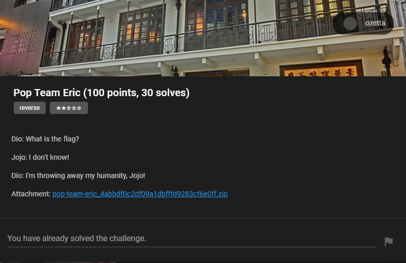
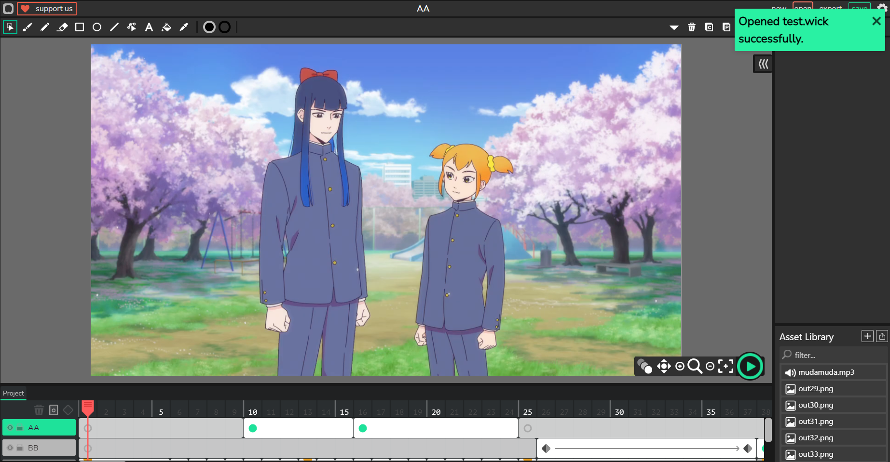
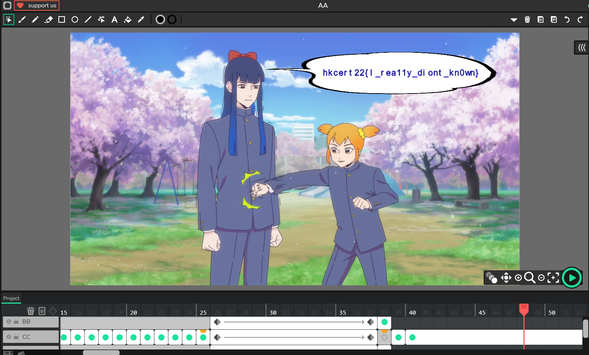

## Challenge



## Solution

In this challenge, we are given a (large) HTML file, [popiku.html](./popiku.html). If we open it, we will see a nice animation but the flag did not show up anywhere.


In the end, "To Be Continued" is shown on the screen. This might be a hint that we need to continue the animation.

Checking the source, we can see a very suspicious part at the very beginning:

```html
<body>
    <!-- The Wick project is bundled here during HTML export. (see src/export/html/HTMLExport.js) -->
    <script>
        window.INJECTED_WICKPROJECT_DATA = 'REDACTED';
    </script>
</body>
```

I tried to search for the keyword `window.INJECTED_WICKPROJECT_DATA` and it turns out that base64 string value, after decoded, can be loaded as a Wick project file. Now we can simply load the data into [Wick Editor](https://www.wickeditor.com/editor/):



We can drag the timeline to end of the animation and we can see the flag. A very simple challenge.

