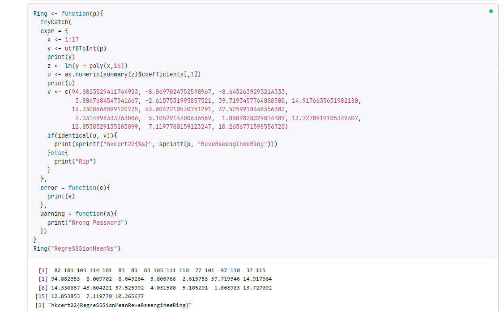

## Challenge


## Solution

We are given a piece of `R` code:

```r
Ring <- function(p){
  tryCatch(
  expr = {
    x <- 1:17
    y <- utf8ToInt(p)
    z <- lm(y ~ poly(x,16))
    u <- as.numeric(summary(z)$coefficients[,1])
    v <- c(94.8823529411764923, -8.0697024752598967, -8.6432639293214333, 
            3.8067684547541667, -2.6157531995857521, 39.7193457764808500, 14.9176635631982180, 
           14.3308668599120725, 43.6042210530751291, 37.5259918448356302, 
            4.0314998333763086,  5.1052914400636569,  1.8689828029874489, 13.7270919105349307, 
           12.8538529135203099,  7.1197700159123247, 10.2656771598556720)
    if(identical(u, v)){
      print(sprintf("hkcert22{\%s}", sprintf(p, "ReveRseengineeRing")))
    }else{
      stop()
    }
  },
  error = function(e){
    print("Wrong Password")
  },
  warning = function(w){
    print("Wrong Password")
  })
}
Ring(readline(prompt="Enter Password: "))
```

The `Ring` function takes a password string as input and checks if it is correct. Below is an analysis of the source code.

```r
x <- 1:17
y <- utf8ToInt(p)
z <- lm(y ~ poly(x,16))
```

The first two lines are straightforward. `x` is a vector of integers from 1 to 17, and `y` is the result of converting the password string to a vector of integers. The third line is the most interesting part. It fits a 16th order polynomial regression to the data. Basically, given 2 vectors `x` and `y`, we want to find coefficients `a_i` of a polynomial function `f(x)` such that `y = f(x)` and the highest order of `f(x)` is 16, i.e. `y = a_0 + a_1 * x^1 + a_2 * x^2 + ... + a_16 * x^16`. You could read this [StackOverflow answer](https://stackoverflow.com/questions/3822535/fitting-polynomial-model-to-data-in-r) for more details.

```r
u <- as.numeric(summary(z)$coefficients[,1])
v <- c(94.8823529411764923, -8.0697024752598967, -8.6432639293214333, 
        3.8067684547541667, -2.6157531995857521, 39.7193457764808500, 14.9176635631982180, 
        14.3308668599120725, 43.6042210530751291, 37.5259918448356302, 
        4.0314998333763086,  5.1052914400636569,  1.8689828029874489, 13.7270919105349307, 
        12.8538529135203099,  7.1197700159123247, 10.2656771598556720)
if(identical(u, v)){
    print(sprintf("hkcert22{\%s}", sprintf(p, "ReveRseengineeRing")))
}else{
    stop()
}
```

The rest part is simple, it checks if the coefficients of the fitted polynomial is equal to the vector `v`. If so, it prints the flag. 

The most tricky thing here is that `poly(x,16)` does not use "raw". It is orthogonal polynomial:

> By default, with raw = FALSE, poly() computes an orthogonal polynomial. It internally sets up the model matrix with the raw coding x, x^2, x^3, ... first and then scales the columns so that each column is orthogonal to the previous ones. This does not change the fitted values but has the advantage that you can see whether a certain order in the polynomial significantly improves the regression over the lower orders.
>  
> (Referenced from https://stackoverflow.com/questions/29999900/poly-in-lm-difference-between-raw-vs-orthogonal)

Therefore the coefficients are some weird decimals instead of nice integers. We can have a quick test:

```r
# y = 2x^3+x^2+3x-2

x <- c(1, 2, 3, 4)  
y <- c(4, 24, 70, 154)
z <- lm(y ~ poly(x, 3))
print(as.numeric(summary(z)$coefficients[,1]))

z <- lm(y ~ poly(x, 3, raw=TRUE))
print(as.numeric(summary(z)$coefficients[,1]))
```

Output:

```
[1]  63.000000 110.908972  32.000000   2.683282
[1] -2  3  1  2
```

I tried multiple ways to convert orthogonal to raw, one actually worked for small order polynomials, but somehow it did not work for this challenge. It is kinda frustrating and I almost thought I wouldn't be able to solve it. Luckily, my teammate `Utaha` noticed that `lm` is a linear system: for example, for the same `x`, result of `y = (0, 1, 1, 0)` is the same as sum of `y = (0, 0, 1, 0)` and `y = (0, 1, 0, 0)`.

```r
# y = 2x^3+x^2+3x-2
​
x <- c(1, 2, 3, 4)  
y <- c(0, 1, 1, 0)
z <- lm(y ~ poly(x, 3))
print(as.numeric(summary(z)$coefficients[,1]))
​
y1 <- c(0, 0, 1, 0)
z1 <- lm(y1 ~ poly(x, 3))
y2 <- c(0, 1, 0, 0)
z2 <- lm(y2 ~ poly(x, 3))
print(as.numeric(summary(z1)$coefficients[,1]) + as.numeric(summary(z2)$coefficients[,1]))
```

Output:

```
[1]  5.000000e-01  1.110223e-16 -1.000000e+00  5.551115e-17
[1]  5.00000e-01  1.94289e-16 -1.00000e+00  0.00000e+00
```

Nice, it works! Now we just need to get 17 vectors (each of size 17) of `y` and solve a linear system. I decided to continue using `R` because why not?

```r
mat <- c()
x <- 1:17
for (i in 1:17) {
    # make i-th value 1
    y <- c(0,0,0,0,0,0,0,0,0,0,0,0,0,0,0,0,0)
    y[i] = 1
    z <- lm(y ~ poly(x, 16))
	u <- as.numeric(summary(z)$coefficients[,1])
    mat <- rbind(mat, u)
}

# print(mat) <- 17 by 17
v <- c(94.8823529411764923, -8.0697024752598967, -8.6432639293214333, 
            3.8067684547541667, -2.6157531995857521, 39.7193457764808500, 14.9176635631982180, 
           14.3308668599120725, 43.6042210530751291, 37.5259918448356302, 
            4.0314998333763086,  5.1052914400636569,  1.8689828029874489, 13.7270919105349307, 
           12.8538529135203099,  7.1197700159123247, 10.2656771598556720)

T1 <- solve(t(mat), v) # t is transpose of mat because we want to solve for T1
print(T1)
```

Output:

```
  u   u   u   u   u   u   u   u   u   u   u   u   u   u   u   u   u 
 82 101 103 114 101  83  83  83 105 111 110  77 101  97 110  37 115 
```

Concatenating the ASCIIs to string, and feed to original `R` script, we get the flag:



## Summary

The challenge is not too hard, but it's interesting in that it taught me a bit about `R` polynomial fitting. Well, I (and `Utaha`) still did not understand what's orthogonal polynomial, but we just treated it as black box and it worked :)