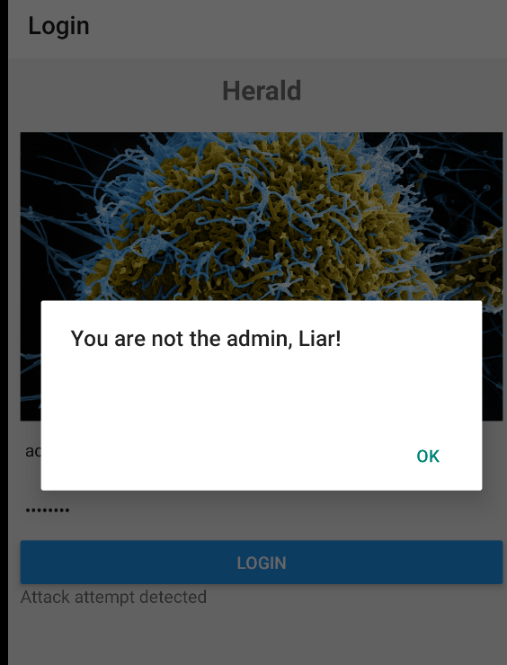

## Herald

> by patacrep
>
> Our lab administrator has just passed out from a strange virus. Please help us find the password to his messaging app so we can identify what he was working on and save his life.
>
> [Herald.apk](https://static.insomnihack.ch/media/Herald-e3081153dbcbc3f2bcd6aa0453e8ec6f7055deaf5762aee0a794e28e58b8bb12.apk)

After installing the app on our android mobile, a login screen is given, and we get `Wrong Username/Password combination` when inputting random values.


Playing around, if `admin` is used as username, we further receive an alert `You are not the admin, Liar!`



Since it’s an apk file, we can use any apk decompiler to decompile it and extract all assets. While most files are irrelevant, we noticed a bundle file `index.android.bundle` under `/resources/assets`, which is a Hermes JavaScript bytecode file (`Hermes` is a JavaScript engine optimized for React Native). At this point we are pretty sure this app was built with React Native, so the key is to reverse this bundle file.

Checking through bundle file reversing, we found this [GitHub Repo](https://github.com/bongtrop/hbctool) of `hbctool`, a command-line interface for disassembling and assembling the Hermes Bytecode. The tool is capable of decompiling `bundle` to `hasm` and compiling `hasm` back to `bundle`. However, we get the following error when trying to decompile:

```shell
MacBook-Pro-2 ~ % hbctool disasm index.android.bundle test_hasm
AssertionError: The HBC version (84) is not supported.
```

In the repo, it states that currently only version 59, 62, 74, and 76 are supported. There is a post in the [repo issues](https://github.com/bongtrop/hbctool/issues/12#issuecomment-1012556823) where someone added support for version 84 in his [forked repo](https://github.com/niosega/hbctool/tree/draft/hbc-v84). Using that, we successfully disassembled `index.android.bundle` to `instruction.hasm`, which looks like this.

```text
Function<global>0(1 params, 19 registers, 0 symbols):
	DeclareGlobalVar    	UInt32:2961
	; Oper[0]: String(2961) '__BUNDLE_START_TIME__'

	DeclareGlobalVar    	UInt32:2964
	; Oper[0]: String(2964) '__DEV__'

	DeclareGlobalVar    	UInt32:209
	; Oper[0]: String(209) 'process'

	DeclareGlobalVar    	UInt32:2968
	; Oper[0]: String(2968) '__METRO_GLOBAL_PREFIX__'

	CreateEnvironment   	Reg8:3
	LoadThisNS          	Reg8:5
	LoadConstString     	Reg8:4, UInt16:599
	; Oper[1]: String(599) 'production'
```

Our goal here is to bypass the password check and login with username `admin`. Looking at the source code, the main interesting function within `instruction.hasm` is the `tryAuth` function which is responsible for verifying the username and password.

```text
Function<tryAuth>4087(3 params, 13 registers, 0 symbols):
	LoadThisNS          	Reg8:2
	GetByIdShort        	Reg8:0, Reg8:2, UInt8:1, UInt8:121
	; Oper[3]: String(121) 'state'

	GetById             	Reg8:0, Reg8:0, UInt8:2, UInt16:4142
	; Oper[3]: String(4142) 'username'

	LoadConstString     	Reg8:1, UInt16:801
	; Oper[1]: String(801) 'admin'

	JStrictNotEqual     	Addr8:38, Reg8:0, Reg8:1
	GetByIdShort        	Reg8:0, Reg8:2, UInt8:1, UInt8:121
	; Oper[3]: String(121) 'state'

	GetById             	Reg8:3, Reg8:0, UInt8:3, UInt16:4120
	; Oper[3]: String(4120) 'password'

	GetById             	Reg8:4, Reg8:2, UInt8:4, UInt16:3485
	; Oper[3]: String(3485) 'decodedText'

	NewArrayWithBuffer  	Reg8:0, UInt16:28, UInt16:28, UInt16:9398
	Call2               	Reg8:0, Reg8:4, Reg8:2, Reg8:0
	JStrictEqual        	Addr8:105, Reg8:3, Reg8:0
	GetByIdShort        	Reg8:0, Reg8:2, UInt8:1, UInt8:121
	; Oper[3]: String(121) 'state'

	GetById             	Reg8:0, Reg8:0, UInt8:2, UInt16:4142
	; Oper[3]: String(4142) 'username'

	JStrictEqual        	Addr8:45, Reg8:0, Reg8:1
	GetEnvironment      	Reg8:0, UInt8:1
	LoadFromEnvironment 	Reg8:0, Reg8:0, UInt8:6
	GetById             	Reg8:3, Reg8:0, UInt8:5, UInt16:4460
	; Oper[3]: String(4460) 'Alert'

```

Let's understand the code line by line.

```text
	GetById             	Reg8:0, Reg8:0, UInt8:2, UInt16:4142
	; Oper[3]: String(4142) 'username'

	LoadConstString     	Reg8:1, UInt16:801
	; Oper[1]: String(801) 'admin'

	JStrictNotEqual     	Addr8:38, Reg8:0, Reg8:1
	GetByIdShort        	Reg8:0, Reg8:2, UInt8:1, UInt8:121
	; Oper[3]: String(121) 'state'
```

The function reads input username to `Reg8:0`, and loads a const string `admin` to `Reg8:1`, then compares them. If they are **not equal**, then some `state` will be triggered which is to print the `Wrong Username/Password combination` error.

```text
	JStrictEqual        	Addr8:45, Reg8:0, Reg8:1
	GetEnvironment      	Reg8:0, UInt8:1
	LoadFromEnvironment 	Reg8:0, Reg8:0, UInt8:6
	GetById             	Reg8:3, Reg8:0, UInt8:5, UInt16:4460
	; Oper[3]: String(4460) 'Alert'
```

If they are **equal**, then an alert `You are not the admin, Liar!` will pop out.

```text
  GetById             	Reg8:3, Reg8:0, UInt8:3, UInt16:4120
	; Oper[3]: String(4120) 'password'

	GetById             	Reg8:4, Reg8:2, UInt8:4, UInt16:3485
	; Oper[3]: String(3485) 'decodedText'

	NewArrayWithBuffer  	Reg8:0, UInt16:28, UInt16:28, UInt16:9398
	Call2               	Reg8:0, Reg8:4, Reg8:2, Reg8:0
	JStrictEqual        	Addr8:105, Reg8:3, Reg8:0
	GetByIdShort        	Reg8:0, Reg8:2, UInt8:1, UInt8:121
	; Oper[3]: String(121) 'state'
```

This block is the key to solving this challenge. The entered password is compared with the content of a static buffer run through `decodedText`. If they match, check is successful and we are able to login. Our trick here is to change `JStrictEqual` to `JStrictNotEqual`, so any random password can bypass the password check.

After changing it, we compile `hasm` to `bundle` and then recompile the apk. Inputting `admin` and empty password gives us the flag text.

Note: Some teams extracted buffers from the `metadata.json` generated by `hbctool` and decoded password/flag directly from it, but our approach seems to be simpler in terms of efforts :)
