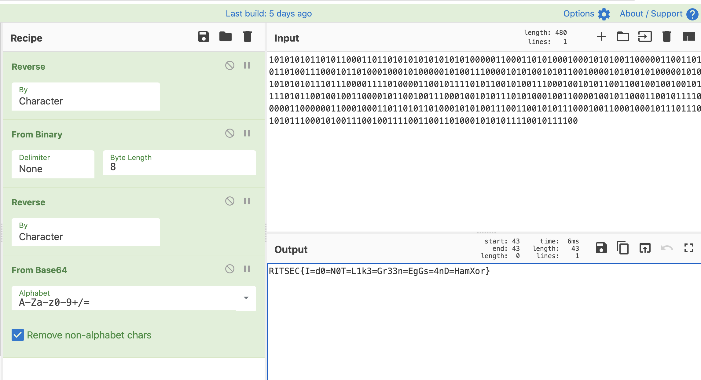

## Hamxor

> I love playing with my blocks while I eat my ham and eggs
>
> nc ctf.ritsec.club:4534
>
> Wrap flag with `RITSEC{}`, not `RS{}`
>
> Author - Raydan

This is one of the best challenges in this year’s RITSEC CTF. I spent a total of 5+ hours on it, finally solving it with lots of trials and errors. My writeup will focus more on the thought process and how I approached the challenge – actual solution might seem fairly straightforward in the end.

We are given a server to connect to, each connection gives a bunch of rubbish data.

```
% nc ctf.ritsec.club 4534
 b=m??B
       {???J?D??IE??	j@?ι?k?ww?u?rE?X??Fb3??;?l???N)?????~??V???ݣk7rD???(??g?y??h-?}?m?!>?m??+?g)C????胜S;I?}|4????N2????M?E`?$Qs(n??]d??v?g>__=?.U?)1?4?J4yQ?????v•7&F??V??̭?"??A<??<?@78=\H?4L??֏K?b??i?p?
```

Note that I truncated the output above, actual content is much longer. Playing around, we noticed that TCP output of the server is different every time, and the length varies too.


Since the challenge description hints to `Hamming code` and `xor`, we did some reading online about Hamming code corrections. Our initial thought: the challenge goal is to correct the errors properly and we end up with valid data to decode. This means that original message is the same, but errors will happen randomly to produce different outputs.

However, the problem is that Hamming code only corrects bit flipping, it would not affect data size in theory. How would the same message (flag probably) produce different outputs with bits corruption?

Before moving on, you need to have a basic understanding of Hamming code – what it is, how it is used to correct single-bit errors when transmitting data. [This YouTube video](https://www.youtube.com/watch?v=X8jsijhllIA) might be helpful. In short, when we have a block of data with `n` bits, bit positions of powers of 2, i.e. 1, 2, 4, 8, 16 etc. will be used as parity bits. A parity bit is an extra bit that makes the number of 1s either even or odd. Each parity bit is responsible for certain bits in the data. When decoding a message in Hamming code data, we can use parity bits to locate error bit and correct it.

Back to the challenge. With some more experiments, we noticed that **all outputs from the server have a length multiple of 64 bytes, or 512 bits.** What does this mean? If one block has 64 bytes of data, and there are `k` blocks in server output, we can essentially `xor` all blocks together to produce one single resulting block. In this way, no matter what is the total size of server output, we finally obtain a fixed 64-byte block which is likely our original message. `k` does not really matter. In addition, before xor-ing blocks we have to do Hamming code correction on each block to make it error-free.

At this stage, we have a rough plan for solving this challenge:

1. Get data from server which is `n` blocks × 512 bits per block
2. For each block perform Hamming code error bit correction
3. XOR all blocks to a single block
4. Maybe binary to ASCII? Not sure yet

The code is as follows.

```py
from pwn import *
import os
from functools import reduce

# 1) Get data from server which is n blocks x 512 bits per block
output = b""
os.system("nc ctf.ritsec.club 4534 > res.txt")
with open("res.txt", "rb") as f:
    output = f.read()
assert len(output) % 64 == 0

def error_loc(binstr):
    has_err = sum(map(int, binstr)) % 2
    err_bit = reduce(lambda x, y: x ^ y, [i for i, bit in enumerate(binstr) if bit == '1'])
    return has_err, err_bit

# 2) For each block correct bits
blocks = []
for i in range(len(output) // 64):
    tmp = output[64*i:64*i+64]
    tmp_bin = ""
    for num in tmp:
        tmp_bin += format(num, '08b')
    assert len(tmp_bin) == 512
    has_err, err_bit = error_loc(tmp_bin)
    if has_err:
        changed = "0"
        if tmp_bin[err_bit] == "0":
            changed = "1"
        tmp_bin = tmp_bin[:err_bit] + changed + tmp_bin[err_bit+1:]
    blocks.append(tmp_bin)

# 3) XOR all blocks to a single block
s = ""
for i in range(64):
    curr = 0
    for item in blocks:
        tmp = int("0b"+item[i*8:i*8+8],2)
        curr ^= tmp
    s += format(curr, "08b")
```

Throwing resulting `s` to CyberChef, we did not find anything meaningful after all sorts of conversions. Author hinted here that we are missing one step of the hamming process – Eana suggested that we need to do a fourth step after XOR-ing all blocks:

```py
# 4) Remove index 0,1,2,4...256 bit of parity bit
s = list(s)
s[0] = None
for i in range(20):
    j = 2 ** i
    if j >= len(s): break
    s[j] = None
ss = "".join(i for i in s if i is not None)
print(ss)
```

And here is the resulting `ss`.

```
1111110101100110110101101101010100010101000011000001010111000101011001010011000001101011001110010101101001000100010000011110010101010001101010010000100101010101010000010101010111011101111000011000010111101001001101001110010101001000110011010010010110100000110101110010011101000011100100010010000101110110010001001000011000110111101001110000011100000010001000101011010100010111100101010011000001110100011001110100010101110100011101111001011110010010011001010001011111010111110100000000000000000000000000
```

It still does not make much sense. But I have no idea what I missed, so I went to sleep. The second day, I was told that the problem might be due to endianness of bytes, and I quickly realized what was wrong. For the data we received, our endianness when changing to binary is incorrect – currently we did this:

```py
for num in tmp:
    tmp_bin += format(num, '08b')
```

But it should be changed to:

```py
for num in tmp:
    tmp_bin += format(num, '08b')[::-1]
```

To represent proper endian format. Once I changed this, I got the following binary output:

```
1010101011010110001101101010101010101010000011000110101000100010101001100000110011010110100111000101101000100010100000101001110000101010010101100100001010101010000010101010101011101110000111101000011001011110101100101001110001001010110011001001001001011110101100100100110000101100100111000100101011101010001001100001001011000110010111100000110000001100010001101101011010001010100111001100101011100010011000100010111011101010111000101001110010011110011001101000101010111100101111000000000000000000000000
```

Now, CyberChef will help us with getting the flag! (We need to remove some trailing 0’s)



Looking back, the challenge itself is not super complicated, but might be a bit guessy at the start on XOR-ing blocks. It is a nice challenge from which I learned about Hamming code error detection and correction.

Special thanks to **Eana** for some ideas and help through solving the challenge.
