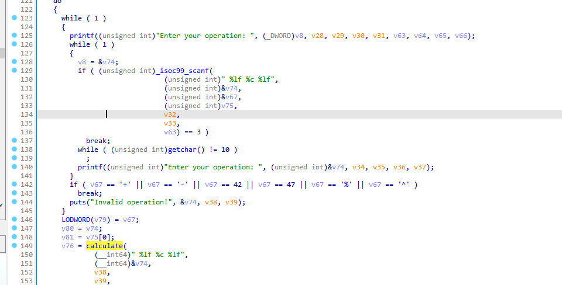
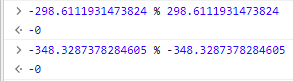

## Fast Calculator

> Check out our new super fast calculator!
> (This challenge is sponsored by Battelle.)
> 
> [calc](./calc)

We are provided with a binary that when running prompts simple arithmetic input. Opening in IDA and decompile it, we get to see that the first part of the main logic is essentially scanning our input operation and perform a `calculate` with `+`, `-`, `*`, `/`, `%` or `^`.



The check on `while ( v76 != 8573.8567 )` means our result is supposed to match this number. We can quickly plug in a few possible inputs and observe the output from the calculator.

```bash
$ ./calc 
Welcome to the fastest, most optimized calculator ever!
Example usage:
  Add:       1 + 2
  Subtract:  10 - 24
  Multiply:  34 * 8
  Divide:    20 / 3
  Modulo:    60 % 9
  Exponent:  2 ^ 12

If you enter the correct secret operation, I might decrypt the flag for you! ^-^

Enter your operation: 85738567 / 10000
Result: 8573.856700

Correct! Attempting to decrypt the flag...
I calculated 368 operations, tested each result in the gauntlet, and flipped 119 bits in the encrypted flag!
Here is your decrypted flag:

uiuctf{This is a fake flag. You are too fast!}

Enter your operation: 8573.8567 ^ 1
Result: 8573.856700

Correct! Attempting to decrypt the flag...
I calculated 368 operations, tested each result in the gauntlet, and flipped 119 bits in the encrypted flag!
Here is your decrypted flag:

uiuctf{This is a fake flag. You are too fast!}

Enter your operation: 8573 + 0.8567
Result: 8573.856700

Correct! Attempting to decrypt the flag...
I calculated 368 operations, tested each result in the gauntlet, and flipped 119 bits in the encrypted flag!
Here is your decrypted flag:

uiuctf{This is a fake flag. You are too fast!}
```

Alright, seems we are always getting the same fake flag regardless of input. Let's read on in the decompiled code.

```c
puts("\nCorrect! Attempting to decrypt the flag...", &v65, v23, v24);
v68 = v61 - 1LL;
v41 = 16 * ((v61 + 15LL) / 0x10uLL);
while ( &v54 != (__int64 *)((char *)&v54 - (v41 & 0xFFFFFFFFFFFFF000LL)) )
    ;
v42 = alloca(v41 & 0xFFF);
if ( (v41 & 0xFFF) != 0 )
    *(__int64 *)((char *)&v54 + (v41 & 0xFFF) - 8) = *(__int64 *)((char *)&v54 + (v41 & 0xFFF) - 8);
v69 = &v54;
v43 = v74;
j_memcpy(&v54, v74, v61);
v59 = 0;
for ( i = 0; i < (int)v62; ++i )
{
    v47 = calculate((unsigned int)&v54, (_DWORD)v43, i, v44, v45, v46, v73[3 * i], v73[3 * i + 1], v73[3 * i + 2]);
    if ( (unsigned __int8)gauntlet(v47) )
    {
        v63 = i / 8;
        v64 = i % 8;
        LODWORD(v43) = 1 << (7 - i % 8);
        v44 = (unsigned int)v43 ^ *((unsigned __int8 *)v69 + i / 8);
        *((_BYTE *)v69 + v63) ^= 1 << (7 - i % 8);
        ++v59;
    }
}
v3 = (__int64 *)v62;
printf(
    (unsigned int)"I calculated %d operations, tested each result in the gauntlet, and flipped %d bits in the encrypted flag!\n",
    v62,
    v59,
    v44,
    v45,
    v46);
puts("Here is your decrypted flag:\n", v3, v48, v49);
LODWORD(v3) = (_DWORD)v69;
printf((unsigned int)"%s\n\n", (_DWORD)v69, v50, v51, v52, v53);
```

The part before `for ( i = 0; i < (int)v62; ++i )` seems to be some random buffer copying and I don't really know what they are for, also they are not related with main program logic, so let's skip them for now. In the next part:

```c
for ( i = 0; i < (int)v62; ++i )
{
    v47 = calculate((unsigned int)&v54, (_DWORD)v43, i, v44, v45, v46, v73[3 * i], v73[3 * i + 1], v73[3 * i + 2]);
    if ( (unsigned __int8)gauntlet(v47) )
    {
        v63 = i / 8;
        v64 = i % 8;
        LODWORD(v43) = 1 << (7 - i % 8);
        v44 = (unsigned int)v43 ^ *((unsigned __int8 *)v69 + i / 8);
        *((_BYTE *)v69 + v63) ^= 1 << (7 - i % 8);
        ++v59;
    }
}
```

There is a big byte array `v73[1104]`. IDA decompiles it badly, but from what we knew before, `v73` is what stores the number input and operation. (`v62 = 368` and `1104 = 3 * 368`). If `gauntlet` returns true, we do some bit flip (As indicated in printed text too). Otherwise noop for current iteration. `gauntlet` looks like a function to check if the result is negative, NaN or infinity.

```c
_BOOL8 __fastcall gauntlet(double a1)
{
  return (unsigned __int8)isNegative(a1) || (unsigned __int8)isNotNumber(a1) || (unsigned __int8)isInfinity(a1);
}
```

In the end, it simply prints "I calculated 368 operations, tested each result in the gauntlet, and flipped 119 bits in the encrypted flag!" and shows the fake flag. At this point, seems we already gone through the (simple) logic of the entire calculator!

### Deeper analysis (and the rabbit hole)

At this stage I had no clue how to continue, so I also asked teammate for some insight, who suggested to hook the function and see what are being produced by `gauntlet`. Turns out bit flipping is determined by these bits:

```
0, 0, 1, 1, 1, 1, 1, 0, 1, 0, 1, 0, 1, 0, 1, 0, 1, 0, 0, 1, 0, 1, 0, 0, 0, 1, 1, 0, 0, 0, 1, 0, 0, 1, 1, 1, 0, 1, 0, 0, 1, 1, 0, 1, 1, 1, 1, 1, 1, 0, 0, 1, 0, 1, 0, 1, 0, 1, 0, 0, 0, 1, 0, 0, 1, 0, 0, 0, 0, 1, 1, 0, 0, 0, 1, 0, 0, 0, 1, 0, 1, 0, 0, 0, 0, 0, 1, 1, 1, 0, 0, 0, 0, 1, 0, 0, 0, 0, 0, 1, 0, 0, 0, 1, 0, 1, 0, 1, 0, 0, 1, 0, 0, 0, 0, 1, 1, 0, 0, 0, 1, 0, 1, 0, 1, 0, 1, 0, 1, 1, 0, 0, 1, 0, 1, 0, 0, 1, 0, 0, 1, 1, 0, 0, 0, 1, 0, 0, 0, 0, 0, 0, 0, 0, 0, 0, 0, 0, 0, 0, 1, 0, 1, 0, 1, 0, 1, 1, 1, 0, 1, 0, 0, 0, 1, 1, 0, 0, 1, 0, 0, 0, 0, 0, 1, 0, 0, 0, 0, 1, 0, 0, 0, 0, 1, 0, 0, 0, 0, 0, 1, 1, 0, 0, 0, 0, 0, 0, 1, 0, 1, 0, 0, 0, 1, 0, 0, 0, 0, 0, 1, 1, 0, 0, 0, 1, 0, 1, 0, 0, 0, 0, 1, 0, 1, 0, 0, 0, 0, 0, 1, 0, 0, 0, 0, 0, 0, 0, 1, 0, 0, 0, 0, 0, 0, 0, 1, 1, 0, 0, 0, 0, 0, 0, 0, 0, 0, 0, 0, 0, 0, 0, 0, 1, 0, 0, 0, 0, 1, 0, 0, 0, 1, 0, 1, 0, 0, 0, 0, 0, 0, 1, 0, 1, 0, 0, 0, 1, 0, 0, 0, 1, 1, 1, 1, 1, 0, 0, 0, 1, 1, 0, 0, 0, 0, 0, 0, 0, 0, 0, 0, 0, 0, 0, 0, 0, 0, 0, 1, 1, 0, 1, 0, 0, 1, 0, 1, 1, 0, 1, 1, 0, 0, 0, 0, 1, 0, 0, 0, 0, 0, 1, 1, 0, 0, 0, 0, 1, 0, 1, 1, 0, 0, 1, 0, 1, 0, 0
```

To make sure each run, regardless of operator, produces the same bits, we used pwndbg to confirm:

```bash
pwndbg> x/50bx 0x7fffffffaf70
0x7fffffffaf70:    0x4b    0xc3    0xe1    0x01    0x00    0xb9    0xee    0x10
0x7fffffffaf78:    0xee    0x4b    0xf0    0xa4    0x78    0x21    0x38    0xcb
0x7fffffffaf80:    0xea    0x2a    0x21    0x6b    0xce    0x83    0x46    0xe8
0x7fffffffaf88:    0x41    0xa7    0x8c    0x2c    0x09    0xcf    0xf5    0xa0
0x7fffffffaf90:    0xa1    0x72    0x27    0x08    0x60    0x28    0xa9    0x20
0x7fffffffaf98:    0x66    0xb3    0xab    0x35    0xa4    0xe9    0x00    0x00
```

This matches the encoded bytes here:

```c
v71 = 0x10EEB90001E1C34BLL;                   // these are the encoded bytes
v72 = 0xCB382178A4F04BEELL;
v73 = 0xE84683CE6B212AEALL;
v74 = 0xA0F5CF092C8CA741LL;
v75 = 0x20A92860082772A1LL;
v76 = 900445030;
v77 = 0xE9A4;
```

So now we can actually write a Python program that matches the binary's behaviour.

```py
bit_arr = [0, 0, 1, 1, 1, 1, 1, 0, 1, 0, 1, 0, 1, 0, 1, 0, 1, 0, 0, 1, 0, 1, 0, 0, 0, 1, 1, 0, 0, 0, 1, 0, 0, 1, 1, 1, 0, 1, 0, 0, 1, 1, 0, 1, 1, 1, 1, 1, 1, 0, 0, 1, 0, 1, 0, 1, 0, 1, 0, 0, 0, 1, 0, 0, 1, 0, 0, 0, 0, 1, 1, 0, 0, 0, 1, 0, 0, 0, 1, 0, 1, 0, 0, 0, 0, 0, 1, 1, 1, 0, 0, 0, 0, 1, 0, 0, 0, 0, 0, 1, 0, 0, 0, 1, 0, 1, 0, 1, 0, 0, 1, 0, 0, 0, 0, 1, 1, 0, 0, 0, 1, 0, 1, 0, 1, 0, 1, 0, 1, 1, 0, 0, 1, 0, 1, 0, 0, 1, 0, 0, 1, 1, 0, 0, 0, 1, 0, 0, 0, 0, 0, 0, 0, 0, 0, 0, 0, 0, 0, 0, 1, 0, 1, 0, 1, 0, 1, 1, 1, 0, 1, 0, 0, 0, 1, 1, 0, 0, 1, 0, 0, 0, 0, 0, 1, 0, 0, 0, 0, 1, 0, 0, 0, 0, 1, 0, 0, 0, 0, 0, 1, 1, 0, 0, 0, 0, 0, 0, 1, 0, 1, 0, 0, 0, 1, 0, 0, 0, 0, 0, 1, 1, 0, 0, 0, 1, 0, 1, 0, 0, 0, 0, 1, 0, 1, 0, 0, 0, 0, 0, 1, 0, 0, 0, 0, 0, 0, 0, 1, 0, 0, 0, 0, 0, 0, 0, 1, 1, 0, 0, 0, 0, 0, 0, 0, 0, 0, 0, 0, 0, 0, 0, 0, 1, 0, 0, 0, 0, 1, 0, 0, 0, 1, 0, 1, 0, 0, 0, 0, 0, 0, 1, 0, 1, 0, 0, 0, 1, 0, 0, 0, 1, 1, 1, 1, 1, 0, 0, 0, 1, 1, 0, 0, 0, 0, 0, 0, 0, 0, 0, 0, 0, 0, 0, 0, 0, 0, 0, 1, 1, 0, 1, 0, 0, 1, 0, 1, 1, 0, 1, 1, 0, 0, 0, 0, 1, 0, 0, 0, 0, 0, 1, 1, 0, 0, 0, 0, 1, 0, 1, 1, 0, 0, 1, 0, 1, 0, 0]

original_flag = [0x4b, 0xc3, 0xe1, 0x01, 0x00, 0xb9, 0xee, 0x10, 0xee, 0x4b, 0xf0, 0xa4, 0x78, 0x21, 0x38, 0xcb, 0xea, 0x2a, 0x21, 0x6b, 0xce, 0x83, 0x46, 0xe8, 0x41, 0xa7, 0x8c, 0x2c, 0x09, 0xcf, 0xf5, 0xa0, 0xa1, 0x72, 0x27, 0x08, 0x60, 0x28, 0xa9, 0x20, 0x66, 0xb3, 0xab, 0x35, 0xa4, 0xe9]

for i in range(0,len(bit_arr)):
    idx = bit_arr[i]
    if (idx == 1):
        v63 = int(i / 8)
        original_flag[v63] ^= 1 << (7 - i % 8); 


print(original_flag)
string = ''.join(chr(num) for num in original_flag)
print(string) # uiuctf{This is a fake flag. You are too fast!}
```

Cool. We are at a dead end now? There seems nothing to reverse now, and no way is flag unrelated with flipping right? We made a lot of wild guesses, including manually flipping random different bits and brute force same 8-bit chunks flips, but no luck. A few hours wasted.

### Noticing missing bits

The next day, we came to realize that something was ignored: we haven't checked the actual operations executed to produce `gauntlet` and thus decrypt the flag. We put up [an Excel sheet](https://docs.google.com/spreadsheets/d/1i4zFNFSymCqdqm3iP6v1s-1HaSOSc_3uA496m-TTdGA/edit#gid=0) to ducument the operations.

```
314.23572239497753 % -343.80018153073945
440.23960117225056 - 97.06735072845765
-101.85126480640992 % 430.61512281284047
26.566683118055153 / -179.0810006863229
-70.14572896052726 % -320.1140167220988
466.1142124377461 / -173.60461194722888
-2.338062192709174 % -435.2257228345381
-214.53669190732774 - -300.7554748526087
-98.75553114434364 ^ 87.0
......
66.37433504049558 ^ 14.781441588664144
-39.73744088699632 ^ 55.0
443.92105349183987 / 53.74338477053027
-0.4580954923237641 / -214.804781136109
```

The operation seems normal, but what about the functions used to compute the operation? Could they have issues? From the very beginning we were ignoring the `calculate` function and assumed they just did proper maths :>

```c
double __fastcall calculate(
        __int64 a1,
        __int64 a2,
        __int64 a3,
        __int64 a4,
        __int64 a5,
        __int64 a6,
        double a7,
        double a8,
        double a9,
        double a10,
        double a11,
        double a12,
        double a13,
        double a14,
        unsigned int a15,
        double a16,
        double a17)
{
  double v10; // [rsp+8h] [rbp-8h]

  v10 = 0.0;
  if ( a15 > '/' )
  {
    if ( a15 == '^' )
      return powf64(a16, a17);
  }
  else if ( a15 >= '%' )
  {
    switch ( a15 )
    {
      case '%':
        v10 = fmodf64(a16, a17);
        break;
      case '*':
        v10 = a17 * a16;
        break;
      case '+':
        v10 = a17 + a16;
        break;
      case '-':
        v10 = a16 - a17;
        break;
      case '/':
        v10 = a16 / a17;
        break;
      default:
        return v10;
    }
  }
  return v10;
}
```

Could functions result in wrong values here? I tried Python to reproduce the code but couldn't find anything. But we are actually getting something different by using JavaScript:

```js
let arr = [
    "314.23572239497753 % -343.80018153073945",
    "440.23960117225056 - 97.06735072845765",
    ...
    "-0.4580954923237641 / -214.804781136109",
]

final_res = []

function isNegative(num) {
  if (Math.sign(num) === -1) {
    return true;
  }

  return false;
}

for (let i = 0; i < arr.length; i++) {
  result = eval(arr[i]);

  console.log(result)

  if (isNegative(result)){
    final_res.push(1);
  }
  else if (Object.is(result, -0)){
    final_res.push(1);
  }
  else{
    final_res.push(0);
  }
}

console.log(final_res);
// '0,0,1,1,1,1,1,0,1,0,1,0,1,0,1,0,1,0,0,1,0,1,0,0,0,1,1,0,0,0,1,0,0,1,1,1,0,1,0,0,1,1,0,1,1,1,1,1,1,0,0,1,0,1,0,1,0,1,1,1,1,1,1,0,1,1,0,1,1,1,1,0,0,0,1,1,1,1,1,1,1,0,1,0,1,1,1,1,1,1,1,1,0,1,1,1,0,0,0,1,0,1,1,1,0,1,1,1,1,1,1,0,0,1,0,1,1,1,1,0,1,1,1,1,1,1,1,1,1,1,0,1,1,1,1,1,0,1,0,1,1,1,1,0,0,1,1,1,1,1,1,0,0,0,0,1,1,1,0,0,1,1,1,1,1,1,1,1,1,1,1,1,0,1,1,1,0,0,1,0,1,1,1,0,1,0,1,1,0,1,1,1,0,1,1,1,0,0,0,1,1,1,0,0,0,1,0,1,1,1,1,1,1,1,1,1,0,1,0,0,1,1,1,1,0,1,1,1,1,1,0,0,1,0,1,1,1,1,0,1,1,1,0,0,0,1,1,0,1,1,1,1,1,1,1,1,1,1,0,0,0,0,1,1,0,1,0,0,0,0,1,1,0,1,0,1,0,0,1,1,0,1,1,1,1,0,1,1,0,0,1,1,1,1,1,1,0,1,0,0,0,1,1,1,1,1,0,0,1,1,1,1,0,1,1,1,1,1,1,1,0,0,1,0,1,0,1,1,1,1,0,1,0,0,1,0,1,1,1,1,1,1,1,1,0,1,0,1,1,1,0,1,1,1,0,1,0,1,1,1,1,0,0,1,0,1,0,0'
```

Something different is yielded. If we apply this bit flip to original encrypted data, we get the flag using the same script before: `uiuctf{n0t_So_f45t_w1th_0bscur3_b1ts_of_MaThs}`.

So, what was the issue? Checking the functions that got different bit flip, we notice there are a lot of `-0`s:



Apparently, floating point maths optimizations happened in the `calculate` function, causing `isnan` and `isinf` to be optimized out completely. As a result, `x < 0.0` is false if `x == -0.0`... This is also why we got different results in JavaScript. It's a quick funny "bug" that we are supposed to observe and exploit to get the flag.

### Afterword

This challenge took us more time and efforts than expected as we went into several rabbit holes and tried to guess different things. I think it could have been made a bit less guessy with some better instructions or hints, but it was still a fun challenge regardless.